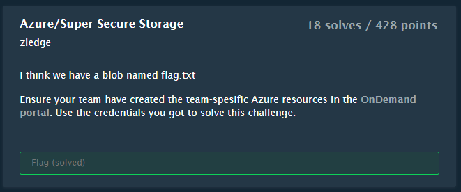
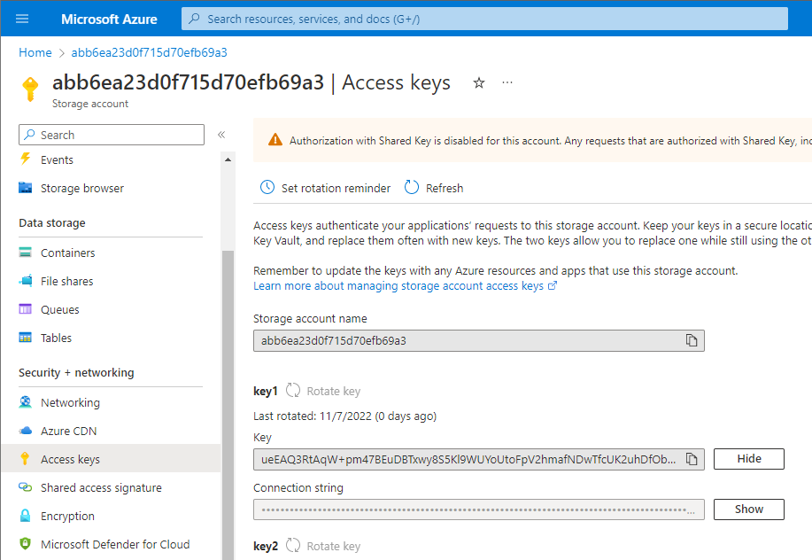

# Super Secure Storage

## Challenge



## Solution

From the OnDemand page we get credentials for a normal user, which we can use via `az cli`.

Log in
```
$ az login -u abb6ea23d0f715@eqcdc.onmicrosoft.com -p M3kLGQztehufF3bhHr8kXHICm191fZDNv9_MzB0_
[
  {
    "cloudName": "AzureCloud",
    "homeTenantId": "6837db8b-72d9-4346-bbb4-c2536150adf5",
    "id": "ad116f11-921a-43ad-8b80-5b8af92e0833",
    "isDefault": true,
    "managedByTenants": [],
    "name": "Azure subscription 1",
    "state": "Enabled",
    "tenantId": "6837db8b-72d9-4346-bbb4-c2536150adf5",
    "user": {
      "name": "abb6ea23d0f715@eqcdc.onmicrosoft.com",
      "type": "user"
    }
  }
]
```

List all resources
```
$ az resource list
```

This listed about 15 resources of various types. Most were virtual machines, disks and networks probably related to the virtual machines.

Then there was a couple of Automation Accounts, and lastly a couple of Storage Accounts.

Given the name of the challenge we'll look into the last two.

```json
[
      {
    "changedTime": "2022-11-07T17:38:12.546620+00:00",
    "createdTime": "2022-11-07T17:27:52.198782+00:00",
    "extendedLocation": null,
    "id": "/subscriptions/ad116f11-921a-43ad-8b80-5b8af92e0833/resourceGroups/abb6ea23d0f715-rg/providers/Microsoft.Storage/storageAccounts/abb6ea23d0f715d70efb69a3",
    "identity": null,
    "kind": "StorageV2",
    "location": "northeurope",
    "managedBy": null,
    "name": "abb6ea23d0f715d70efb69a3",
    "plan": null,
    "properties": null,
    "provisioningState": "Succeeded",
    "resourceGroup": "abb6ea23d0f715-rg",
    "sku": {
      "capacity": null,
      "family": null,
      "model": null,
      "name": "Standard_LRS",
      "size": null,
      "tier": "Standard"
    },
    "tags": {},
    "type": "Microsoft.Storage/storageAccounts"
  },
  {
    "changedTime": "2022-11-07T17:37:53.535558+00:00",
    "createdTime": "2022-11-07T17:27:32.311581+00:00",
    "extendedLocation": null,
    "id": "/subscriptions/ad116f11-921a-43ad-8b80-5b8af92e0833/resourceGroups/abb6ea23d0f715-rg/providers/Microsoft.Storage/storageAccounts/abb6ea23d0f715d70efb69b2",
    "identity": null,
    "kind": "StorageV2",
    "location": "northeurope",
    "managedBy": null,
    "name": "abb6ea23d0f715d70efb69b2",
    "plan": null,
    "properties": null,
    "provisioningState": "Succeeded",
    "resourceGroup": "abb6ea23d0f715-rg",
    "sku": {
      "capacity": null,
      "family": null,
      "model": null,
      "name": "Standard_LRS",
      "size": null,
      "tier": "Standard"
    },
    "tags": {},
    "type": "Microsoft.Storage/storageAccounts"
  }
]
```

A Storage Account in Azure can be used to save files, blobs or table-data.

Logging into https://portal.azure.com, we can see the same two Storage Accounts.
On one of them we see a Container called "TODO", but our user doesn't have access to view the content.

Looking at Access Keys we can see the keys, but the warning message lets us know that "Authorization with Shared Key is disabled for this account."



Looking a the Settings->Configuration we can see that "Allow storage account keys access" has been set to Disabled. We can enable it and save, and wait 30 seconds for the change to take effect.


Once that is complete, we can go the the Storage Browser, and we now have access to see the flag.txt file.


```
EPT{ecc665b7-b661-4ea4-8fe9-d8a3540fd3ca}
```