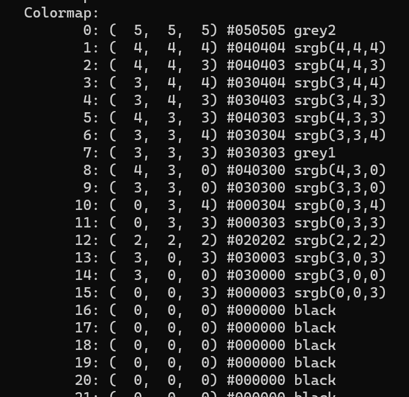
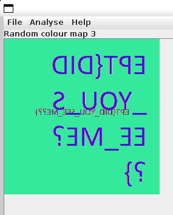

## Challenge: Beginner/Hidden out of sight

Category: Steganography

### Description

Something must be hidden in the darkness.

Downloads: image.gif

### Solution

1. First we run strings on image.gif to check the metadata.
2. We are able to see that GIF89a and NETSCAPE2.0 is connected to ImageMagick. Therefore we install ImageMagick.
4. By converting the gif into all its .png components (total of 7) using the command `convert image.gif out.png`, we are able to inspect each of the components. 
5. Based on the description "Something must be hidden in the darkness" we first check the black picture.
4. Running the command `identify -verbose image.gif` we are able to see that the data stored in the 5th image (the black one from the gif) contains more data than the others. See picture below:

6. The 8-bit colormap is a place where one can hide information. By using **stegsolve** we can scroll through the pictures, we find this:  
  
7. And that there we have the flag

### Flag
`EPT{DID_YOU_SEE_ME??}`