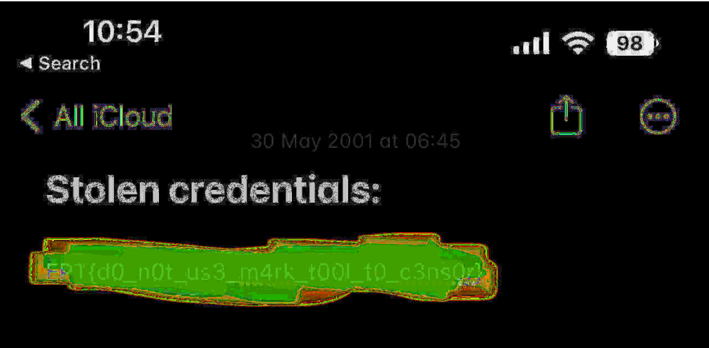

# Notes - Revisited writeup

In this challange we are again working with the same picture we had in [Notes](https://github.com/ept-team/equinor-ctf-2022/tree/main/writeups/Beginner/Notes/USN-CTF)

We are given the following information:

The hacker claims we have planted this note on his phone. Can you find out the actual date and time when it was last modified?

The flag format is: `EPT{31.12.2099_23:59}`

P.S: This is not an artificial challenge - this timestamp is indeed added by the notes application and can be recreated easily on your phone.

# Solution

By using [StegOnline](https://stegonline.georgeom.net/image) and messing with the settings we can see that the creation of the note becomes visible.

Convering this to the flag format gives us the flag ***`EPT{30.05.2011_06:45}`***

