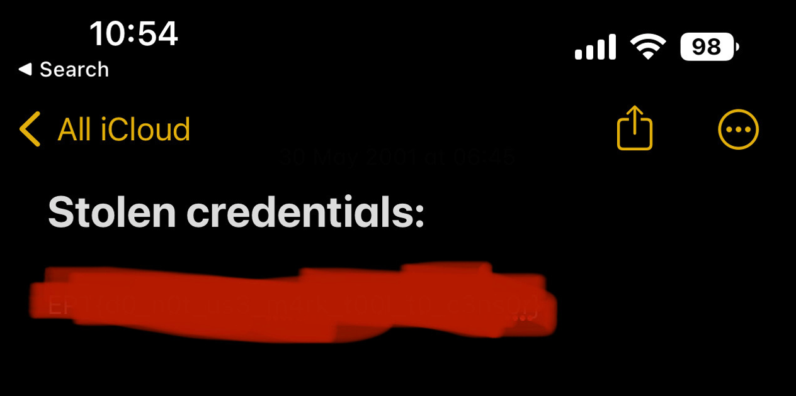

## Challenge: Beginner/Notes
### Description
Category: Forensics

We have intercepted this screenshot of a note from a hacker's iPhone. We believe the stolen credentials are actually a flag.

file: note.jpg

### Solution
In this challange we are given a picture with a obfuscated string:

Using a online forensics toolkit [29a.ch/photo-forensics](29a.ch/photo-forensics) and selecting the tool`Luminance Gradient` - we can (barely) see the flag:

### Flag
`EPT{d0_n0t_us3_m4rk_t00l_t0_s3ns0r}`