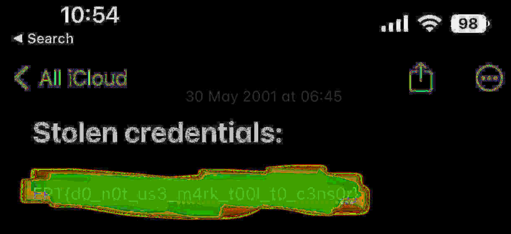

# Notes writeup 

For this challange we are given the following information as well as the file `note.jpg`
We have intercepted this screenshot of a note from a hacker's iPhone. We believe the stolen credentials are actually a flag.

# Solution

Using the site [StegOnline](https://stegonline.georgeom.net/image) and messing around with the options gives you this image:

From here you can simply read off the flag: ***`EPT{d0_n0t_us3_m4rk_t00l_t0_c3ns0r}`***
