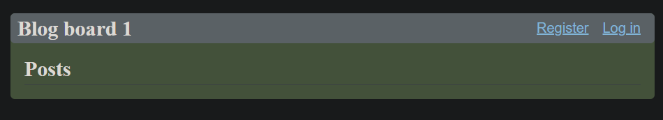
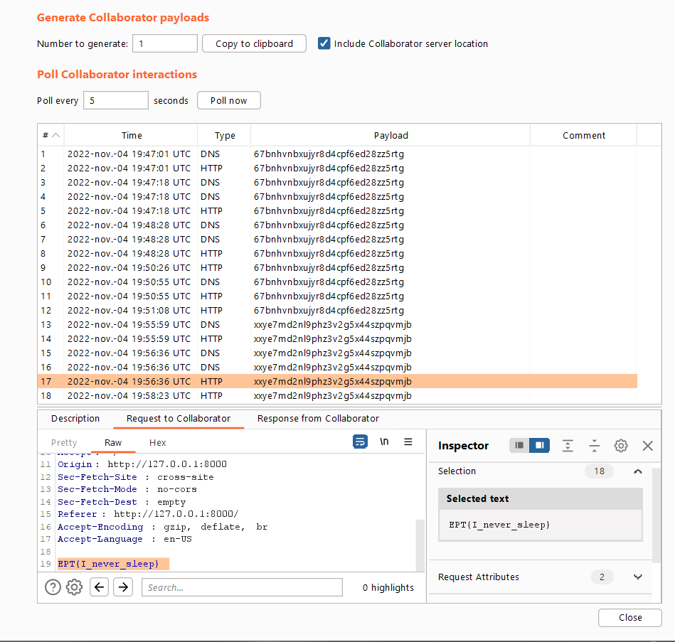

## Challenge: Beginner/blog
### Description
The admin is an avid reader of the blog. Allegedly, he logs in like every minute to check for any blog updates.

Ondemand Container:

io6.ept.gg:32838

### Solution
Visiting the address from the "Ondemand Container" - we are given a blog board, with the possiblility to read blog posts. We can also register users and submit our own posts. Knowing this, we guessed we had to use XSS in the website to get the flag, considering that we know that the admin reads the blog posts regularly - and we probably want to get his cookie. 

We register a random user "123:123", and make a new blog post containing a XSS-payload.
[portswigger has a lab on how to exploit XSS to steal cookies](https://portswigger.net/web-security/cross-site-scripting/exploiting/lab-stealing-cookies). In Burp Collaborator we generate a collaborator payload. "copy to clipboard" in Burp collaborator gives us a subdomain ("BURP-COLLABORATOR-SUBDOMAIN"), which we insert in the payload of the blog-post:

    

After a few seconds after we submitted the blog-post, we get "traffic" in the collaborator GUI:

As we can see in the picture above - in the tab "Request to Collaborator", we have the flag! 

### Flag
`EPT{I_never_sleep}`
