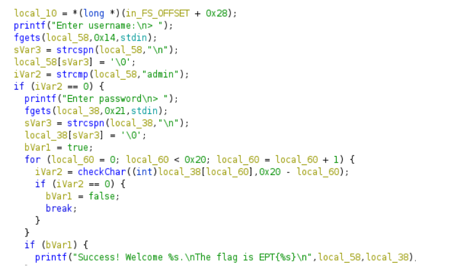
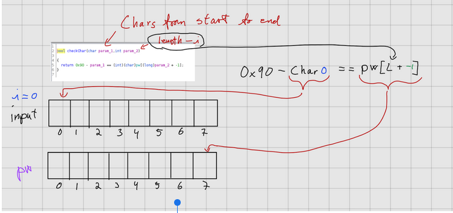
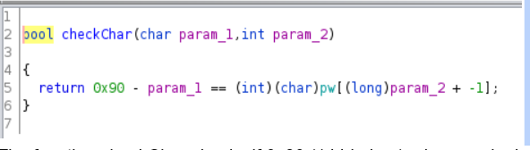
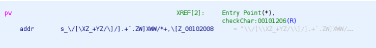
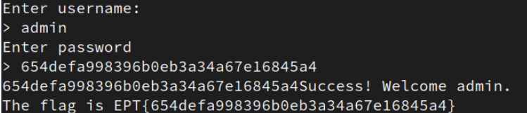

# Nop writeup

In this challenge we are given an executable file that we have to reverse engineer to find the flag. Upon attempting to run the file, it asks for a username and password, which at this current stage are both unknown

# Solution
We use [Ghidra](https://ghidra-sre.org/) to help us in this challange. Ghidra is a free open-source reverse engineering tool developed by the United States NSA recommended by the CTF organisers. We will be using its code analyzer to try to find clues that will bring us closer towards finding the flag.

We open Ghidra, create a project, open the code debugger, import the file and start an analysis. Now we have Ghidra’s interpretation of the machine code which we will assume is fairly accurate given this is a beginner challenge meant to be solved.

Along the left side of the program we search the functions and variables until we find the main function:



From the code we can conclude the username is admin, but the password is a different story. 




The function `checkChar` checks if 0x90 (144 in hex) minus each character of the password we enter from start to end is equal to the opposite sitting character of the pw variable. If this is not true, the program will stop. In short, we simply need to find the ASCII value which added to the password makes 144, and then flip the order. Convert this back into text, and we’ve got our flag. This is a simple equation with 1 unknown, as we can find the value of the pw variable in the assembly code:



ASCII value: `092 047 091 092 088 090 095 043 089 090 047 092 093 047 093 046 043 096 046 090 087 093 088 087 087 047 042 043 044 092 091 090 013 010`

We use this simple python script to solve the equation for us:

```python
pw_strings = ["092","047","091","092","088","090","095","043","089","090","047","092","093","047","093","046","043","096","046","090","087","093","088","087","087","047","042","043","044","092","091","090","013","010"]
pw_ints = ["092","047","091","092","088","090","095","043","089","090","047","092","093","047","093","046","043","096","046","090","087","093","088","087","087","047","042","043","044","092","091","090","013","010"]


for b in range(0,len(pw_strings)):
    pw_ints[b] = int(pw_strings[b])
        
pwlen = len(pw_ints) 

real_pw = ["092","047","091","092","088","090","095","043","089","090","047","092","093","047","093","046","043","096","046","090","087","093","088","087","087","047","042","043","044","092","091","090","013","010"]


for i in range(0, (pwlen)):
    real_pw[i] = 144 - pw_ints[33 - i]
    print(chr(real_pw[i]), end ="")
```

It spits out “654defa998396b0eb3a34a67e16845a4”, which turns out to be the password and part of the flag! 



***`EPT{654defa998396b0eb3a34a67e16845a4}`***


