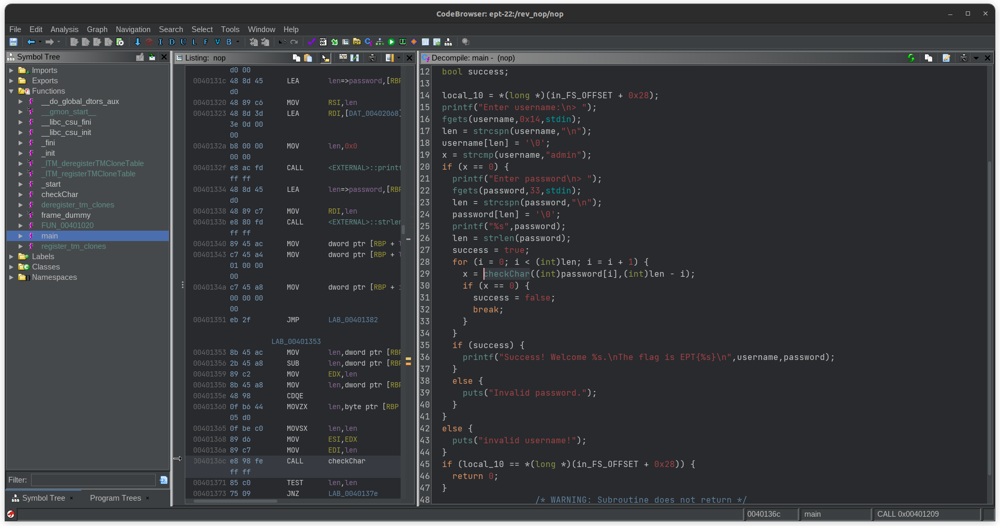
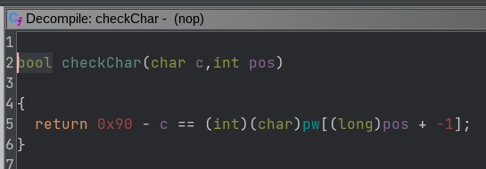
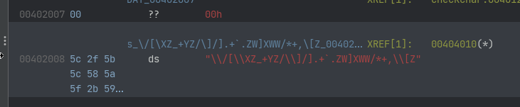
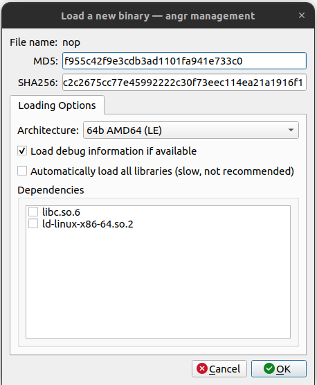
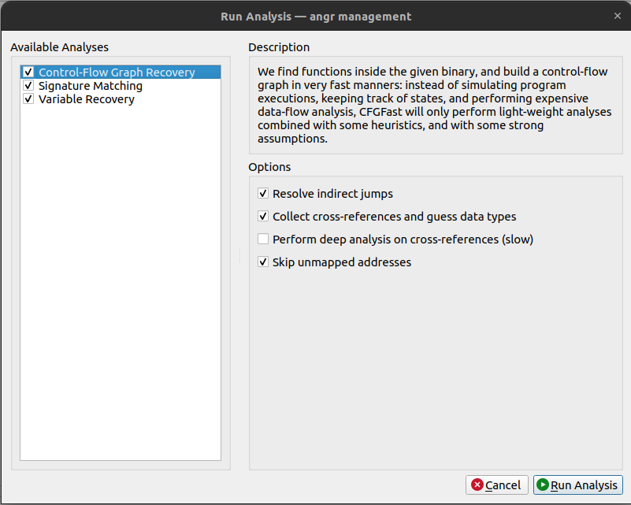
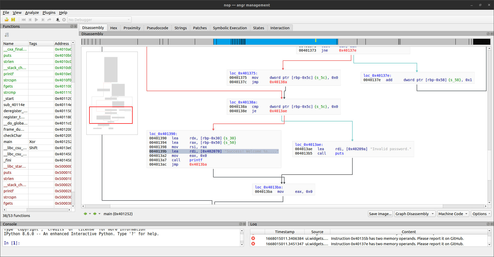
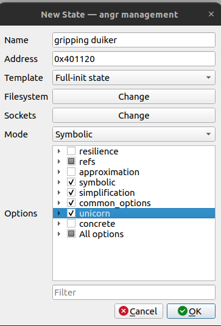

# rev/nop writeup by coldboots

## First inspection

Starting with `file nop` we see that it is a 64-bit ELF executable with debug symbols (not stripped). Running it gives us the following output:

```
nop: ELF 64-bit LSB pie executable, x86-64, version 1 (SYSV), dynamically linked, interpreter /lib64/ld-linux-x86-64.so.2, BuildID[sha1]=973a969499312fa79f6a7fda9e05105832fd5e05, for GNU/Linux 3.2.0, not stripped
```

## Reversing it in Ghidra

- If you don't already have Ghidra installed, you can download it from [here](https://ghidra-sre.org/) or the GitHub [repo](https://github.com/NationalSecurityAgency/ghidra). Note that the 10.5 version requires Java 17, so you might need to install that as well.
- Create or open a project in Ghidra.
- Personally, I like to create a new project for each CTF, and creating a folder for each challenge. This makes it easier to keep track of what I've done. I usually prefix the folder names the same way I organize the challenges on disk; with `rev_`, `pwn_`, `for_`, etc.
- _File_ -> _Import File_ -> _Import Binary File_.
- Select the `nop` binary.
- Double-click the `nop` binary to analyze it. For larger binaries, this may take a while.

### main() function



We see that the main function is pretty simple. It asks the user to input both a username, that has to equal `admin` for the program to continue, and a password, that is further checked in a loop that works over the `checkChar()` function.

### checkChar(char c, int pos) function



Further, when we inspect the `checkChar(char c, int pos)` function, we see that it is a simple equation; The current char `c` from the loop in `main()` is subtracted from 0x90, and then compared to a character at the position `pos - 1` in a global variable named `pw`.

## The pw global variable



We see that the `pw` global variable is 37 characters long, which is a bit odd, since the password is only 32 characters long.

## Solving it

Now, this is where we normally would write a solve script in plain Python, but we'd like to show a different way of solving it, that may be useful trick for beginners.

`angr`, a popular symbolic execution framework, can be used to solve this challenge, but we're doing it with a twist; we'll use `angr-management`, a GUI for `angr`.

At the time of writing/competing, the latest PyPi version of `angr-management` doesn't work (at least not under Python 3.10 / Ubuntu 22.04), so we'll have to install an older version.

The following commands will install and start angr-management:

```sh
-> python -m venv venv && source venv/bin/activate && pip install angr-management==9.2.21
...
-> angr-management &
```

- _File_ -> _Load a new Binary_ -> _Select the `nop` binary_.
- In the dialog that opens\*, you may choose to import the shared libraries the binary uses. This is not necessary, for the current challenge. Press _OK_.



- In the second dialog, _Run Analysis_, just press _Run Analsysis_.



- The main window should now look like this:



- Scrolling a bit down, we can see that the code branches at the result of the `checkChar()` function. We can see that the result is compared to 0, and if it is equal, the program will continue. If it is not equal, the program will exit with a failure.
- If all characters pass the check, the program will print the body of the flag, without the `EPT{}` part.
- First, we now right-click the `0040139b lea rdi, [0x402070] ; Success! ...` and choose _Find in execution_.
- Secondly, we right-click the `004013ae lea rdi, [0x40209a] ; Invalid password.` and choose _Avoid in execution_.
- Thirdly, to speed up the simulation, we right-click the `004012c5 lea rdi, [0x402044] ; "Invalid username!"` a bit further up, and choose _Avoid in execution_.
- It's now time to run a simulation, that will try to find a path that will lead to the `Success!` string. We locate the icon of a running man on the top bar, and press it -> _New simulation..._.


- The following dialog will show up:



- We choose the _Full-init state_ template, and check the `unicorn` option. We'' leave the rest of the options as they are. Press OK.
- The tab _Symbolic Execution_ should now show up. In the _SimulationManagers_ sidebar, choose _Settings_ and check the _Keep at most one active path_. This is equivalent with the `DFS` - Depth First Search - algorithm when scripting angr in Python.
- Flip back to the _General tab_.
- Press the _Explore_ button. Sit back and relax while you hear your CPU fan spin up.
- During the run, you will see that the _active_ states folder should contain a single state, while the _stashed_ folder should fluctuate, and the _deadended_ folder should grow.
- Finally, after some time, the _found_ folder should contain a single state. This is the state that we were looking for.

Inspecting the state in the _found_ folder, we change to the _File Descriptors_ tab, and scroll down to the _stdout_ file descriptor. It will have the following value:

```
admin\x00\x00\x00\x00\x00\x00\x00\x00\x00\x00\x00\x00\x00\x00654defa998396b0eb3a34a67e16845a4
```

The first part is the username, and the last part, starting with 654... is the correct password.

The flag is `EPT{654defa998396b0eb3a34a67e16845a4}`.

As a final note, it's worth mentioning that we could have done the initial analysis with `angr-management` as well.
