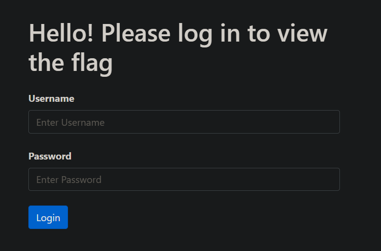
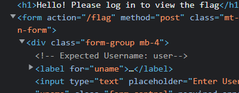
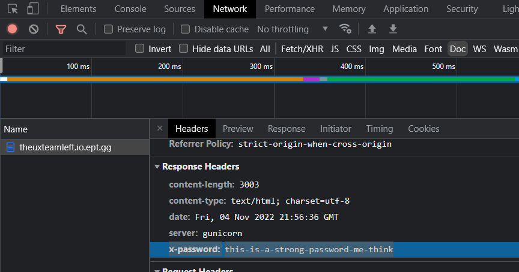
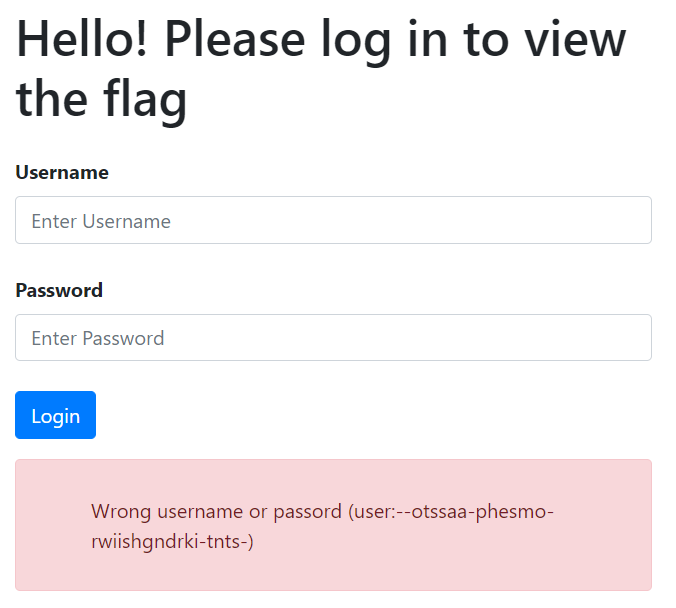
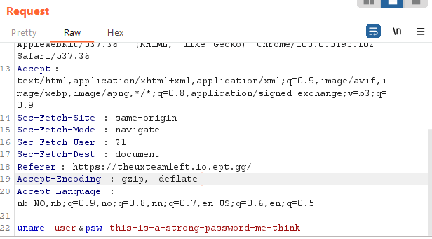
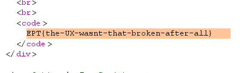

## Challange: Educational/Broken UX

### Description
Category: Web

Our UX team left us... can you get the flag? I think the team left the creds lying around before they were fired. Find the creds and log in to get the flag.

Site: theuxteamleft.io.ept.gg
### Solution
Entering the given site, we see this:

When checking the site's sourcecode, we find the username: user.

We also find ``<!-- Expected Password: This should be a secret, so it had to be hidden with the response headers-->`` - so we go to `inspect` -> `Network` and filter on docs. Then we can see the password: 

When trying to login with the credentials we found, `user` and `this-is-a-strong-password-me-think`, we can see that the webpage shuffles the sequence of the letters of the given password.

The login button is also moving around when trying to push it, but being fast solves this. :D

But to get around the shuffling of the password, we manually enter the username and password in the HTTP-request using BurpSuite:

This bypasses the client-side shuffling and in the response in we get the flag!  

### Flag
`EPT{the-UX-wasnt-that-broken-after-all}`
