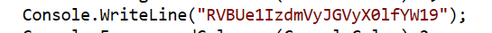

## Challenge: Educational/Console Pew
### Description
Complete level 1 for epic loot

You might know that C# is a high level programming language and that it uses a combination of static and JIT compilation. This means that the code is compiled down to bytecode.

Decompilation is the reverse of compilation. You have an executable file, .dll, .exe…, and with a tool (decompiler) you get the original source code (in other words, the compiled code is converted into readable source code).

There are various tools that can reliably decompile .NET assemblies into equivalent C# or IL code. Two examples being dnSpy and dotPeek

### Solution
Looking at the source code with dotpeek we find the base64 encoded flag in the win condition of the program.  

### Flag
`EPT{R3ver$er_I_am}`
