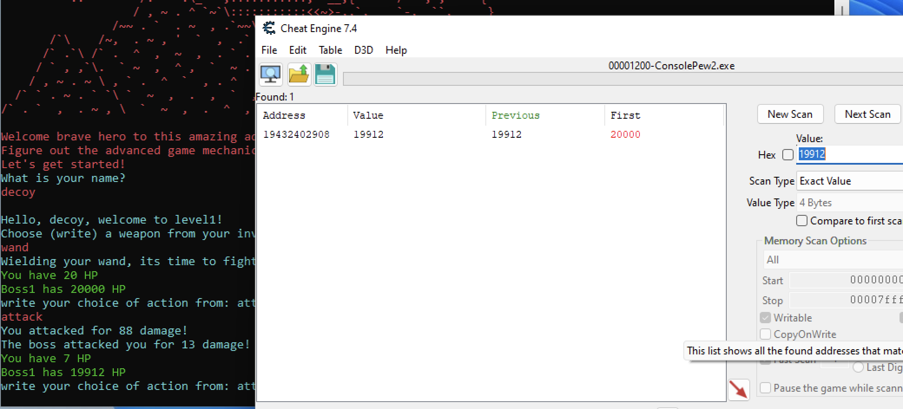
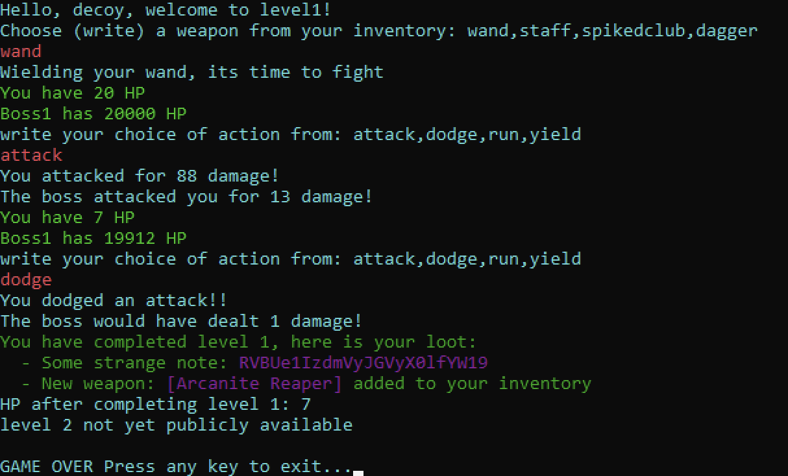

# Console Pew

I did this with the description and file from Beginner/ConsolePew2, so I missed the hints in Educational/ConsolePew. The flag is the same though, and the same method is verified for ConsolePew.exe.

Loaded CheatEngine and searched for the boss score (20000). Then did some damage to the boss to get a new number I could search for:

Set the boss score to 0 and dodged:

The flag was base64 encoded: `EPT{R3ver$er_I_am}`

Reading the flag I realized that this wasn't the intended solution ;)
