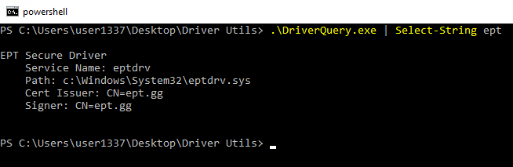
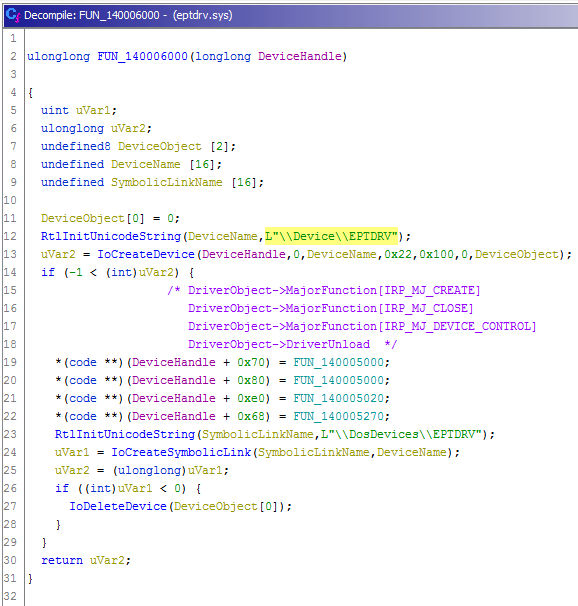
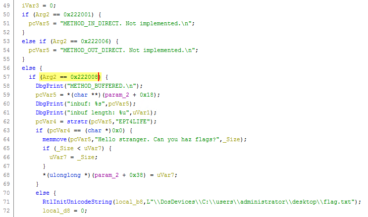
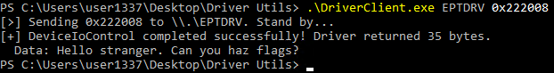
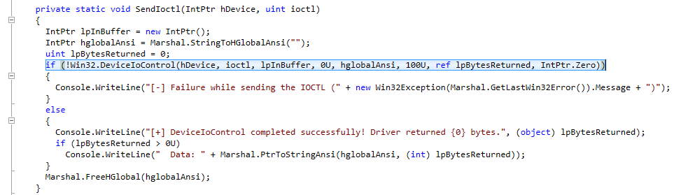
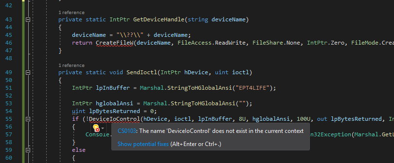
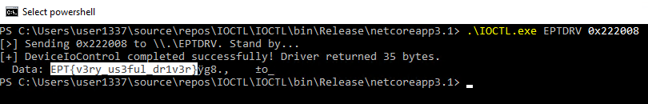

# Drive To Survive S01

Author: [FoxMaccloud](https://github.com/FoxMaccloud/)
Website: [Foxmaccloud.com](https://foxmaccloud.com/)

## Description

Drive To Survive S01 is a challenge where the box has a driver called `EPTDRV` in the kernel. We can communicate with this driver using IOCTL. Given the right dwIoControlCode and right input passed along the control code, the driver will give us back the flag.

## Analysis

Connecting to the box, we are given a folder containing some binaries
```
Driver Utils
├──DriverClient.exe
└──DriverQuery.exe
```
DriverQuery.exe enumerates driver services and DriverClient.exe attemtps to communicate with a driver given the symlink.



Opening eptdrv.sys in Ghidra, we find our symlink and we can find our IOCTL codes.



In the IRP_MJ_DEVICE_CONTROL function, we find our presumed ioctl codes. Only `0x222008` looks to be implemented, and references the flag.


Using the DriverClient we can attempt to provide this symlink and IOCTL code.



Looking closer at the code, we see that we only hit the flag if pcVar5 contains `EPT4LIFE`.


pcVar5 in this context is the AssociatedIrp and can be passed along with DeviceIoControl.

## Making our own client

Decompiling the DriverClient, we see that the DriverClient doesn't have an option to pass along this string. We can attempt to modify it and make our own client passing along the EPT4LIFE string. We pass along the string using `DeviceIoControl` where we send out control code to the driver. This call takes an argument `lpInBuffer` where we pass along a pointer to the input buffer that contains the data required to perform the operation and `lpInBuffer`, which is the size of the buffer in bytes.



When attempting to compile, it will complain that it doesn't know `CreateFileW` and `DeviceIoControl`.



To fix this we need to import these extern functions.


We can now attempt to build our script and run it like we did earlier.




## IOCTL.cs

```cs
// Decompiled with JetBrains decompiler
// Type: DriverClient.Program
// Assembly: DriverClient, Version=1.0.0.0, Culture=neutral, PublicKeyToken=null
// MVID: D3BBE6B9-5530-4718-A4A0-0E5F6EC31598
// Assembly location: C:\Users\user1337\Desktop\Driver Utils\DriverClient.exe

using System;
using System.ComponentModel;
using System.IO;
using System.Runtime.InteropServices;

namespace DriverClient
{
    internal class Program
    {
        public static string usage = "Usage: DriverClient.exe <symlink_name> <ioctl>";

        private static void Main(string[] args)
        {
            if (args.Length < 2)
            {
                Console.WriteLine(Program.usage);
            }
            else
            {
                string deviceName = args[0];
                uint uint32 = Convert.ToUInt32(args[1], 16);
                IntPtr deviceHandle = Program.GetDeviceHandle(deviceName);
                if (deviceHandle == IntPtr.Zero)
                {
                    Console.WriteLine("[-] Couldn't get a handle on " + deviceName);
                }
                else
                {
                    Console.WriteLine("[>] Sending 0x" + uint32.ToString("X4") + " to \\\\.\\" + deviceName + ". Stand by...");
                    Program.SendIoctl(deviceHandle, uint32);
                }
            }
        }

        [DllImport("kernel32.dll", CharSet = CharSet.Unicode, SetLastError = true)]
        static extern IntPtr CreateFileW(
             [MarshalAs(UnmanagedType.LPWStr)] string filename,
             [MarshalAs(UnmanagedType.U4)] FileAccess access,
             [MarshalAs(UnmanagedType.U4)] FileShare share,
             IntPtr securityAttributes,
             [MarshalAs(UnmanagedType.U4)] FileMode creationDisposition,
             [MarshalAs(UnmanagedType.U4)] FileAttributes flagsAndAttributes,
             IntPtr templateFile
            );

        [DllImport("kernel32.dll", ExactSpelling = true, SetLastError = true, CharSet = CharSet.Auto)]
        static extern bool DeviceIoControl(
            IntPtr hDevice, uint dwIoControlCode,
            IntPtr lpInBuffer, uint nInBufferSize,
            IntPtr lpOutBuffer, uint nOutBufferSize,
            out uint lpBytesReturned, IntPtr lpOverlapped
            );

        private static IntPtr GetDeviceHandle(string deviceName)
        {
            deviceName = "\\??\\" + deviceName;
            return CreateFileW(deviceName, FileAccess.ReadWrite, FileShare.None, IntPtr.Zero, FileMode.Create, FileAttributes.Normal, IntPtr.Zero);
        }

        private static void SendIoctl(IntPtr hDevice, uint ioctl)
        {
            IntPtr lpInBuffer = Marshal.StringToHGlobalAnsi("EPT4LIFE");
            IntPtr hglobalAnsi = Marshal.StringToHGlobalAnsi("");
            uint lpBytesReturned = 0;
            if (!DeviceIoControl(hDevice, ioctl, lpInBuffer, 8U, hglobalAnsi, 100U, out lpBytesReturned, IntPtr.Zero))
            {
                Console.WriteLine("[-] Failure while sending the IOCTL (" + new Win32Exception(Marshal.GetLastWin32Error()).Message + ")");
            }
            else
            {
                Console.WriteLine("[+] DeviceIoControl completed successfully! Driver returned {0} bytes.", (object)lpBytesReturned);
                if (lpBytesReturned > 0U)
                    Console.WriteLine("  Data: " + Marshal.PtrToStringAnsi(hglobalAnsi, (int)lpBytesReturned));
            }
        }
    }
}
```

#### Flag

> EPT{v3ry_us3ful_dr1v3r}