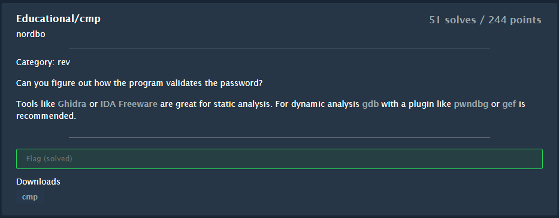
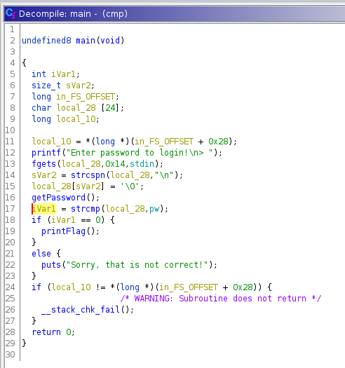
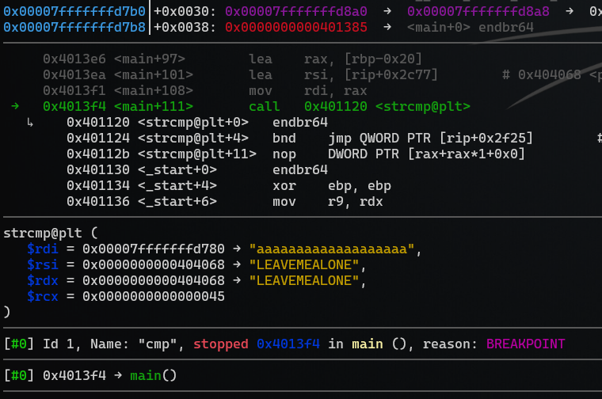

# Educational/cmp

> Author: [@hagronnestad](https://github.com/hagronnestad)
> 
> This writeup is also available as a webpage here: [https://heinandre.no/ctf-equinor-22/educational-cmp/](https://heinandre.no/ctf-equinor-22/educational-cmp/)




- [Educational/cmp](#educationalcmp)
  - [Reversing](#reversing)
  - [Solving in `gdb`](#solving-in-gdb)
  - [Solving with `ltrace`](#solving-with-ltrace)
  - [Flag](#flag)

## Reversing

Let's have a quick look with `checksec`:

```
$ checksec cmp
[*] '/home/hag/ctf-equinor-22/Educational-cmp/cmp'
    Arch:     amd64-64-little
    RELRO:    Partial RELRO
    Stack:    Canary found
    NX:       NX enabled
    PIE:      No PIE (0x400000)
```

Then we import the executable into `ghidra` and have a look at the decompiled `main`-method:



We see that we have a simple `strcmp` that needs to succeed.

We could look up `pw` in `ghidra`, but we need to tell `ghidra` to treat the `pw`-pointer as a `char`-array to see the string in clear text. I'm not very good in `ghidra` so let's look at a couple of other methods we can use.

## Solving in `gdb`

Let's load the executable in `gdb` and set a breakpoint on the `strcmp`-call:

```bash
$ gdb cmp

gef➤  disas main
Dump of assembler code for function main:
# ...abbreviated
   0x00000000004013e1 <+92>:    call   0x401216 <getPassword>
   0x00000000004013e6 <+97>:    lea    rax,[rbp-0x20]
   0x00000000004013ea <+101>:   lea    rsi,[rip+0x2c77]
   0x00000000004013f1 <+108>:   mov    rdi,rax
   0x00000000004013f4 <+111>:   call   0x401120 <strcmp@plt>
   0x00000000004013f9 <+116>:   test   eax,eax
# ...abbreviated
End of assembler dump.

gef➤  b *0x00000000004013f4
Breakpoint 1 at 0x4013f4

gef➤  r
Starting program: /home/hag/ctf-equinor-22/educational-cmp/cmp
Enter password to login!
> aaaaaaaaaaaaaaaaaaaaa
```

We get the follwing information when we hit the breakpoint:



As we can see, a simple breakpoint on the `strcmp`-call let's us easily see the strings that are compared in clear text. The password is `LEAVEMEALONE`.

## Solving with `ltrace`

Let's run the program using `ltrace ./cmp`:

```bash
$ ltrace ./cmp
printf("Enter password to login!\n> "Enter password to login!) = 27
fgets(> aaaaaaaaaaaaaaaaaaa
"aaaaaaaaaaaaaaaaaaa", 20, 0x7fd2905ba9a0)                     = 0x7ffd7aa7e6b0
strcspn("aaaaaaaaaaaaaaaaaaa", "\n")                           = 19
strlen("\222\350\201\210\233\340\205\237\222\342\216\233")     = 12
strcmp("aaaaaaaaaaaaaaaaaaa", "LEAVEMEALONE")                  = 21
puts("Sorry, that is not correct!"Sorry, that is not correct!
)                                                              = 28
+++ exited (status 0) +++
```

Again, we can easily see the password in clear text.

## Flag

```bash
$ ./cmp
Enter password to login!
> LEAVEMEALONE
EPT{228dea3beade02d907a77af1c622e18a}
```
