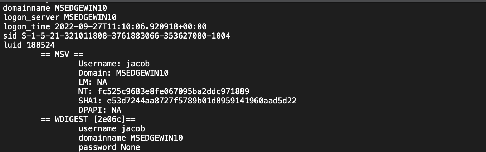
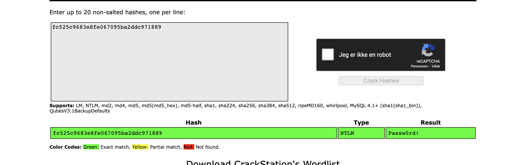

# Forensics/Never Gonna Give You Up (23 solves / 403 points) 

by *Roellik* for *coldboots*

---

More forensics!

# Description

`Techarisma Chapter 3/7
It seems that the threat actor have been utilizing their admin privileges to mess with protected processes. We found a dump file on a compromised system. What could they have got out of this?`

`Our insider was able to provide us with a custom password wordlist that we suspect was used in this attack.`

# Intro

It looks like Jacob the poor sod is still having coomputer issues. He's lucky to have friends like us, but I'd say he's starting to owe us a favor at this point.

The challenge provides the file `lsass.DMP` and a `wordlist.txt` containing exactly 100 000 lines of seemingly random garbage wrapped in the `EPT{}` flag format. It's natural to assume that one of them is the correct flag. Knowing how much money Equinor spent on infrastructure this year, we can simply hook the CTF API and try them all, which should take less than two minutes with 1000 requests a second. 

Start by importing the `requests` library in Python.

... alright, let's not do that. 

This is a pretty typical introductory CTF and cyber security challenge. `lsass.exe` is the file that handles login verification for Windows systems. By dumping it, we gain access to the NTLM hashes that the correct password for a user is checked against. Since Jacob has been kind enough to take a dump for us (hehe), we simply need to extract the hashes.

The most common tool for this job is `mimikatz`, which also has a very user fiendly (albeit a bit feature light) implementation in Python called [pypykatz](https://github.com/skelsec/pypykatz) that should be up for the job. Point the latter towards the file with the command `pypykatz lsa minidump lsass.DMP > lsass_dump.txt` to receive a neatly structured overview of the different login sessions.

The NTLM password hash is stored in the "LM" field, as shown for jacobs user above. We can probably assume that he knows his own password, but let's check the hash against a database like [Crackstation](https://crackstation.net/) to be sure.

So we found the password corresponding to the hash - sadly it's the cookie cutter `Passw0rd!`. Walking through the file we can see that `IEuser`'s hash is identical. However the suspicious `SAmaintenenace` has a unique one, and it doesn't give any matches on Google or in the major password databases. 

Could it be that `SAmaintenance`'s password corresponds to the correct flag? Let's race through the provided `wordlist.txt` and see! 

`Hashcat` is usually the prefered tool for cracking hashes, but since NTLM is fast to iterate with and we only have 100 000 lines to go through, `John the Ripper` with it's faster syntax is more than good enough. So let's dump the hash to its own file and get started.

John has a tendency to mix up similar hashes and we know the format, so define it strictly both for cracking and showing the result with `--format=NT`. 

And bingo was his name-o! 

## Flag 

`EPT{h5otWWUeQ9Brc1KAkMVx}`

Thanks a lot to EPT and Equinor for the great challenges, good company, an absolutely amazing onsite event and keeping the CTFtime second place nice and warm for us before we snatch it back!