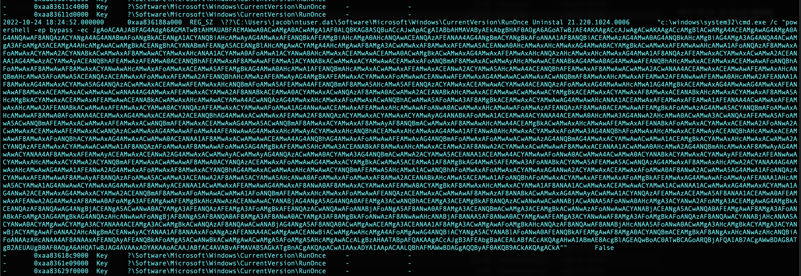
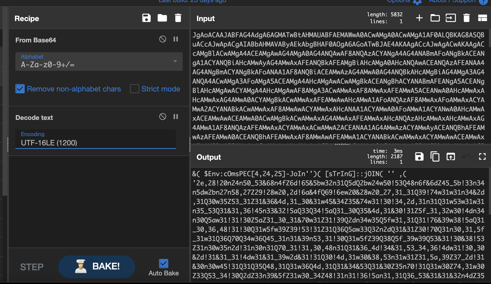
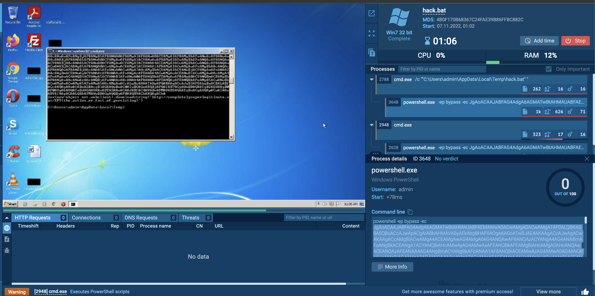

# Forensics/Never Gonna Give You Up (6 solves/480 points) 

by *Roellik* for *coldboots*

---

Since I suffered severe brain trauma from sitting too close to the speakers during Scooter's enthralling fire challenge anthem at the onsite, which again led me to spend fruitless hours on the ... beautiful IQ puzzle, I sadly ran out of time before I got properly started with this challenge. 

But I love memory forensics and Volatility, and decided to spend my hung over Sunday trying to recreate a solution for educational and aforementioned brain damage related reasons. 

# Description

`Techarisma Chapter 5/7
We have collected a memory dump of Jacob's compromised system. Can you find out how the attackers have planned to come back in case they lost access?`

# The Start of Your Ending (41st Side)

So, the entry point is a 5,4GB memory dump. Judging from the brief we're looking for traces of a persistence mechanism to allow attackers continued access to the compromised computer. I typically start these challenges by firing up either Volatility 2 or 3 and doing some initial recon to get a sense of what's happening on the computer. Since Vol 2 struggled finding a ready made profile while 3 ate it just fine, I decided on the latter.

After checking running processes (`vol -f memdump.raw windows.pslist`), the command history (`windows.cmdline`), some quick searches through the file system for interesting extensions like .txt, .ps1, .bat (`windows.filescan`),  and getting an overview of the network (`windows.netscan`), I was no wiser. The malfind plugin (`windows.malfind`) only returned common false positives, as did Didier Stevens' brilliant [1768.py](https://github.com/DidierStevens/DidierStevensSuite/blob/master/1768.py) script for identifying Cobalt Strike beacons. 

Alright, so someone's been hiding their traces well. Time to really delve under the hood to see what's happening on poor Jacob's computer. At this point I would typically use Volatility 2's excellent plugins Autoruns and Winesap, both checking for autorunning processes. Since I didn't have the correct Vol 2 profile and little time to generate my own, I decided on going manual. 

 `windows.registry.printkey --recurse > reggae.txt` will recursively print out as much of the registry as it can and save it to a (pretty massive) file. Despite some real effort grep-ing for fragments of the flag in both ASCII, hex and Base64, fishy URLs, suspicious processes like Ruby, Python or Powershell scripts and other anomalies, I was at a loss. 

# Keep It Thoro

So, Volatility's key features are just additional heuristical Python scripts and it's easy for something to slip past their parsing, especially with something as massive and fragmented as the Windows registry. Thus, manually sifting through our reggae.txt file would both be extremely labor intensive and possibly fruitless. Since any clear signs of malicious persistance would be revealed by our tentative recon, it's very plausible that it's simply hidden in a (for Volatility 3) blind spot in the registry. 

This is where we tighten our approach a bit. Hivescan didn't reveal any very on the nose custom registry keys, so it's fair to assume that our secret is hidden in a default key. [Doing a bit of research](https://www.cyborgsecurity.com/cyborg-labs/hunting-for-persistence-registry-run-keys-startup-folder/) will reveal some of the most common paths, and they should be of a managable size to parse by hand with (`vol -f memdump.raw windows.registry.printkey --key <path> --recurse`). 

And eureka! `\Software\Microsoft\Windows\CurrentVersion\RunOnce` gives a very suspicious response. 

# Give Up The Goods

So apparently an extensive bit of encoded Powershell is ran at start-up with the bypass command. Doesn't seem very well-mannered to me. Let's deobfuscate it a bit in CyberChef to get an idea of what it does.

Bah. This looks like a hassle to break up by hand, and MacOS' Powershell refused to run it due to local Windows specific references. Luckily there are some great, free Windows sandboxes like App.any.run that we can experiment with to see if dynamic analysis reveals interesting network traffic, new files or similar.

Let's gather the core part of the ominous payload and save it to hack.bat, so we can download and run it directly on App.any.run. On the first try the window simply closes, but by accessing cmd and going to C:\Users\admin\AppData\Local\Temp we can just smash it again. 

And what do you know - a flag pops out!

## Flag 
`EPT{the_action_or_fact_of_persisting}`

Thanks a lot to EPT and Equinor for the great challenges, good company, an absolutely amazing onsite event and keeping the CTFtime second place spot nice and warm for us before we snatch it back!