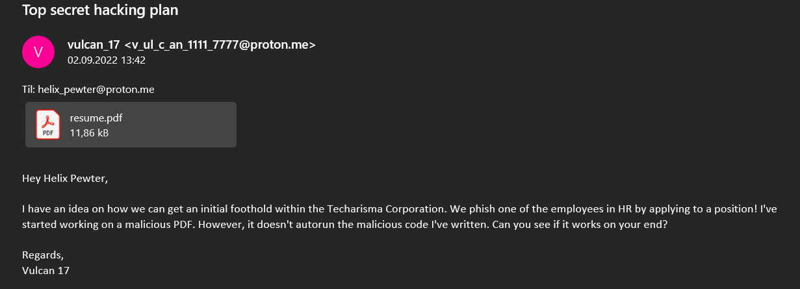
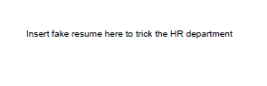
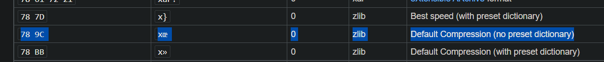
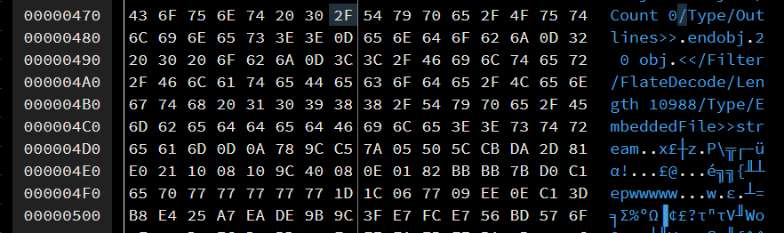
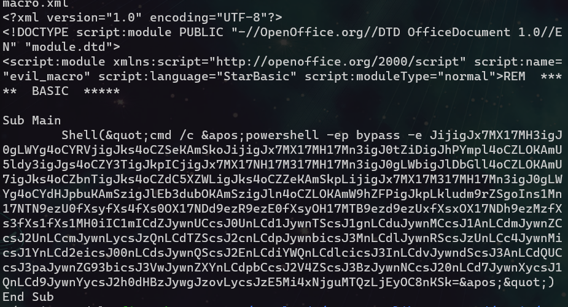
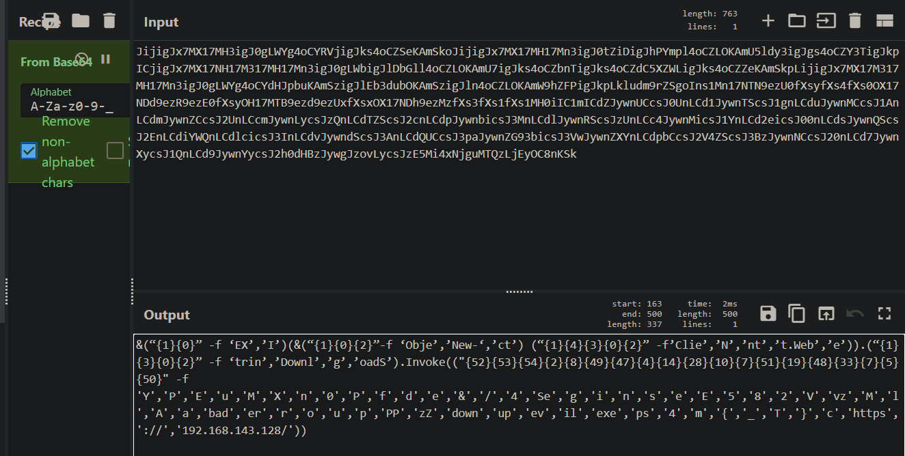
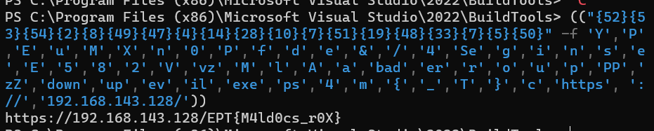

## Challenge: Forensics/Pretty Document File
### Description
Techarisma Chapter 1/7
One of our Offensive Operations guys is on the inside of the hacking crew Haxquad. He has compromised one of them and extracted an email. Seems like they are working on something new. Can you take a look and see if you can find anything interesting?

Downloads:  
Top secret hacking plan.eml

### Solution
The file we are given is a `.eml` file, which is an email-file. Opnening this , gives us an email with an attached pdf-file.

We open the pdf-file, and see this: 

There is probably something hidden inside the pdf-file. 
By opening the file in [hexed.it](hexed.it), we can look for abnormalities in the file. In the beginnging of the file, everything is readable. We find the plaintext strings from the pdf, but some lines later the text is unreadable. Considering that the pdf-file does not contain any images or other files than text - this can be something to look more into. By looking at the hex-values, we can see something that looks like a zlib-file:

By deleting everything before `78 9C` - and saving the rest as a zlib-file, we are able to decompress the file and get more files! 

By looking through the files, we find a file that looks very suspect: `evil_macro.xml`.

Reading the file, we find something that looks like a powershell-script when decoded with base64:

The script has letters and words in shuffled order.
If we copy everything from "{52}" and after - and run it in powershell - the sequence is corrected and we get the flag!

### Flag
`EPT{M4ld0cs_r0X}`
