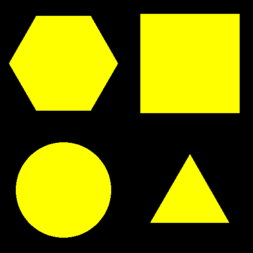

# Lets play a game
The task is to correctly identify shapes in an image recieved as base64:

The [script](./solve.py) split the picture in four and identify each part by counting pixels on the two first colored lines:
* Only one colored pixel = triangle
* Equal amount of pixels = rectangle
Then I just picked a percentage threshold for circle/hexagon that seemed to work.

Some cursing and dirty script modification ensued when they introduced a level two with colored objects, but eventually the script was robust enough to get the flag.
