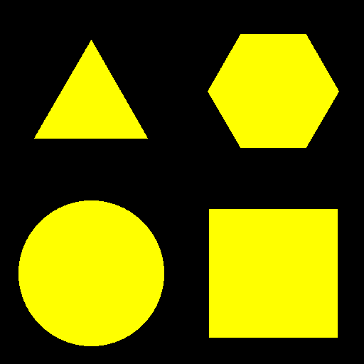
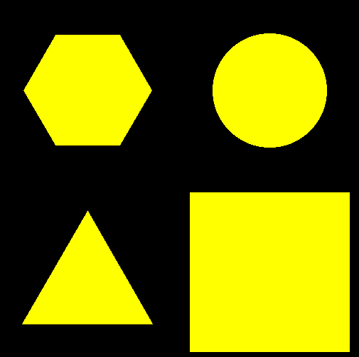
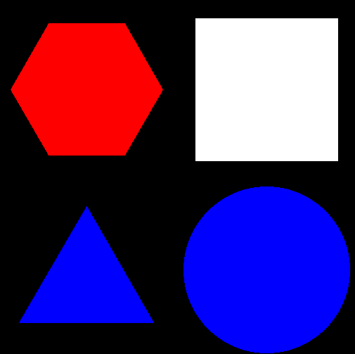

## Challenge: Misc/Lets play a game and Misc/Lets play harder
### Description
Do you prefer if/else of ML, or is it just the same to you?
nc io.ept.gg 30047


### Solution

Connecting to `io.ept.gg 30049` we are greeted with a picture of four shapes and a question about the location of these shapes. 

`Where is the triangle (['nw', 'ne', 'sw', 'se'])?`


Using python we can use the OpenCV library to detect the shapes using Machine Learning. There are many scripts online on how to use OpenCV to detect shapes in images, for example: [https://www.geeksforgeeks.org/how-to-detect-shapes-in-images-in-python-using-opencv/](https://www.geeksforgeeks.org/how-to-detect-shapes-in-images-in-python-using-opencv/).


In [CV2](https://opencv.org/) we can use the use the function `findContours()` to find the given image's contours, and then we use `approxPolyDP()` to find the number of corners in a shape. Knowing the number of corners we can approximate a shape, e.g triangle=3.

For `findContours()` to work we must use a black and white (binary) image with it. Therefore we use the `cvtColor()` function to first convert the RGB image to grayscale. Then we use the `threshold()` function to convert the grayscale image into binary with only the values, 0 and 255.

Having the number of corners of each shape from `approxPolyDP()`, we just use if-else to detect the shapes. When we have detected the correct shapes we use the function `getCorner(x, y)` to store the location of each shape in a dictionary. 

```python
# This function gets the location of the current x, y pixel coordinates
def getCorner(x, y):
    if x < 250:
        if y < 250:
            return "nw"
        else:
            return "sw"
    else:
        if y < 250:
            return "ne"
        else:
            return "se"
```

```python
 # Detect shapes
    gray = cv2.cvtColor(img, cv2.COLOR_BGR2GRAY) # Convert image to grayscale
    thresh = cv2.threshold(gray, 0, 255, cv2.THRESH_BINARY + cv2.THRESH_OTSU)[1] # Convert image to binary
    ROI_number = 0
    cnts = cv2.findContours(thresh, cv2.RETR_EXTERNAL, cv2.CHAIN_APPROX_SIMPLE)
    cnts = cnts[0] if len(cnts) == 2 else cnts[1]
    for cnt in cnts:
        approx = cv2.approxPolyDP(cnt, 0.01 * cv2.arcLength(cnt, True), True) # Count corners
        
        # Draw borders around each shape
        cv2.drawContours(img, [cnt], 0, (0, 0, 255), 5)
        M = cv2.moments(cnt)
        if M["m00"] != 0.0:
            x = int(M["m10"] / M["m00"])
            y = int(M["m01"] / M["m00"])
        if len(approx) == 3:
            shapes[getCorner(x, y)] = "triangle"
        elif len(approx) == 4:
            shapes[getCorner(x, y)] = "rectangle"
        elif len(approx) == 6:
            shapes[getCorner(x, y)] = "hexagon"
        else:
            shapes[getCorner(x, y)] = "circle"
        
        # Save new image with drawn contours 
        # cv2.imwrite('./new_shapes.png', img)
        
    return shapes, img, colors
```
 
  


In level 2 of this challenge we also needed to deal with the color of the shapes. A problem we struggled with was that CV2 found it hard to convert some colored shapes in the image to binary correctly. Therefore it didn't detect all shapes.   

We solved this by first finding the color of each shape, and then we changed the colors of the image to black and white before passing it to cv2. Using the library [webcolors](https://webcolors.readthedocs.io/en/1.12/faq.html) we easily created the dictionary of location->color pairs with the `rgb_to_name()` function.

```python
    # Get colors from all the shapes and add it to the relevant shapes
    (b, g, r) = img[125, 125]
    colors["nw"] = rgb_to_name((r, g, b))
    (b, g, r) = img[125, 375]
    colors["ne"] = rgb_to_name((r, g, b))
    (b, g, r) = img[375, 125]
    colors["sw"] = rgb_to_name((r, g, b))
    (b, g, r) = img[375, 375]
    colors["se"] = rgb_to_name((r, g, b))
```

```python
    # If we are in level 2 -> change all the colours of the shapes to white
    if counter > 199:
        for x in range(500):
            for y in range(500):
                (b, g, r) = img[x, y]
                if (r, g, b) != (0, 0, 0):
                    img[x, y] = (255, 255, 255)
```

Having done this we now have two dictionaries, `colors = {}` and `shapes = {}`.   
We now find what location is the same for both dictionaries depending on the question asked:

```python
    # Returns possible locations of both the shape dict and color dict, based on the question
    possibleShapes = [k for k, v in shapes.items() if v == shape]
    possibleColors = [k for k, v in colors.items() if v == color]
    # Checks what location is the same in possible locations of both shapes and colors
    for pos in possibleShapes:
        if pos in possibleColors:
            ans = pos
```
  
(ex. `Where is the red triangle (['nw', 'ne', 'sw', 'se'])?`)  


Lastly we just interact with the program using [pwntools](https://docs.pwntools.com/en/stable/intro.html) to receive questions and send our answer.

Starting "Level 3" gives ut the flag: 
```
[*] Switching to interactive mode
LEVEL 3
FLAG: EPT{2b3a1b85-abcd-4216-ba56-f3323180a918}
```

#### The full code

```python
from pwn import *
from base64 import b64decode
import cv2
import numpy as np
from matplotlib import pyplot as plt
from webcolors import rgb_to_name
# Connect to program
p = remote("io.ept.gg", 30049)
# This function gets the location of the current x, y pixel coordinates
def getCorner(x, y):
    if x < 250:
        if y < 250:
            return "nw"
        else:
            return "sw"
    else:
        if y < 250:
            return "ne"
        else:
            return "se"
# Counter variable to know what level we are on
counter = 0
# This is the main function for finding shapes in images
def findShapes(tmp):
    shapes = {}
    colors = {}
    # Save the current image to be processed
    with open("shapes.png", "wb") as file:
        file.write(tmp)
    # Read the image in to cv2 library
    img = cv2.imread("./shapes.png")
    # Get colors from all the shapes and add it to the relevant shapes
    (b, g, r) = img[125, 125]
    colors["nw"] = rgb_to_name((r, g, b))
    (b, g, r) = img[125, 375]
    colors["ne"] = rgb_to_name((r, g, b))
    (b, g, r) = img[375, 125]
    colors["sw"] = rgb_to_name((r, g, b))
    (b, g, r) = img[375, 375]
    colors["se"] = rgb_to_name((r, g, b))
    # If we are in level 2 -> change all the colours of the shapes to white
    if counter > 199:
        for x in range(500):
            for y in range(500):
                (b, g, r) = img[x, y]
                if (r, g, b) != (0, 0, 0):
                    img[x, y] = (255, 255, 255)
    # Do amazing machine learning to detect shapes
    gray = cv2.cvtColor(img, cv2.COLOR_BGR2GRAY) # Convert image to grayscale
    thresh = cv2.threshold(gray, 0, 255, cv2.THRESH_BINARY + cv2.THRESH_OTSU)[1] # Convert image to binary
    ROI_number = 0
    cnts = cv2.findContours(thresh, cv2.RETR_EXTERNAL, cv2.CHAIN_APPROX_SIMPLE)
    cnts = cnts[0] if len(cnts) == 2 else cnts[1]
    for cnt in cnts:
        approx = cv2.approxPolyDP(cnt, 0.01 * cv2.arcLength(cnt, True), True)
        
        # Draw border around the shapes
        # cv2.drawContours(img, [cnt], 0, (0, 0, 255), 5)
        M = cv2.moments(cnt)
        if M["m00"] != 0.0:
            x = int(M["m10"] / M["m00"])
            y = int(M["m01"] / M["m00"])
        if len(approx) == 3:
            shapes[getCorner(x, y)] = "triangle"
        elif len(approx) == 4:
            shapes[getCorner(x, y)] = "rectangle"
        elif len(approx) == 6:
            shapes[getCorner(x, y)] = "hexagon"
        else:
            shapes[getCorner(x, y)] = "circle"
            
        # Save new image with drawn contours 
        # cv2.imwrite('./new_shapes.png', img)
    return shapes, img, colors
# Interact with the program until it sends us the image
p.recvuntil("ready?")
p.sendline("yes")
# LEVEL 1
# Loop through and answer 200 questions
for i in range(200):
    # Get image of shapes and save the question
    p.recvline()
    spm = p.recvline()
    shape = spm.split()[3].decode()
    # Run findShapes() on the image and return a dict of {"location": "shape"} pairs
    b_64 = p.recvline().strip().decode()
    tmp = b64decode(b_64)
    shapes, img, colors = findShapes(tmp)
    # Get the answer to the question of the location (If spm=triangle this returns location sw)
    ans = list(shapes.keys())[list(shapes.values()).index(shape)]
    # Send answer to program
    p.sendline(ans)
    counter += 1
    print(i, spm, shapes, colors, ans)  # Print debug information
# LEVEL 2
p.recvline()
print("#############\nlevel 2\n################")
for i in range(200):
    # Get shapes and colors from question
    p.recvline()
    spm = p.recvline()
    color = spm.split()[3].decode()
    shape = spm.split()[4].decode()
    # Gets dict of {"location": "shape"} pairs and {"location": "color"} pairs
    b_64 = p.recvline().strip().decode()
    tmp = b64decode(b_64)
    shapes, img, colors = findShapes(tmp)
    # Returns possible locations of both the shape dict and color dict, based on the question
    possibleShapes = [k for k, v in shapes.items() if v == shape]
    possibleColors = [k for k, v in colors.items() if v == color]
    # Checks what location is the same in possible locations of both shapes and colors
    for pos in possibleShapes:
        if pos in possibleColors:
            ans = pos
    # Send answer
    p.sendline(ans)
    print(i, spm, shapes, colors, ans)  # Debug information
p.interactive()  # Get the flag
```

### Flag
`EPT{2b3a1b85-abcd-4216-ba56-f3323180a918}`
