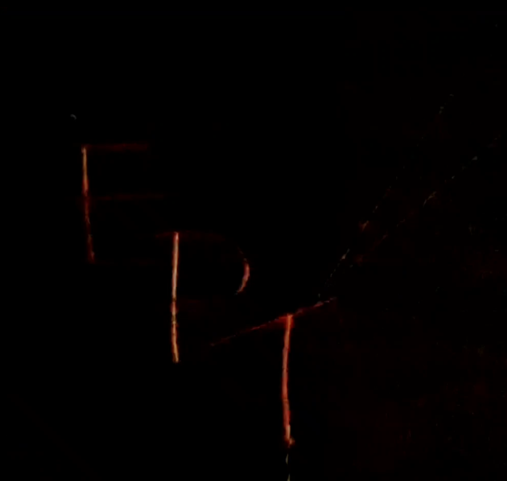
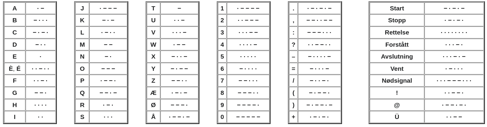

# Writeup for EPT signals

For this challenge you had to be onsite to solve it. In the venue there were two illuminated EPT-signs. 
The signs would at cetain times start blinking in a specific pattern during the event.

[Youtube video of the signal](https://youtu.be/NSjDDMf0DLA)




The first part of the solution was to turn the blinking of the sign into a digital format that computers make sense of. This was done by first recording the bliking and then giving the video as input to a python script which spat out '1' and '0' whether the frame was mostly black or not. 

In the script below we loop over every frame of the video recorded and if the pixel value of the pixel in the upper left corner is above the given threshold of 10 then we think the sign is turned on and we return the value 1, if not return 0. 

```py
import cv2

vidcap = cv2.VideoCapture('eptflag.mp4')
success, image = vidcap.read()

while success:
    
    pixel = image[0][0][0]

    if pixel > 10:
        print(1, end="")
    else:
        print(0, end="")

    success, image = vidcap.read()
```

This gave us a signal in ones and zeroes.

```
111111111000000000000111000111000111000111000000000000111000111000000000000111100111100111100000000000000000000000000000000111111111100111100111111111100111100000000000111100111100111100111100000000000111100111111111100000000000111100111111111100111100111100000000000111100111111111100111100111100000000000111100000000000111111111100111100000000000111111111100111111111100111100000000000111100000000000000000000000000000000011100111100000000000011100011100011100000000000000000000000000000000011111111100011111111100011111111100000000000011111111100011100000000000000000000000000000000011100011100011111111100011100000000000011100011100000000000011100011111111100000100000000000001100000000000001100001111111100001100001111111100000000001111100100000000000000000000000000000000000000010000000000000001100000100001000001100000000000001000000000000000000000000000000000001100001100001111111100001100000000000001100001111111100001100001100000000000001100001111111100000000000001111111110001111111110001100000000000000000000000000000000001110001110000000000001110001110001110000000000000000000000000000000001111111110001110001111111110001110000000000001111111110001111111110001111111110000000000001111111110001111111110000000000001110001110000000000001111111110001110000000000001111111110001111111110001110000000000000000000000000000000001110000111111110000110000000000000110000000000000110000111111110000000000000110000111111110000110000110000000000000110000111111110000110000110000000000000111111110000110000111111110000111111110000000000000000000000000000000000110000110000110000000000000111111111000111111111000111111111000000000000111111111000111111110000111111111000000000000111111111000111000000000000000000000000000000000111111111000111000000000000111111111000111111111000111111111000000000000111000111111111000111111111000000000000111000111111111000111000111111111000111000011111111000000000000000000000000000000000011000011111111000000000000011000011111111000011000000000000011000000000000000000000000000000000011111111000011000011111111000011111111000000000000011111111000011111111000011111111000000000000011000011000011111111000000000000000000000000000000000011000011111111000011000000000000011000000000000011000011111111000000000000011111111000011100011100000000000011111111100011100011111111100011111111100000000000011100011100011111111100011111111100011100011100000000000000000000000000000000011100000000000011100011111111100011111111100011100000000000011111111100000000000011111111100011100011111111100011111111100011100000000000011100011111111100011111111100000000000001100000000000001100011111111100001100001100000000000001100001111111100001100001100000000000001111111100001100001100001100001100001111111100000000000001111111100001100001100000000000001111111100001111111100001111111100000000000001111111100001100000000000001100000000000001111111110001110001110001110001110001111111110000000000001111111110001111111110000000000001111111110001111111110001111111110000000000001110001111111110001110000000000001110001110001110000000000001110000000000001111111110001110001110001110001110001111111110000000000001110001110000000000000110000110000110000000000000111111110000110000110000110000110000111111110000000000000111111110000110000111111110000110000000000000111111110000111111110000111111110000111111110000111111110000000000000111111110000111111110000111111110000111111110000111111110000000000000110000111111110000110000110000000000000111111111000111000111111111000111111111000110000111111111000000000000111000111111111000111000111111111000111000111111111000000000000000000000000000000000111111111000000000000111000111000111000111000000000000111000111111111000000000000110011111000000000000000000000000000000000111000111000000000000011000011000011000000000000000000000000000000000011000011000000000000011111111000000000000011000011111111000011000011111111000111000111111111000000000000000000000000000000000011000000000000011111111000011000000000000011000011111111000011111111000011111111000000000000011111111000011111111000011111111000000000000011111111000011000011111111100011111111100000000000000000000000000000000011111111100000000000011100011100011100011100000000000011100000000000000000000000000000000011100011111111100011100000000000011100000000000011100011100011100000000000011111111100000000000000000000000000000000011111111100011111111110011111111110000000000011110011110011111111110011110000000000000000000000000000000011111111110000000000011110011110011110011100000000000011100000000000000000000000000000000011111111100011110001111111100001100000000000001111111100000000000001100001100001111111100001100000000000001100001111111100001100001111111100001100001111111100000000000000000000000000000000000000000000000000000000000000000000000001111111111111111111111111111111111111111111
```

The next step was to figure what kind of signal it was. A teamm ember suggested that it could be [morse code](https://en.wikipedia.org/wiki/Morse_code). With the code snippet in the description of the challenge we knew that the signal had to be decoded to a code that did not include curly brackets or underscores.

```py
`flag = flag.replace("(", "{").replace(")", "}").replace("-", "_").upper()`

```

If we take a look at the supported characters in morse we see that it includes parantehes and dashes, but no curly brackets or underscores.




The next step is to turn our binary signal into morse. 

In the script below we iterate over every character in our signal and we measure how long the signal is switched on or off. 

In morse we have a short signal, long signal and spacing between each letter. In the script below we  group the 1's with a size greater than 4 as a long signal, represented by `-`, else we think it's a short signal and we print a `.`. 

If we receive a group of 0's with a size greater than 10, then we treat it as a space and we print out ` `. 

```py
current_group = "1"
group_count = 0
with open("raw_signal.txt") as f:
    chars = list(f.read())

    for char in chars:
        group_count += 1
        if current_group != char:

            if current_group == "0":
                if group_count > 10:
                    print(" ", end="")
            else:
                if group_count > 4:
                    print("-", end="")
                else:
                    print(".", end="")

            current_group = char
            group_count = 0
```

This gives us the morse code below.

```
- .... .. ... -.-. .... .- .-.. .-.. . -. --. . .. ... --- -. ..-. .. .-. . .-.--. . .... . ..-. .-.. .- --. .. ... -.-. --- -- .. -. --. .-. . .- .-.. .-.. -.-- ... --- --- -. -. --- .-- .-.-.- .- .-. . -.-- --- ..- .-. . .- -.. -.-- ..--.. . .--. - -.--. .-- . .-.. .-.. -....- -.. --- -. . -....- -- --- .-. ... . -....- .. ... -....- -.-. ----- ----- .-.. -.--.- .-.-.- - .... .- .- .. ... .. - .-.-.- . -. .--- --- -.-- - .... . .-. . ... - --- ..-. - .... . -.-. - ..-. .-.-.- 
```

By using [Cyberchef](https://gchq.github.io/CyberChef/#recipe=From_Morse_Code('Space','Line%20feed')&input=LSAuLi4uIC4uIC4uLiAtLi0uIC4uLi4gLi0gLi0uLiAuLS4uIC4gLS4gLS0uIC4gLi4gLi4uIC0tLSAtLiAuLi0uIC4uIC4tLiAuIC4tLi0tLiAuIC4uLi4gLiAuLi0uIC4tLi4gLi0gLS0uIC4uIC4uLiAtLi0uIC0tLSAtLSAuLiAtLiAtLS4gLi0uIC4gLi0gLi0uLiAuLS4uIC0uLS0gLi4uIC0tLSAtLS0gLS4gLS4gLS0tIC4tLSAuLS4tLi0gLi0gLi0uIC4gLS4tLSAtLS0gLi4tIC4tLiAuIC4tIC0uLiAtLi0tIC4uLS0uLiAuIC4tLS4gLSAtLi0tLiAuLS0gLiAuLS4uIC4tLi4gLS4uLi4tIC0uLiAtLS0gLS4gLiAtLi4uLi0gLS0gLS0tIC4tLiAuLi4gLiAtLi4uLi0gLi4gLi4uIC0uLi4uLSAtLi0uIC0tLS0tIC0tLS0tIC4tLi4gLS4tLS4tIC4tLi0uLSAtIC4uLi4gLi0gLi0gLi4gLi4uIC4uIC0gLi0uLS4tIC4gLS4gLi0tLSAtLS0gLS4tLSAtIC4uLi4gLiAuLS4gLiAuLi4gLSAtLS0gLi4tLiAtIC4uLi4gLiAtLi0uIC0gLi4tLiAuLS4tLi0g) we can decode the above morse into 

`THISCHALLENGEISONFIREEHEFLAGISCOMINGREALLYSOONNOW.AREYOUREADY?EPT(WELL-DONE-MORSE-IS-C00L).THAAISIT.ENJOYTHERESTOFTHECTF.`

And there is the flag, the last step is to replace `()` and `-` with `{}` and `_`.

Thanks for the fun challenge!

## Flag
`EPT{WELL_DONE_MORSE_IS_C00L}`