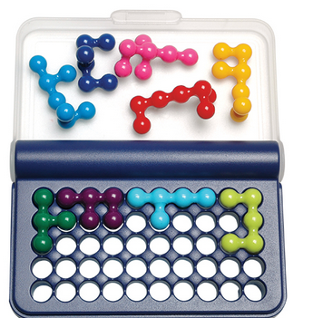
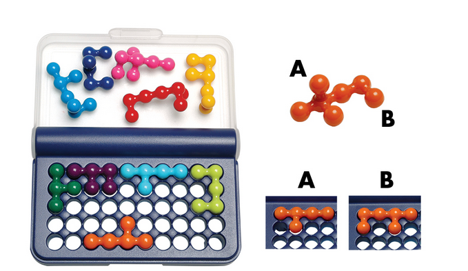
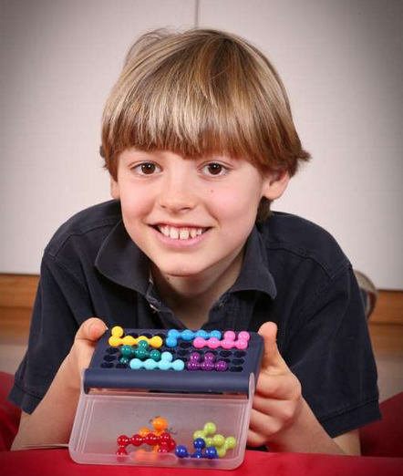

# IQ puzzle writeup

This was one of the onsite puzzles meaning they were only solveable by attending the live event in Oslo. We were able to solve this challange within 10 minutes, leading to us getting **`First blood`** on this challange.

In this puzzle you got a grid in which you had to fit all your pieces in, some pieces were locked. In our case three pieces were locked. 

# Solution
Nevertheless, if you tried to brute force this puzzle then it would take a long time. Especially if you don’t do it systematically. Reason for this is that every piece can have two different forms.
So how we solved it is mainly by doing two things:

### 1: Get rid of most of the variation from turning the piece.
To achieve this, count the free spaces after the locked pieces. Then count the minimal amount of spaces your pieces can cover. As every piece differs by 1 when turned, you now have the amount of turned pieces from the difference between the two. 

We had 35 free spaces and 32 as minimal on our remaining pieces. This allows us exactly 3 flips, no more or less. So of the 7 remaining pieces we had to flip three. This reduces the number of combinations a lot.

### 2: Lock more pieces.
Find the most restricted area on your board, where few pieces will fit. In our case we had a spot where only 3 pieces (where one could be turned, so effectively 4) could fit without making holes. Now test from those combinations. If you have multiple members with a board, you can test them in parallel. Remember that the now “locked” piece also counts for the number of flips. For example one of our combinations had to be flipped, that means that the last 6 pieces only 2 could be flipped.

# Conlcusion

Be systematic, don’t repeat earlier attempts. Or as Einstein would say it: "Insanity is doing the same thing over and over again and expecting different results."

