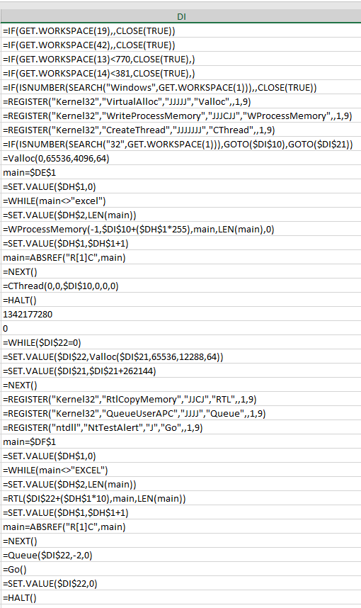
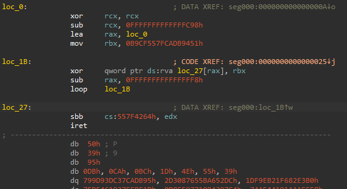
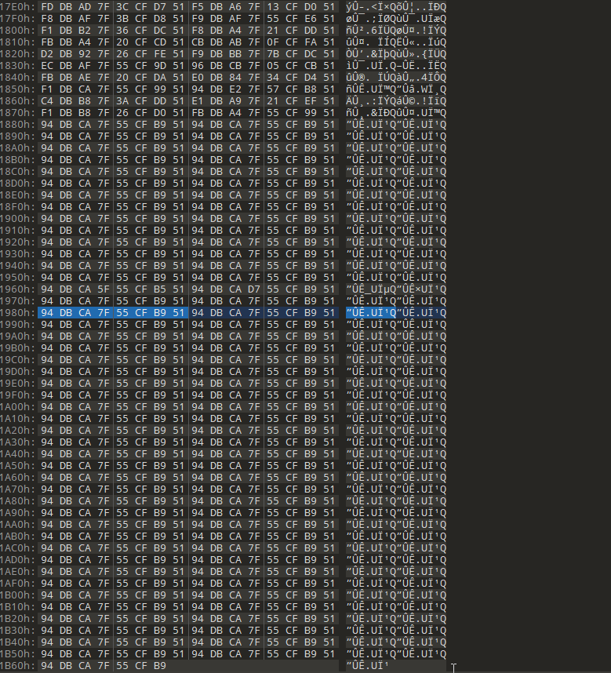
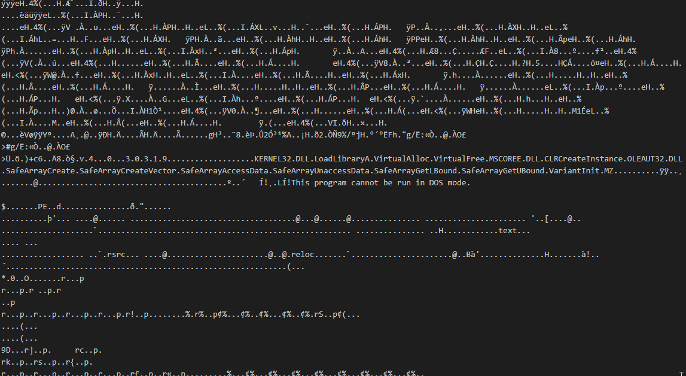
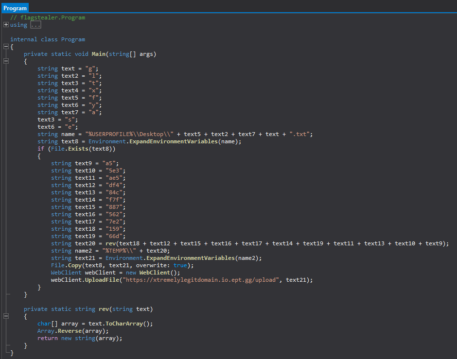

### Humble beginnings and microing my macro
We start out with an excel file `Thanks for nothing.xls` that contains a meme picture about enabling macros.
If we enable macro the document closes itself and there is no visible macros in the "view macros" view.
Something weird is going on with this document and even the trusty tool `oledump` was not able to properly dump out something analyzable. However, if we look more around in the document itself we found a hidden sheet named "Macro1". The column `DI` contains references to windows API calls "VirtualAlloc","WriteProcessMemory" and "CreateThread" first to copy some code into a process, then "RtlCopyMemory","QueueUserAPC" and "NtTestAlert" to use Asyncronous Procedure Call to run the shellcode in another thread as a method for indirect Process Injection using the undocumented function NtTestAlert to trigger the queued APC call (example [here](https://cocomelonc.github.io/tutorial/2021/11/20/malware-injection-4.html)).

The exposed API logic of the macro:



As we know the high level overview of what is happening, we expect some shellcode encoded somewhere in the macro document although we do not precicely know how this ends up in column DH. But looking at the content, we have a pretty good guess that it is the content in column DF which is not pure ascii.

As this is already in hex format, we can simly regex away and convert it to binary with two one liners (or you know, use cyberchef to make your life easier):
`sed 's/=//g; s/CHAR(//g; s/)&/ /g; s/)//g;' DF | perl -pe 's/\R//g' > DF.hexbin`
`python3 -c 'a=open("DF.hexbin","r").read().split(" ");a=a[1:];o=bytearray();[o.append(int(x)) for x in a];open("DF.bin","wb").write(o)'`

### Shellcode, in my process??

Now if we open this new shellcode in a dissasembler and interpret it as 64bit code, we see it does some dynamic unpacking of its code:



Now we could have debugged this by loading it a shellcode runner or wrapped with a PE EXE shell to debug it.
But since this is a fire challenge and we need to solve this quickly we can repeat the old line "there is no cheating in reverse engineering" and spot by eye in a hex editor an interesting pattern near the end of the file:




Now what happens if we xor the whole file this this `94 DB CA 7F 55 CF B9 51` key?



Aye aye captain, a MZ file in sight! Dumping out new PE file and looking at in PEStudio we see that is is a DotNet binary called flagstealer. Looking at this file in a DotNet decompiler like ILSpy shows us the basic functionality:



TLDR; it checks if a file called `flag.txt` exists in the current users Desktop folder and if it does it replaces it with another file `"%TEMP%\5a3e5c485ead66f7f2e72657884fd951"` before uploading the file to `https://xtremelylegitdomain.io.ept.gg/upload`.

### GETing that FLAG

If we try to send a POST request with CURL to this path we see that "The upload functionality is temporarily disabled.Previously uploaded files can still be found in the uploads folder with the filename it was uploaded with filename it was uploaded with.":
```
curl -X POST https://xtremelylegitdomain.io.ept.gg/upload -k
<!DOCTYPE html>
<html lang="en">
    <head>
        <style>
            .container {
                padding-top: 50px;
              height: 200px;
              position: relative;
              

            }
            
            .vertical-center {
                text-align: center;
                /* border: 3px solid green; */
                padding-bottom: 50px;
                padding-top: 50px;
              
            }
            .yolo {
                margin: 0 auto;
                margin-top: 30px;
                padding-top: 10px;
                width: 50%;
                position: center;
            }
            </style>
        <title>
            Flagstealer
        </title>
        <link href="https://cdn.jsdelivr.net/npm/bootstrap@5.1.1/dist/css/bootstrap.min.css" rel="stylesheet" integrity="sha384-F3w7mX95PdgyTmZZMECAngseQB83DfGTowi0iMjiWaeVhAn4FJkqJByhZMI3AhiU" crossorigin="anonymous">
        <script src="https://cdn.jsdelivr.net/npm/bootstrap@5.1.1/dist/js/bootstrap.bundle.min.js" integrity="sha384-/bQdsTh/da6pkI1MST/rWKFNjaCP5gBSY4sEBT38Q/9RBh9AH40zEOg7Hlq2THRZ" crossorigin="anonymous"></script>
    </head>
    <body>
        <div class="container">
            <div class="vertical-center">
        
            <h1>The upload functionality is temporarily disabled.</h1>
            <h3>Previously uploaded files can still be found in the uploads folder with the filename it was uploaded with.</h3>
            <br />
            <br />
            <form action = "upload" method = "POST" enctype = "multipart/form-data" disabled="disabled">
            <input type = "file" name = "file"  disabled="disabled"/>
            <input type = "submit" disabled="disabled"/>
        

    </div>
</div>

    </body>
</html>%          
```


If we use the known filename "5a3e5c485ead66f7f2e72657884fd951" and try to send a GET request with CURL  at "https://xtremelylegitdomain.io.ept.gg/uploads/5a3e5c485ead66f7f2e72657884fd951", we get the flag `EPT{EXCELntDonut_1s_4ll_kill3r_n0_f1ller}`.

