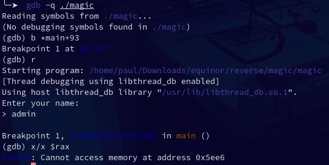
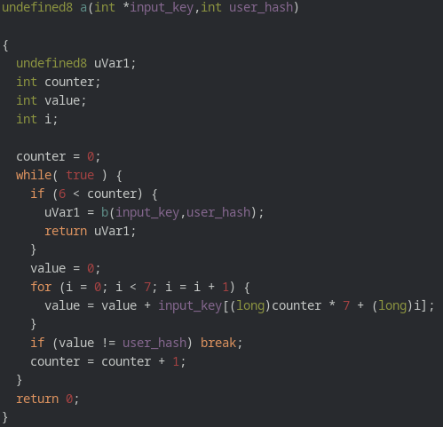

# reverse / magic unicorns

We don't have a lot of information about this challenge, the title could gives us some tips about emulation (python unicorn module) but I didn't used it.

So let's run our prefered decompiler (Ghidra for me).

## Overview

From a high level perspective, the program isn't very complicated.
There isn't any anti-debug protection and it isn't stripped.

The first input asked is a user name, then, it is sent to a function (`e`) which calculates an int from it.  
It look like a hash function (I'll call it `user_hash`). But we don't need to reverse it from now, because dynamic analysis will do the job for us.

The second input is an array of 49 int, which will form the key.  
Then, the program perform a lot of checks in order to verify if the key corresponds to the `user_hash`.  
If all the checks are ok, we get the flag !

From here, the plan was pretty clear : get the hash of whatever user with dynamic analysis, and find a working key using an SMT solver (I used z3)

## Journey to flag

### Dynamic for hash
Because we are not asked for a specific user, we can user whatever we want. Let's find the hash of user `admin`.

To do so, the easiest way is to use dynamic analysis instead of reversing the hash function.  
I juste launched gdb, set a breakpoint just after the hash function, and got the `user_hash`



We now need a key that pass all the checks with `0x5ee6` as `user_hash`

### SMT for the win
The checks starts with function `a`. We can see that if we loop 7 times, we will go to function `b`. Which means, we need to pass the `if` in each iteration.  
If we give the good types and we rename some variables, it becomes clearer.



In each iteration, we check if the sum of `input_key[counter * 7 + i] == user_hash`.  
With `counter` the number of the iteraction and `i` going from 0 to 6.

This gives us a system of equation. Solving this system by hand is possible but this is very anoying so I used an SMT solver (z3) to do it.  
Here is the code for adding the constraints of function `a` to z3
```python
for counter in range(7):
  tmp = f's.add('
  for i in range(7):
    tmp += f'passwd[{counter * 7 + i}] + '
  tmp = tmp[:-3] + f' == user_hash)'
  eval(tmp)
```

If the key satisfies these equations, we go to function `b`.  
This look a lot like `a` but the equations are in the form: `input_key[i * 7 + counter] == user_hash`.  
Then, the z3 constraints are
```python
for counter in range(7):
  tmp = f's.add('
  for i in range(7):
    tmp += f'passwd[{i * 7 + counter}] + '
  tmp = tmp[:-3] + f' == user_hash)'
  eval(tmp)
```

We can now do the same with functions `c,d,e,f` (watch `solve.py` to see the differences) in order to give z3 all the constraints on the key.

Once this is done, we can ask z3 for a key that satisfies all the equations.

We just have to send this key to the program (with `admin` as user name) and we get the flag !

You can find details about how to do all that with z3 in `solve.py`.  
And feel free to contact me if something is unclear or if you have a question :)