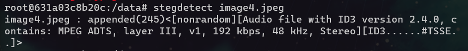
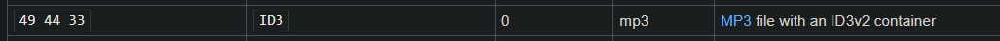
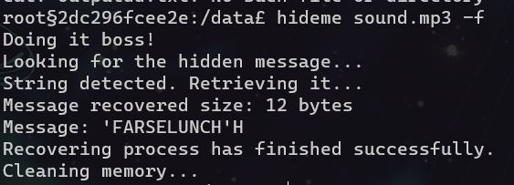
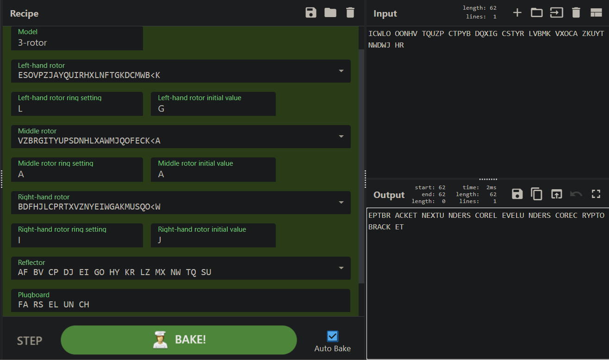

## Challenge: Stego/jærsk crypto

### Description
No frills. Pure organic 100% guess-free† fully authentic and original‡ crypto.

(This challenge is valued minimum points because it is an antimodel of a CTF challenge*, not because it is easy.)

†If you know what to do.
‡Slightly inspired by the emerging underground Mexican crypto scene.
*As decided by self pro-claimed independent EPT CTF experts.

### Solution
We are given a PowerPoint-file, containing 3 slides with text and one picture on each slide. The content of the slides does not look interesting at first - and as this is a stego-challange, I assume we have to look deeper. 

By decompressing the PPT-file using 7-zip, we get all the files inside the ppt.

By `cat`-ing the first file: `[Conetent_types].xml` - we find this:

    Enigma('3-rotor','LEYJVCNIXWPBQMDRTAKZGFUHOS','A','A','ESOVPZJAYQUIRHXLNFTGKDCMWB<K','L','G','VZBRGITYUPSDNHLXAWMJQOFECK<A','A','A','BDFHJLCPRTXVZNYEIWGAKMUSQO<W','I','J','AF BV CP DJ EI GO HY KR LZ MX NW TQ SU','?? ?? ?? ?? ??',true)

This challenge probably wants us to decipher a text using enigma!

Looking through the rest of the files:
We can see that there are four pictures in the media folder, one more than we could see in the powerpoint slides. By looking at the filesizes, we see that the image not seen in the ppt slides is way larger than the others. I assume that some data is hidden here - so I copy the image file in a `temp` folder, and run a container "[DominicBreuker's Stego-tools](https://github.com/DominicBreuker/stego-toolkit)" to try out different stego-tools. 

    docker run -it --rm -v $(pwd):/data dominicbreuker/stego-toolkit /bin/bash

From the results given by`stegdetect`, it looks like there is an **ID3** audio-file hidden inside the image. 

I couldn't find any tool that would extract this audio file, so I manually extracted it with [hexed.it](hexed.it), by searcing for the **ID3 file signature**.

[Wikipedia](https://en.wikipedia.org/wiki/List_of_file_signatures) shows us that the the file signature for **ID3 mp3** is `49 44 33`.

By searching for `49 44 43` in `image4.jpeg` on [hexed.it](hexed.it), we get a hit. We successfully extract the audio-file by deleting everything before these numbers, and saving the remaining data as `sound.mp3`. 

The mp3-file plays an Norwegian song, but does not give any clues to the challange. I move the audio file to the container as mentioned earlier, to do some more stego attempts on this file.

After trying different stego-tools, we get a hit using **hideme**. "FARSELUNCH" is the recovered message. The length of this string fits with the "?? ?? ?? ??" on the "enigma"-string.

It seems like we have all the parts for the enigma decryption, except the cipher-text itself. 

By looking at the picture `image4` - we can see some some text in the upper-left part of the picture. This is probably the ciphertext to be decrypted with enigma.

Cyberchef has a enigma recipie that we can use! 
By pasting the string:

    Enigma('3-rotor','LEYJVCNIXWPBQMDRTAKZGFUHOS','A','A','ESOVPZJAYQUIRHXLNFTGKDCMWB<K','L','G','VZBRGITYUPSDNHLXAWMJQOFECK<A','A','A','BDFHJLCPRTXVZNYEIWGAKMUSQO<W','I','J','AF BV CP DJ EI GO HY KR LZ MX NW TQ SU','FA RS EL UN CH',true)

into the URI, after `https://icyberchef.com/#recipe=` - we easily get the correct setup in CyberChef. In the Input-field, we enter the text from image4. 

By taking the output and removing spaces and replacing "BRACKET" with "{" and "}", and "UNDERSCORE" with "_", we get the flag:

### Flag
`EPT{NEXT_LEVEL_CRYPTO}`