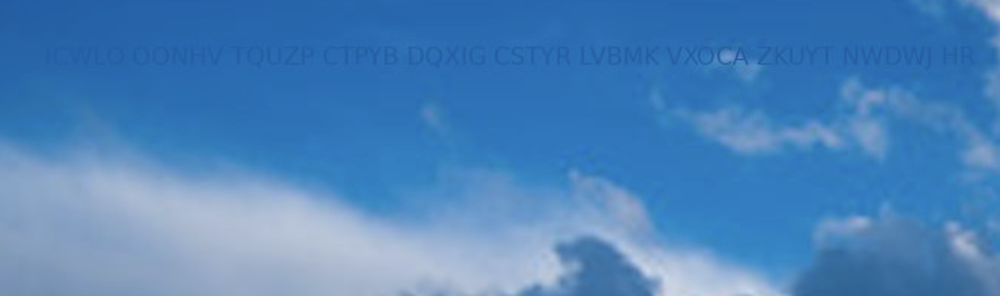
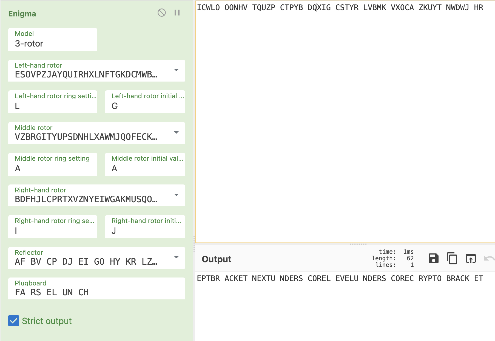

# Jærsk crypto

We did not solve this in time for the CTF, but the puzzle was intriguing, so here we go.

Inside the [powerpoint](../J%C3%A6rsk%20Crypto.pptx) we found an unused [image](./image4.jpeg) with some text barely visible in the sky:


We also found a gem in one of the XML files:
> \<!--Enigma('3-rotor','LEYJVCNIXWPBQMDRTAKZGFUHOS','A','A','ESOVPZJAYQUIRHXLNFTGKDCMWB<K','L','G','VZBRGITYUPSDNHLXAWMJQOFECK<A','A','A','BDFHJLCPRTXVZNYEIWGAKMUSQO<W','I','J','AF BV CP DJ EI GO HY KR LZ MX NW TQ SU','?? ?? ?? ?? ??',true)-->

Exactly the syntax Cyberchef uses for Enigma, but we don't have the plugboard settings.

The software-part of exif info had a clue: 
> Software: \x49\x44\x33 

The hex values for `ID3` - suggesting that we have an MP3 file in here. Extracting data from that value with `binwalk -R "\x49\x44\x33" --dd="raw" image4.jpeg` (thanks LOLASL) revealed an [mp3 file](./107F0B.mp4). No human-parsable audio in the mp3 or anything seen with Sonic Visualizer...

Using `hideme` (found in [a stego-toolkit](https://github.com/DominicBreuker/stego-toolkit)) we could get some plaintext:

```
: ~/ept/stego; hideme _image4.jpeg.extracted/107F0B.mp4 -f
Doing it boss!
Looking for the hidden message...
String detected. Retrieving it...
Message recovered size: 12 bytes
Message: 'FARSELUNCH'
Recovering process has finished successfully.
Cleaning memory...
```

Bingo!



> EPTBR ACKET NEXTU NDERS COREL EVELU NDERS COREC RYPTO BRACK ET

aka 

> EPT{NEXT_LEVEL_CRYPTO}
